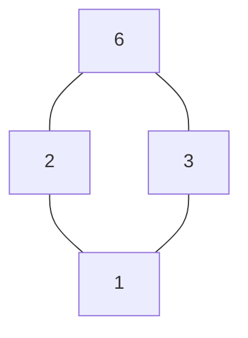
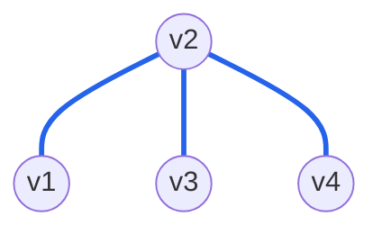

# 离散数学

## 第一章 命题与命题公式

### 命题连接词

- **否定**（$\neg$）：取反

  | P    | $\neg$P |
  | ---- | ------- |
  | 0    | 1       |
  | 1    | 0       |

- **合取**（$\land$）：看作`并`关系，只有P和Q同时为真，P $\land$ Q 为真，否则为假

  | P    | Q    | P $\land$ Q |
  | ---- | ---- | ----------- |
  | 0    | 0    | 0           |
  | 0    | 1    | 0           |
  | 1    | 0    | 0           |
  | 1    | 1    | 1           |

- **析取**（$\lor$）：看作`或`关系，只有P和Q同时为假，P $\lor$ Q 为假，否则为真
  **同或**：两边可以同时成立或者两边至少有一个成立（三种情况）

   今天刮风或今天下雨。
  **异或**：两边不能同时成立或者两边其中一个成立（两种情况）

  (P $\land$  $\neg$ Q) $\lor$ ( $\neg$ P $\land$ Q) 两边必须有一个为假

   我 15 岁或我 16 岁

  | P    | Q    | P $\lor$ Q |
  | ---- | ---- | ---------- |
  | 0    | 0    | 0          |
  | 0    | 1    | 1          |
  | 1    | 0    | 1          |
  | 1    | 1    | 1          |

- **单箭头**（$\rightarrow$）：**推导出**只有P为真，Q为假的时候，P $\rightarrow$ Q 为假，其他情况都为真 <font color='#EF4444'>真指向假 为假 否则都是真</font>
  P $\rightarrow$ Q $\Leftrightarrow$ $\neg$P $\lor$ Q

    P 是真 Q 是假，P $\rightarrow$ Q 为假（上面的定义可知）$\Leftrightarrow$ 取反的 P || Q = F || F = F

  |  P   |  Q   | P $\rightarrow$ Q | $\neg$P | $\neg$P $\lor$ Q |
  | :--: | :--: | :---------------: | :-----: | :--------------: |
  |  0   |  0   |         1         |    1    |        1         |
  |  0   |  1   |         1         |    1    |        1         |
  |  1   |  0   |         0         |    0    |        0         |
  |  1   |  1   |         1         |    0    |        1         |

- **双箭头**（$\leftrightarrow$）：只有 P 和 Q 相等的时候为真，否则都是假

  两边同时成立或同时不成立

  |  P   |  Q   | P$\leftrightarrow$Q |
  | :--: | :--: | :-----------------: |
  |  0   |  0   |          1          |
  |  0   |  1   |          0          |
  |  1   |  0   |          0          |
  |  1   |  1   |          1          |

  P $\leftrightarrow$ Q $\Leftrightarrow$ (P $\rightarrow$ Q) $\land$ (Q $\rightarrow$ P)

  | \(P\) | \(Q\) | \(P $\rightarrow$ Q\) | \(Q $\rightarrow$ P\) | (P $\rightarrow$ Q) $\land$ (Q $\rightarrow$ P) | \(P $\leftrightarrow$ Q\) |
  | ----- | ----- | --------------------- | --------------------- | ----------------------------------------------- | ------------------------- |
  | T     | T     | 真指向真 T            | 真指向真 T            | T                                               | T                         |
  | T     | F     | 真指向假 F            | 假指向真 T            | F                                               | F                         |
  | F     | T     | 假指向真 T            | 真指向假 F            | F                                               | F                         |
  | F     | F     | 假指向假 T            | 假指向假 T            | T                                               | T                         |

### 命题符号化

<font color='#EF4444'>$\rightarrow$</font> 由 P 能确定 Q 的一种关系，即 P 推理出 Q（P $\rightarrow$ Q）

<font color='#EF4444'>前推后</font>：因为……所以……、只要（如果）……就…… 、 要是……就……

<font color='#EF4444'>后推前</font>：只有……才……

遇到除非，转化为只有……才……，然后后推前

<font color='#EF4444'>异或的关系</font>：两者具有相斥性，不能同时成立 比如：要么……要么…… ($\neg$q $\land$  p)  $\lor$ (q $\land$ $\neg$p)

### 真值表演算

方法：交错赋值，$2^n$

用真位表法判定下列逻辑等价式成立

（P $\rightarrow$ Q）$\land$（R $\rightarrow$ Q）$\Leftrightarrow$ P $\lor$ R $\rightarrow$ Q

|  P   |  Q   |  R   | P $\rightarrow$ Q | R $\rightarrow$ Q | （P $\rightarrow$ Q）$\land$（R $\rightarrow$ Q） | P $\lor$ R | P $\lor$ R $\rightarrow$ Q |
| :--: | :--: | :--: | :---------------: | :---------------: | :-----------------------------------------------: | :--------: | :------------------------: |
|  0   |  0   |  0   |         1         |         1         |                         1                         |     0      |             1              |
|  0   |  0   |  1   |         1         |         0         |                         0                         |     1      |             0              |
|  0   |  1   |  0   |         1         |         1         |                         1                         |     0      |             1              |
|  0   |  1   |  1   |         1         |         1         |                         1                         |     1      |             1              |
|  1   |  0   |  0   |         0         |         1         |                         0                         |     1      |             0              |
|  1   |  0   |  1   |         0         |         0         |                         0                         |     1      |             0              |
|  1   |  1   |  0   |         1         |         1         |                         1                         |     1      |             1              |
|  1   |  1   |  1   |         1         |         1         |                         1                         |     1      |             1              |

### 判断永真式/矛盾式

**永真式（重言式）**：真值表**全为 1**（推荐）

**永假式（矛盾式）**：真值表**全为 0**

**可满足式**：至少**有一个是 1**

例题见：8、9

**非重言式的可满足式**：至少有一组成假指派，并且至少有一组成真指派

即真值表至少有一个 0，切至少有一个 1

### 求成真或成假指派

**成真指派（成真赋值**），原子命题取什么值整个命题的值为真

**成假指派（成假赋值）**，原子命题取什么值整个命题的值为假

方法：等值变换或真值表（推荐）

命题公式（$\neg$ P $\rightarrow$ Q）$\rightarrow$ (P $\land$ $\neg$ Q) 的成真指派为 00 10，成假指派为 01 11。

|               P                |               Q                | $\neg$ P | $\neg$ Q | $\neg$ P $\rightarrow$ Q | P $\land$ $\neg$ Q | ($\neg$ P $\rightarrow$ Q) $\rightarrow$ (P $\land$ $\neg$ Q) |
| :----------------------------: | :----------------------------: | :------: | :------: | :----------------------: | :----------------: | :----------------------------------------------------------: |
| <font color='#EF4444'>0</font> | <font color='#EF4444'>0</font> |    1     |    1     |            0             |         0          |                <font color='#EF4444'>1</font>                |
| <font color='#409EFF'>0</font> | <font color='#409EFF'>1</font> |    1     |    0     |            1             |         0          |                <font color='#409EFF'>0</font>                |
| <font color='#EF4444'>1</font> | <font color='#EF4444'>0</font> |    0     |    1     |            1             |         1          |                <font color='#EF4444'>1</font>                |
| <font color='#409EFF'>1</font> | <font color='#409EFF'>1</font> |    0     |    0     |            1             |         0          |                <font color='#409EFF'>0</font>                |

### 常用的命题规律


**分配率速记口诀**：<font color='#EF4444'>外运算进括号配每项，内运算留外面连结果；</font>

### 练习

1. 令 p：今天下雨，q：我今天进城。命题“因为今天不下雨，所以我今天进城”的符号化形式为 **C**

   1. p $\rightarrow$ q
   1. q $\rightarrow$ p
   1. $\neg$p $\rightarrow$ q
   1. $\neg$q  $\rightarrow$ p

   前推后，因为……所以……

1. 设 P：我周末不加班，Q：我去爬山，命题“只要我周末不加班，我就去爬山”的符号化为 **C**

   1. $\neg$P $\lor$ $\neg$Q
   1. P $\lor$ Q
   1. P $\rightarrow$ Q
   1. Q $\rightarrow$ P

   前推后，只要……就……

1. 设 p：今天晴天，q：我们去放风筝，命题“今天要是晴天，我们就去放风筝”的符号化为 **A**

   1. p $\rightarrow$ q
   1. p $\rightarrow$ $\neg$q
   1. q $\rightarrow$ p
   1. q $\rightarrow$ $\neg$p

   前推后，要是……就……

1. 设 P：明天下雨，Q：我去游泳，命题“如果明天不下雨，我就去游泳”的符号化为 **D**

   1. $\neg$P $\lor$ Q
   1. $\neg$P $\land$ Q
   1. $\neg$Q $\rightarrow$ P
   1. $\neg$P $\rightarrow$ Q

   前推后，如果……就……

1. 设 P：他勤奋，Q：他成绩高，命题“只有他勤奋，他成绩才高”符号化为 **B**

   1. P $\lor$ Q
   1. Q $\rightarrow$ P
   1. $\neg$p $\lor$ $\neg$Q
   1. P $\rightarrow$ Q

   后推前，只有……才……

1. 令 p：今天大雨，q：小王迟到。命题“除非天下大雨，否则小王不会迟到”的符号化形式为 **B**

   1. p $\rightarrow$ q
   1. q $\rightarrow$ p
   1. $\neg$p $\rightarrow$ q
   1. $\neg$q $\rightarrow$ p

   后推前，除非，转换为只有……才……

1. 令 p：我今天上班，q：我今天休息。命题“今天我要么上班要么休息”的符号化形式为 **D**

   1. p $\lor$ q
   1. q $\rightarrow$ p
   1. $\neg$p $\land$ q
   1. ($\neg$q $\land$ p) $\lor$ (q $\land$ $\neg$p)

   “要么……要么……”表示异或：两者只能成立一个，不能同时成立。

   1. p $\lor$ q

      表示“我今天上班或者我今天休息”。这是普通的“或”，只要求至少有一个成立，允许“既上班又休息”这种情况，所以不符合“要么……要么……”。

   1. q $\rightarrow$ p

      表示“如果我今天休息，那么我今天上班”。它表达的是条件关系，不是二选一关系，所以不符合原命题。

   1. $\neg$p $\land$ q

      表示“我今天不上班，并且我今天休息”。它只说了“休息”这一种情况，漏掉了“上班并且不休息”的情况，所以不完整。

   1. ($\neg$q $\land$ p) $\lor$ (q $\land$ $\neg$p)

      可以分成两部分理解：

      - $\neg$q $\land$ p：我今天不休息，并且我今天上班。
      - q $\land$ $\neg$p：我今天休息，并且我今天不上班。

      两部分中间用 $\lor$ 连接，表示这两种情况满足一种即可。它正好表达“上班和休息只能选一个”，所以正确。

   重点：普通“或”允许两个都真；“要么……要么……”只允许一真一假。

1. 下列命题公式是永真式的是 **C**

   1. p $\land$ (p $\rightarrow$ q)
   1. p $\land$ (p $\leftrightarrow$ q)
   1. P $\lor$ (p $\rightarrow$ q)
   1. P $\lor$ (p $\leftrightarrow$ q)

   |  p   |  q   | p $\rightarrow$ q | p $\leftrightarrow$ q | p $\land$ (p $\rightarrow$ q) | p $\land$ (p $\leftrightarrow$ q) |  P $\lor$ (p $\rightarrow$ q)  | P $\lor$ (p $\leftrightarrow$ q) |
   | :--: | :--: | :---------------: | :-------------------: | :---------------------------: | :-------------------------------: | :----------------------------: | :------------------------------: |
   |  0   |  0   |         1         |           1           |               0               |                 0                 | <font color='#EF4444'>1</font> |                1                 |
   |  0   |  1   |         1         |           0           |               0               |                 0                 | <font color='#EF4444'>1</font> |                0                 |
   |  1   |  0   |         0         |           0           |               0               |                 0                 | <font color='#EF4444'>1</font> |                1                 |
   |  1   |  1   |         1         |           1           |               1               |                 1                 | <font color='#EF4444'>1</font> |                1                 |

1. 下列命题公式是矛盾式的是 **B**

   1. p $\land$ (p $\rightarrow$ q)
   1. $\neg$ (p $\rightarrow$ q) $\land$ q
   1. p $\land$ (p $\leftrightarrow$ q)
   1. p $\lor$ (p $\leftrightarrow$ q)

   |  p   |  q   | p $\rightarrow$ q | $\neg$ (p $\rightarrow$ q) | p $\leftrightarrow$ q | p $\land$ (p $\rightarrow$ q) | $\neg$ (p $\rightarrow$ q) $\land$ q | p $\land$ (p $\leftrightarrow$ q) | p $\lor$ (p $\leftrightarrow$ q) |
   | :--: | :--: | :---------------: | :------------------------: | :-------------------: | :---------------------------: | :----------------------------------: | :-------------------------------: | :------------------------------: |
   |  0   |  0   |         1         |             0              |           1           |               0               |    <font color='#EF4444'>0</font>    |                 0                 |                1                 |
   |  0   |  1   |         1         |             0              |           0           |               0               |    <font color='#EF4444'>0</font>    |                 0                 |                0                 |
   |  1   |  0   |         0         |             1              |           0           |               0               |    <font color='#EF4444'>0</font>    |                 0                 |                1                 |
   |  1   |  1   |         1         |             0              |           1           |               1               |    <font color='#EF4444'>0</font>    |                 1                 |                1                 |


## 第二章 命题逻辑的推理理论

### 求大小项的个数

方法：真值表中，0：大项 1：小项，交错赋值，大小项个数和是$2^n$

命题公式 $\neg$ (P $\rightarrow$ Q)的主合取范式中极大项的个数为 3

方法 1：

|  P   |  Q   | P $\rightarrow$ Q | $\neg$ (P $\rightarrow$ Q) |
| :--: | :--: | :---------------: | :------------------------: |
|  0   |  0   |         1         |             0              |
|  0   |  1   |         1         |             0              |
|  1   |  0   |         0         |             1              |
|  1   |  1   |         1         |             0              |

方法 2：

$\neg$ (P $\rightarrow$ Q)  $\Leftrightarrow$ $\neg$ ($\neg$P $\lor$ Q) $\Leftrightarrow$ P $\land$ $\neg$Q

当且仅当 P 和 $\neg$Q 都为 1 的时候，整体才为 1，所以 $2^2 -1$

$\neg$ (P $\rightarrow$ Q) $\land$ $\neg$ Q $\land$$\neg$ R 的主析取范式中含小项的个数为

1. 将蕴含式(P $\rightarrow$ Q) 改写为析取式

   (P $\rightarrow$ Q) $\Leftrightarrow$ ($\neg$P $\lor$ Q)

   原式$\neg$ (P $\rightarrow$ Q) $\Leftrightarrow$ $\neg$ ($\neg$P $\lor$ Q)

1. 对$\neg$ ($\neg$P $\lor$ Q) 使用德摩根定律

   $\neg$ (A $\lor$ B) $\Leftrightarrow$ $\neg$ A $\land$ $\neg$ B

   $\neg$ (A  $\land$ B) $\Leftrightarrow$ $\neg$ A $\lor$ $\neg$ B

   原式 $\neg$ ($\neg$P $\lor$ Q)  $\Leftrightarrow$  $\neg$ $\neg$ P $\land$  $\neg$ Q

1. 使用双重否定率

   $\neg$ $\neg$ A $\Leftrightarrow$ A

   $\neg$ $\neg$ P $\Leftrightarrow$ P

1. P $\land$  $\neg$ Q $\land$  $\neg$ Q $\land$  $\neg$ R

1. 使用幂等律

   A $\land$ A $\Leftrightarrow$ A

   A $\lor$ A $\Leftrightarrow$ A

1. 因此主析取范式 P $\land$  $\neg$ Q $\land$  $\neg$ R

1. 因为三个项都是并的关系，必须要三个项都为真整个式子才为真

1. P = 1，$\neg$ Q = 1，$\neg$ R = 1 时公式为真，也就是 P = 1，Q = 0，R = 0，只有这一种情况，所以含小项的个数为 1

### 求主范式

主析取范式：() $\lor$ ()，() 是小项，由 $\land$ 构成，取真值表为 1 的数据（0 大项，1 小项）<font color='#EF4444'>补T</font>

主合取范式：() $\land$ ()，() 是大项，由 $\lor$ 构成，取真值表为 0 的数据（0 大项，1 小项）<font color='#EF4444'>补 F</font>

<font color='#EF4444'>方法：恒等式 T  $\Leftrightarrow$ (P $\lor$  $\neg$ P) F  $\Leftrightarrow$ (P $\land$  $\neg$ P)</font>

如果题目中没有要求，用真值表

如果题目中有要求，必须按要求的来

**例题**：用等值演算，化简，如果求主析取，保留 $\lor$ ，如果求主合取，保留 $\land$ ，主范式两边没有的要进行添项，两边都要有所有命题。

求主析取范式：

<font color='#EF4444'>求主析取，补T 大项内部使用 $\land$ 连接 T  $\Leftrightarrow$ (P  $\lor$  $\neg$ P)</font>

(P $\land$ Q) $\lor$ R

左边进行添项，R 是一个真值，左边缺少一个 R 所以添加一个真值 R

(P $\land$ Q)  $\land$  T <font color='#EF4444'>$\lor$</font> T $\land$ T $\land$ R

右边进行添项，P、Q 都是真值，所以添加 P、Q；将添加的项转化为**恒等式**

(P $\land$ Q) $\land$ (R $\lor$  $\neg$ R) <font color='#EF4444'>$\lor$</font> T $\land$ T $\land$ R

(P $\land$ Q) $\land$ (R $\lor$  $\neg$ R) <font color='#EF4444'>$\lor$</font> (P $\lor$  $\neg$ P) $\land$ (Q $\lor$  $\neg$ Q) $\land$ R

**例题**：用等值演算法求命题公式(p $\rightarrow$ q) $\land$ r 的主析取范式

(p $\rightarrow$ q) $\land$ r

消去蕴含词

 $\Leftrightarrow$ ( $\neg$ p $\lor$ q) $\land$ r

 $\Leftrightarrow$ 使用分配率进行展开(A $\lor$ B) $\land$ C $\Leftrightarrow$ (A  $\land$ C) $\lor$ (B  $\land$ C)

 $\Leftrightarrow$ ( $\neg$ p $\land$ r) $\lor$ (q $\land$ r)

 现在已经是析取式，但不是主析取式，主析取式中的每一项都包含全部变元即，q p r

对第一个项 ( $\neg$ p $\land$ r) 补全变元 q

 $\Leftrightarrow$  ($\neg$ p $\land$ r) <font color='#EF4444'> $\land$ </font> T

 $\Leftrightarrow$   $\neg$ p $\land$ r <font color='#EF4444'> $\land$ </font> (q $\lor$  $\neg$ q) 使用分配律打开

 $\Leftrightarrow$ ( $\neg$ p $\land$ r $\land$ q) <font color='#EF4444'> $\lor$ </font> ( $\neg$ p $\land$ r $\land$  $\neg$ q)

对第二个项 (q $\land$ r) 补全变元 p

 $\Leftrightarrow$  (q $\land$ r)<font color='#EF4444'> $\land$ </font>T

 $\Leftrightarrow$  (q $\land$ r)<font color='#EF4444'> $\land$ </font>(p $\lor$  $\neg$ p) 使用分配律打开

 $\Leftrightarrow$ (q $\land$ r $\land$ p) <font color='#EF4444'> $\lor$ </font> (q $\land$ r $\land$  $\neg$ p)

合并结果

( $\neg$ p $\land$ r $\land$ q) $\lor$ ( $\neg$ p $\land$ r $\land$  $\neg$ q)  <font color='#EF4444'> $\lor$ </font>  (q $\land$ r $\land$ p) $\lor$ (q $\land$ r $\land$  $\neg$ p)

其中 ( $\neg$ p $\land$ r $\land$ q) 出现两次使用幂等率 A $\lor$ A $\Leftrightarrow$ A

( $\neg$ p $\land$ r $\land$ q) $\lor$ ( $\neg$ p $\land$ r $\land$  $\neg$ q)  <font color='#EF4444'> $\lor$ </font>  (q $\land$ r $\land$ p) $\lor$ ~~(q $\land$ r $\land$  $\neg$ p)~~

只保留一个

( $\neg$ p $\land$ r $\land$ q) $\lor$ ( $\neg$ p $\land$ r $\land$  $\neg$ q)  <font color='#EF4444'> $\lor$ </font>  (q $\land$ r $\land$ p)

整理式子，由于是二进制表示，0 在前面，

( $\neg$ p $\land$ q $\land$ r) $\lor$ ( $\neg$ p $\land$  $\neg$ q $\land$ r) <font color='#EF4444'> $\lor$ </font> (p $\land$ q $\land$ r)

<font color='#EF4444'>注意</font>：主析取最后是 m 有 $\neg$ 为 0，无 $\neg$ 为 1

$m_{011}$  $\lor$ $m_{001}$  $\lor$ $m_{111}$


**例题**：用等值演算法求命题公式(p $\lor$ q) $\land$ (q $\rightarrow$ $\neg$ r)的主合取范式

<font color='#EF4444'>求主合取 补F 大项内部由 $\lor$ 连接 F $\Leftrightarrow$ (P  $\land$ $\neg$ P)</font>

消去蕴含词

(p $\lor$ q) <font color='#EF4444'> $\land$ </font>($\neg$ q $\lor$  $\neg$ r)

求主合取范式，每个大项补全变元，

(p $\lor$ q  <font color='#EF4444'>$\lor$ F</font>) $\land$ ( $\neg$ q $\lor$  $\neg$ r <font color='#EF4444'>$\lor$ F</font>)

对第一个大项使用分配率

(p $\lor$ q) $\lor$ <font color='#EF4444'>(r $\land$  $\neg$ r)</font>

令 A = p  $\lor$ q

B = r

C =  $\neg$ r

(p $\lor$ q $\lor$ r) $\land$ (p $\lor$ q $\lor$  $\neg$ r)

对第二个大项使用分配率

( $\neg$ q $\lor$  $\neg$ r) $\lor$ (p $\land$  $\neg$ p)

令 A= ( $\neg$ q $\lor$  $\neg$ r)

B = p

C =  $\neg$ p

( $\neg$ q $\lor$  $\neg$ r $\lor$ p) $\land$ ( $\neg$ q $\lor$  $\neg$ r $\lor$  $\neg$ p)

合并结果

(p $\lor$ q $\lor$ r) $\land$ (p $\lor$ q $\lor$  $\neg$ r) <font color='#EF4444'> $\land$ </font> ( $\neg$ q $\lor$  $\neg$ r $\lor$ p) $\land$ ( $\neg$ q $\lor$  $\neg$ r $\lor$  $\neg$ p)

0 是大项

1 是小项

(p $\lor$ q $\lor$ r)  $\Leftrightarrow$ 000

(p $\lor$ q $\lor$  $\neg$ r)  $\Leftrightarrow$ 001

( p $\lor$ $\neg$ q $\lor$  $\neg$ r ) $\Leftrightarrow$ 011

( $\neg$ q $\lor$  $\neg$ r $\lor$  $\neg$ p) $\Leftrightarrow$ 111

$M_{000} $ $\land$ $M_{001}$ $\land$ $M_{011}$ $\land$ $M_{111}$

<font color='#EF4444'>注意</font>：主合取最后是M，有 $\neg$ 为 1，无 $\neg$ 为 0


### 判断大小项的性质

**使用举例法证明**：

**小项**：

P $\land$ Q

P $\land$  $\neg$ Q

 $\neg$ P $\land$ Q

 $\neg$ P $\land$  $\neg$ Q

**大项**：

P $\lor$ Q

P $\lor$  $\neg$ Q

 $\neg$ P $\lor$ Q

 $\neg$ P $\lor$  $\neg$ Q

1. 任意不同小项的合取为 F

   P $\land$ Q $\land$ P $\land$  $\neg$ Q

   $\Leftrightarrow$ ~~P~~ $\land$ Q $\land$ P $\land$  $\neg$ Q

   $\Leftrightarrow$ Q $\land$ P $\land$  $\neg$ Q

   $\Leftrightarrow$ 1 $\land$ 1 $\land$ 0

   $\Leftrightarrow$ 0

1. 任意不同大项的析取为 T

   P  $\lor$ Q $\lor$ P $\lor$  $\neg$ Q

   $\Leftrightarrow$ ~~P~~  $\lor$ Q $\lor$ P $\lor$  $\neg$ Q

   $\Leftrightarrow$ Q $\lor$ P $\lor$  $\neg$ Q

   $\Leftrightarrow$ 1 $\lor$ 1 $\lor$ 0

   $\Leftrightarrow$ 1

1. 大项的否定是小项，小项的否定是大项

   **大项**：P $\lor$ Q

   $\Leftrightarrow$  $\neg$ (P $\lor$ Q)

   $\Leftrightarrow$  $\neg$ P $\land$  $\neg$ Q

   **小项**：P $\land$ Q

   $\Leftrightarrow$  $\neg$ (P $\land$ Q)

   $\Leftrightarrow$  $\neg$ P $\lor$  $\neg$ Q

**例题**：命题公式P $\rightarrow$ Q 的主析取范式中含小项的个数是 **3**

1. 1
1. 2
1. 3
1. 4

|  P   |  Q   |       P $\rightarrow$ Q        |
| :--: | :--: | :----------------------------: |
|  1   |  1   | <font color='#EF4444'>1</font> |
|  1   |  0   |               0                |
|  0   |  1   | <font color='#EF4444'>1</font> |
|  0   |  0   | <font color='#EF4444'>1</font> |

**例题**：设命题公式 A 含有 2 个命题变元，且已知 A 为矛盾式，则 A 的主合取范式含大项的个数为 **3**

1. 2
1. 3
1. 4
1. 1

两个命题变元 P Q，两个变元共有 4 种组合方式，矛盾式所有组合全为 0，所以有 4 个大项

**例题**：求命题公式 $\neg$ (P $\land$ Q) $\rightarrow$ R 的主合取范式中含有大项的个数 3

|  P   |  Q   |  R   | P $\land$ Q | $\neg$ (P $\land$ Q) | $\neg$ (P $\land$ Q) $\rightarrow$ R |
| :--: | :--: | :--: | :---------: | :------------------: | :----------------------------------: |
|  1   |  1   |  1   |      1      |          0           |                  1                   |
|  1   |  1   |  0   |      1      |          0           |                  1                   |
|  1   |  0   |  1   |      0      |          1           |                  1                   |
|  1   |  0   |  0   |      0      |          1           |    <font color='#EF4444'>0</font>    |
|  0   |  1   |  1   |      0      |          1           |                  1                   |
|  0   |  1   |  0   |      0      |          1           |    <font color='#EF4444'>0</font>    |
|  0   |  0   |  1   |      0      |          1           |                  1                   |
|  0   |  0   |  0   |      0      |          1           |    <font color='#EF4444'>0</font>    |

**例题**：包含 n 个命题变项的重言式的主析取范式包括有小项的个数为 **1**

1. $2^n$

1. 2n

1. 1

1. 0

重言式全都为 1，要求下降也就是为 1 的，n 个命题中的组合个数为$2^n$

**例题**：若含 n(n$\geq$2) 个命题变项的命题公式 A 为可满足式，则 A 的主合取范式中最多含有 $2^n -1$ 个大项

假设 x 为 1 的个数 y 为 0 的个数，n 个命题那么组合个数为 $2^n$个，可满足式至少有一个是 1

x + y = $2^n$

需要让为大项也就是为 0 的项尽可能多，那么就需要让为 1 的项尽可能少，可满足式是至少有一个是 1，所以有$2^n -1$个大项最多

**例题**：任意两个不同大项的析取式的真值是 <font color='#EF4444'>T</font>

1. 写出两个不同大项的析取式：

   (P $\lor$ Q) $\lor$ (P $\lor$  $\neg$ Q)

1. 符号相同可以直接去掉括号：

   $\Leftrightarrow$ P $\lor$ Q $\lor$ P $\lor$  $\neg$ Q

1. P 相同，根据幂等率 A $\lor$ A $\Leftrightarrow$ A：

   $\Leftrightarrow$ P $\lor$ Q $\lor$  $\neg$ Q

   $\Leftrightarrow$ 1 $\lor$ 1 $\lor$ 0

   $\Leftrightarrow$ 1

**例题**：两个不同小项的合取式的真值是 <font color='#EF4444'>F</font>

1. 写出两个不同小项的合取式：

   (P $\land$ Q) $\land$ (P $\land$  $\neg$ Q)

1. 符号相同可以直接去掉括号：

   $\Leftrightarrow$ P $\land$ Q $\land$ P $\land$  $\neg$ Q

1. P 相同，根据幂等率 A $\land$ A $\Leftrightarrow$ A：

   $\Leftrightarrow$ P $\land$ Q $\land$  $\neg$ Q

   $\Leftrightarrow$ 1 $\land$ 1 $\land$ 0

   $\Leftrightarrow$ 0

**例题**：下列关于小项和大项的性质表述正确的是 **4**

1. 任意两个不同小项的合取式必为真
1. 任意两个不同大项的析取式必为假
1. 任意两个不同小项的析取式必为假（<font color='#EF4444'>这里是没有结论的</font>）
1. 大项的否定是小项

**例题**：下列关于小项和大项的性质，不正确的是 **3**

1. 任意两个不同小项的合取必为假
1. 任意两个不同大项的析取必为真
1. 任意两个不同小项的合取必为真
1. 大项的否定是小项


### 推理规则

**常用规则**：

1. P 为真 + P $\rightarrow$ Q 为真，得出 Q 为真

   P 1

   P $\rightarrow$ Q 2

   Q 由 1、2

1. 析取为真，并且一边为假，则另一边为真

   P $\lor$ Q 1

    $\neg$ P 2

   Q 由 1、2

1. 合取为真则两边为真

   P $\land$ Q 1

   P 由 1

   Q由 1

1. 双条件一边可以得出另一边

   P $\leftrightarrow$ Q 1

   P 2

   Q 由 12

**注意**：题目里给出条件 P，表示 P 为真，给出条件 $\neg$ P，表示 P 假

**例题**：前提 p  $\land$ q、q $\rightarrow$ $\neg$ r、r $\lor$ s，结论 s

1. p $\land$ q
1. q 为真 由 1
1. q $\rightarrow$ $\neg$ r 这里可以理解为如果 q 为真那么  $\neg$ r 为真
1.  $\neg$ r 由 2、3 这里解读为  $\neg$ r 为真那么 r 为假
1. r  $\lor$ s
1. s 由 4、5

### 自然推理-CP 规则

如果结论要证明的是一个已知单条件，那么可以把前件当做已知条件，加上原来的已有条件，只要能推出后件为真，则证明整个单条件为真

**例题**：用 CP 规则证明下面有效推理

前提：P $\rightarrow$ (Q $\rightarrow$ R)，S $\rightarrow$ P，Q

结论：S $\rightarrow$ R

1. S  将结论中的 S 单条件当做一个结论，S 为真
1. S $\rightarrow$ P 由 1 证明 P 为真
1. P 由 1 2 证明 P 为真
1. P $\rightarrow$ (Q $\rightarrow$ R)
1. Q $\rightarrow$ R 由 3 4 推出这里为真
1. Q
1. R 由 5 6 推出 R 为真
1. R $\rightarrow$ S 成立

**例题**：用 CP 规则证明下面有效推理

前提：P $\rightarrow$ (Q $\rightarrow$ S)，P $\lor$  $\neg$ R，Q

结论：R $\rightarrow$ S

1. R 将结论中的 R 单条件当做一个结论，R 为真
1. P $\lor$ $\neg$ R R 取非后为假，P 为真
1. P 由 1 2 得到 P 为真
1. P $\rightarrow$ (Q $\rightarrow$ S)
1. Q $\rightarrow$ S 由 3 4 得到 Q $\rightarrow$ S 为真
1. Q
1. S 由 5 6 得出 S 为真
1. R $\rightarrow$ S 为真

**例题**：用 CP 规则证明下面有效推理

前提：p $\rightarrow$ r， $\neg$ q $\lor$ p，s $\rightarrow$ q

结论：s $\rightarrow$ r

1. 为了证明 s → r，先假设 s 为真，根据 CP 规则。
1. s → q 是题目给的前提，根据 P 规则。
1. 由 s 和 s → q 推出 q 为真，根据 T 规则。
1. ¬q ∨ p 是题目给的前提，根据 P 规则。
1. ¬q ∨ p 等价于 q → p。
1. 由 q 和 q → p 推出 p 为真，根据 T 规则。
1. p → r 是题目给的前提，根据 P 规则。
1. 由 p 和 p → r 推出 r 为真，根据 T 规则。
1. 因为在假设 s 的情况下推出了 r，所以根据 CP 规则得到 s → r。

### 自然推理-归谬法

要证明一个命题为真，先假设它为假，如果由这个假设推出矛盾，说明原命题为真

**例题**：用归谬法证明下面有效推理

前提：p $\rightarrow$  $\neg$ q，q $\lor$  $\neg$ r，r $\land$ s

结论： $\neg$ p

1. p  先假设 p 为真
1. p $\rightarrow$  $\neg$ q 如果 p 为真那么 $\neg$ q 为真
1.  $\neg$ q 由 1 2  $\neg$ q 为真，那么 q 为假
1. q $\lor$  $\neg$ r 如果 q 为假，那么 $\neg$ r 必须为真，r 即假
1.  $\neg$ r 由 3 4 得出 r 为假
1. r $\land$ s
1. r 由 6 可以得出 r 是真
1. 5 6 产生矛盾
1. 即 $\neg$ p 为真

**例题**：证明：S $\rightarrow$ $\neg$ Q，S $\lor$ R， $\neg$ R $\leftrightarrow$ Q $\vdash$R

 $\vdash$ 表示结论，要证明 R

1.  $\neg$ R 假设 R 为假
1. S $\lor$ R
1. S 由 1 2 可以得出 S 是真
1. S $\rightarrow$ $\neg$ Q S 为真那么 $\neg$ Q 为真
1.  $\neg$ Q 由 3 4 得出 Q 为假
1. $\neg$ R $\leftrightarrow$ Q
1. R 由 5 6 可以得出 $\neg$ R 为假，那么就是 R 为真
1. 由 1 7 产生矛盾，所以 R 为真

## 第三章 谓词逻辑

### 谓词和量词

**谓词 P()**：表示某种性质

**个体词**：a，b，c（特指 具体对象，比如小张这个人）；x，y，z(泛指 不特定指哪个人，可能是一个班的人)

P 表示胖这个性质

a 表示小张

x 表示一群人

P(a) 表示小张是个胖子

P(x) 表示这群人里最少有一个胖子

**论域**：个体词的取值范围


**量词**：表示数量的词

**全称量词**：$\forall$ 表示所有

 $\forall$ xP(x) 表示这一群人中都是胖子

**存在量词**：$\exists$ 表示存在

 $\exists$ xP(x) 表示这一群人至少有一个人是胖子

### 谓词符号化

有些语义复杂的语句无法表示为简单的命题

**工具**：谓词，个体词，量词

**规则**：

A 是 B，用单条件表示为：A $\rightarrow$ B

A 不是 B，用合取非表示为：A $\land$  $\neg$ B

P(x) 表示x 个人是胖子  L(x) 表示 x 个人是懒得

 $\forall$ x(P(x) $\rightarrow$ L(x)) 表示这 x 个胖子，都是懒得

 $\exists$ x(P(x) $\land$ $\neg$ L(x)）表示这 x 个胖子里有些不是懒得

**例题**：M(x):x 是人，S(x):x 喜欢游泳，用谓词表达式写出命题“并不是所有人都喜欢游泳”

 $\neg$ $\forall$ x(M(x) $\rightarrow$ S(x))

 $\exists$ x(M(x)  $\land$  $\neg$ S(x)

**例题**：令 F(x):x 是实数，G(x):x 是有理数。命题“实数不全是有理数”的符号化形式为 **3**

1.  $\forall$ x(F(x) $\rightarrow$ G(x))
1.  $\forall$ x(F(x)  $\land$  G(x))
1.  $\neg$ $\forall$ x(F(x) $\rightarrow$ G(x))
1.  $\neg$ $\forall$ x(F(x)  $\land$  G(x))

**例题**：设令 F(x):x 是火车，G(x):x 是汽车，L(x,y):x 比 y 快。命题“**不存在**比所有火车都快的汽车”的符号化形式是 **3**

1.  $\forall$ x(F(x) $\rightarrow$  $\forall$ y(G(y) $\rightarrow$ L(x,y)))
1.  $\exists$ x(F(x) $\land$  $\exists$ y(G(y) $\land$ L(x,y)))
1.  $\neg$ $\exists$ y(G(y) $\land$  $\forall$ x(F(x) $\rightarrow$ L(y,x)))
1.  $\neg$ $\forall$ y(G(y) $\rightarrow$  $\forall$ x(F(x) $\rightarrow$ L(x,y)))

 $\exists$ 表示存在，命题是不存在所以找 $\neg$ $\exists$ 的选项

**例题**：设令F(x):x 是火车，G(x):x 是汽车，L(x,y):x 比 y 快。命题“**有的**火车比有的汽车快”的符号化形式为 **2**

1.  $\forall$ x(F(x) $\rightarrow$  $\forall$ y(G(y) $\rightarrow$ L(x,y)))
1.  $\exists$ x(F(x) $\land$  $\exists$ y(G(y) $\land$ L(x,y)))
1.  $\neg$ $\exists$ y(G(y) $\land$  $\forall$ x(F(x) $\rightarrow$ L(y,x)))
1.  $\neg$ $\forall$ y(G(y) $\rightarrow$   $\forall$ x(F(x) $\rightarrow$ L(x,y)))

 $\exists$ 表示存在，命题要找有的

### 谓词公式的真值

谓词公式和命题一样也有真值（真/假，1/0，T/F）

根据语义去判断

全称必须所有都成立才为真，存在即有一个成立即为真

量词出现的顺序不同，表达的含义也可能不同

**例题**：在整数域中，命题公式 $\forall$ x($x^2 > 0$) 的真值为 **F**，命题公式 $\forall$ x $\exists$ y($x^2 < y$)的真值为 **T**

整数可以取负数，所有的 x 的平方都是大于 0 的，0 的平方不成立

$\forall$ x $\exists$ y($x^2 < y$) 所有的 x 都可以找到 y，y 的条件是小于 x 的平方 可以假设 y = $x^2 + 1$

**例题**：设论域为整数集，命题公式  $\forall x(x^2\geq x)$的真值为 **T**，命题公式 $\forall x \exists y(x^2 + y^2 = 6)$的真值为 **F**

**例题**：设论域为自然数集， $\forall x  \exists y(x + y = 10)$的真值是 **F**

所有的 x 都存在 y，x + y = 10 假设 x = 100，自然数从 0 开始，y 无法取值

**例题**：设论域是正整数，下列谓词公式中值为真的是 **4**

1.  $\forall x  \exists y(x^2 + y^2 = 10)$
1.  $\forall y  \exists x(x^2 + y^2 = 10)$
1.  $\forall x \forall  y(x^2 + y^2 = 10)$
1. $\exists x \exists  y(x^2 + y^2 = 10)$

### 量词的辖域

辖域就是量词管辖的范围

**量词后面没有括号**：辖域为后面的谓词

**量词后面有括号**：辖域为括号的范围

**例题**：谓词公式  $\exists xF(x)  \land G(x,y)$ 中量词 $\exists x$的辖域是 **F(x)**

**例题**：公式  $\forall x(A(x)  \land  \exists yB(y))  \rightarrow C(x)$中 $\exists y$ 的辖域是 **B(y)**

**例题**：公式 $\forall x(A(x)  \land  \exists yB(y)) \leftrightarrow C(x)$ 中量词   $\forall x$ 的辖域是**$(A(x)  \land  \exists yB(y))$**

**例题**：谓词公式 $\forall x(F(x)  \land G(y))  \rightarrow  \exists y(H(x)  \rightarrow S(y,z))$ 中量词  $\forall x$ 的辖域是 **1**

1. $F(x)  \land G(y)$
1. F(x)
1. $\forall x(F(x)  \land G(y))$
1. F(x),H(x)

### 约束变元和自由变元

量词后面的个体词为**指导变元**，对其辖域内起约束作用

辖域内与指导变元相同个体词为**约束变元**（有人管）

非约束变元为自由变元（没人管）

**例题**：下列谓词公式中 y 是自由变元的是 **2**

1.  $\forall x P(x,y)  \rightarrow  \exists yQ(y)$
1. $\forall x P(x,y)  \rightarrow  \exists xQ(x)$
1. $\forall y P(x,y)  \rightarrow  \exists xQ(x)$
1. $\forall x P(x)  \rightarrow  \exists yQ(x,y)$

**例题**：谓词公式 $\forall xF(x)  \lor G(x,y)$中变元 x 为 **4**

1. 自由出现
1. 约束出现
1. 既不是自由出现也不是约束出现
1. 既是自由出现也是约束出现

前面为约束出现，后面为自由出现

### 量词的消去

量词可以用等价的形式表示，即不使用量词

全称量词 = 谓词取论域里所有的值，用合取链接

存在量词 = 谓词取论语里所有的值，用析取链接

x    [a,b,c ……]

 $\forall xP(x)  \Leftrightarrow P(a)  \land P(b) \land P(c) ……$

  $\exists xP(x)  \Leftrightarrow P(a) \lor P(b) \lor P(c) ……$

**例题**：设论域元素集为{a,b}，下列选项中谓词公式 $\forall xP(x)$ 等价的是 **1**

1. P(a)  $\land$ P(b)
1. $\neg$ P(a) $\land$ P(b)
1. P(a)  $\land$ $\neg$ P(b)
1. P(a)  $\lor$ P(b)
**例题**：设论域为{a,b}，与谓词公式 $\exists xP(x)$等价的是 **2**

1. P(a)  $\land$ P(b)
1. P(a)  $\lor$ P(b)
1. P(a) $\rightarrow$ P(b)
1. P(h) $\rightarrow$ P(a)
**例题**：设论域元素为 a、b，与 $\forall xR(x)  \land (\exists y)S(x)$等价的是 **2**

1. (R(a) $\land$ R(b)) $\land$ (S(a) $\land$ S(b))
1. (R(a) $\land$ R(b)) $\land$ (S(a) $\lor$ S(b))
1. (R(a) $\lor$ R(b)) $\land$ (S(a) $\land$ S(b))
1. (R(a) $\lor$ R(b)) $\land$ (S(a) $\lor$ S(b))

### 谓词恒等式

1. $\neg  \forall xP(x) \Leftrightarrow \exists x \neg P(x)$
1. $\neg \exists xP(x) \Leftrightarrow \forall x \neg P(x)$
1. $\forall x(A(x) \land B(x)) \Leftrightarrow \forall xA(x) \land \forall xB(x)$
1. $\exists x(A(x) \lor B(x)) \Leftrightarrow \exists xA(x) \lor \exists xB(x)$
1. $\forall xA(x) \lor \forall xB(x) \Rightarrow \forall x(A(x) \lor B(x))$
1. $\exists x(A(x) \land B(x)) \Rightarrow \exists xA(x) \land \exists xB(x)$

**例题**：下列谓词恒等式不正确的是 **2**

1. $\forall x(P(x) \land Q(x)) \Leftrightarrow \forall xP(x) \land xQ(x)$
1. $\exists x(P(x) \land Q(x)) \Leftrightarrow \exists xP(x) \land \exists xQ(x)$  和公式 4 不一致
1. $\neg \exists xP(x) \Leftrightarrow \forall x \neg P(x)$
1. $\neg \forall x P(x) \Leftrightarrow \exists x \neg P(x)$

**例题**：下列谓词恒等式不正确的是 **1**

1. $\forall x(P(x) \lor Q(x)) \Rightarrow \forall xP(x) \lor \forall xQ(x)$
1. $\exists x(P(x) \lor Q(x)) \Rightarrow \exists xP(x) \lor \exists xQ(x)$
1. $\forall xP(x) \lor \forall xQ(x) \Rightarrow \forall x(P(x) \lor Q(x))$
1. $\exists xP(x) \lor \exists xQ(x) \Rightarrow \exists x(P(x) \lor Q(x))$

**例题**：下列谓词恒等式，不正确的是 **1**

1. $\forall x(P(x) \lor Q(x)) \Leftrightarrow \forall xP(x) \lor \forall xQ(x)$

1. $\exists x(P(x) \lor Q(x)) \Leftrightarrow \exists xP(x) \lor \exists xQ(x)$

1. $\forall x(P \rightarrow Q(x)) \Leftrightarrow P \rightarrow \forall xQ(x)$

   $\Leftrightarrow \forall x(\neg P \lor Q(x))$

   $\Leftrightarrow \neg P \lor \forall x Q(x)$

   $\Leftrightarrow P \rightarrow \forall xQ(x)$

1. $\exists x(P \rightarrow Q(x)) \Leftrightarrow P \rightarrow \exists xQ(x)$

   $\Leftrightarrow \exists x(\neg P \lor Q(x))$

   $\neg P \rightarrow \exists x Q(x)$

**例题**：下列式子不正确的是  **2**

1. $\forall xA(x) \lor \forall xB(x) \Rightarrow \forall x(A(x) \lor B(x))$

1. $\exists xA(x) \land \exists xB(x) \Rightarrow \exists x(A(x) \land B(x))$

1. $\exists x(A(x) \land B(x)) \Rightarrow \exists xA(x) \land \exists xB(x)$

1. $\exists xA(x) \rightarrow \forall xB(x) \Rightarrow \forall x(A(x) \rightarrow B(x))$

   $\neg \exists xA(x) \lor \forall xB(x) \Leftrightarrow \forall x \neg A(x) \lor \forall xB(x)$

   $\Leftrightarrow \forall x(\neg A(x) \lor B(x))$

   $\Leftrightarrow \forall x (A(x) \rightarrow B(x))$

**例题**：下列式子中，不正确的是 **3**

1. $\exists xA(x) \rightarrow B \Leftrightarrow \forall x(A(x) \rightarrow B)$

   $\exists xA(x) \rightarrow B \Leftrightarrow \neg \exists xA(x) \lor B \Leftrightarrow \forall x (\neg A(x) \lor B) \Leftrightarrow \exists x(A(x) \rightarrow B)$

1. $\exists x(A(x) \lor B(x)) \Leftrightarrow \exists xA(x) \lor \exists xB(x)$

1. $A \rightarrow \forall xB(x) \Leftrightarrow \exists x(A \rightarrow B(x))$

   $\neg A \lor \forall xB(x) \Leftrightarrow \forall (\neg A \lor B(x)) \Leftrightarrow \forall(A \rightarrow B(x))$

1. $\forall x(A(x) \land B(x)) \Leftrightarrow \forall xA(x) \land \forall xB(x)$

### 前束范式

谓词公式的标准化

所有的量词都集中在前面，辖域为整个公式

**步骤**：

第一步：改名规则，不同辖域的同名变元改名

第二步：单条件变析取

第三步：通过恒等公式量词移到前面

**例题**：下列谓词公式中，不是前束范式的是 **1**

1. $\forall x(A(x) \land \exists yB(y))$
1. $\forall x \forall y (A(x) \rightarrow B(y))$
1. $\forall x \exists y (A(x) \lor B(y) \rightarrow C(y))$
1. $\forall x \exists y(A(x) \land B(y) \rightarrow c(x,y))$

**例题**：公式$\forall xA(x) \rightarrow \exists yB(y)$的前束范式为

$\neg \forall x A(x) \lor \exists yB(y)$

$\Leftrightarrow \exists x \neg A(x) \lor \exists yB(y)$

$\Leftrightarrow \exists x \exists y (\neg A(x) \lor B(y))$

**例题**：公式$\forall x P(x) \rightarrow \neg \exists xQ(x)$对应的前束范式为

$\neg \forall xP(x) \lor \neg \exists yQ(y)$ 改名规则

$\Leftrightarrow \forall xP(x) \rightarrow \forall y \neg Q(y)$

$\Leftrightarrow \neg \forall xP(x) \lor \neg \exists yQ(y)$

$\Leftrightarrow \exists x \neg P(x) \lor \forall y \neg Q(y)$

$\exists x \forall y (\neg P(x) \lor \neg Q(y))$

**例题**：把谓词公式$\forall x(P(x,y) \rightarrow \forall y Q(x,y))$ 化为前束范式

$\Leftrightarrow \forall x (P(x,y) \rightarrow \forall zQ(x,z))$

$\Leftrightarrow \forall x(\neg P(x,y) \lor \forall zQ(x,z))$

$\Leftrightarrow \forall x \forall z (\neg P(x,y) \lor Q(x,z))$

### 谓词推理

1. 先进行谓词符号化
1. 使用谓词推理规则得出结论

**推理规则**：全称成立，则单个成立

**例题**：证明前提“在本离散数学课上的每个人都掌握一定的图论基础知识”和“小华是课本上的学生”，可得结论“小华掌握一定的图论基本知识”

**前**：$\forall x(L(x) \rightarrow T(x))$     $l(h)$

**结**：T(h)

1. $\forall x(l(x) \rightarrow T(x))$
1. $l(h) \rightarrow T(h)$ 由 1
1. $l(h)$
1. $T(h)$ 由 2 3  单条件成立，单条件的前件成立，那么单条件的后件成立

**例题**：将下面命题符号化，并构造推理证明

凡大学生都是勤奋的，小明不勤奋，所以小明不是大学生

**前**：$\forall x(D(x) \rightarrow Q(x))$    $\neg Q(m)$

**结**：$\neg D(m)$

1. $\forall x(D(x) \rightarrow Q(x))$
1. $D(m) \rightarrow Q(m)$ 由 1 如果小明是大学生，那么小明勤奋
1. $\neg Q(m) \rightarrow \neg D(m)$ 由 2 转换为逆否命题 如果小明不勤奋，那么小明不是大学生
1. $\neg Q(m)$
1. $\neg D(m)$ 由 3 4

## 第四章 集合

### 集合的基本概念

**集合**：若干元素汇集到一起 {1,2,3}

**集合的表示**：重复的元素只算一个，元素的顺序不影响

**元素与集合的关系**：$\in$

**集合的基数（势）**：元素的个数

**空集**：没有元素的集合 $\varnothing$

### 子集和真子集

**子集**：原集合中取一部分组成的集合，可以取所有元素 $\subseteq$

**真子集**：原集合中取一部组成的集合，但不能取所有元素 $\subset$

空集是任意集合的子集

要特别注意一个集合是看成元素还是集合，来判断与另一个集合的关系

**例题**：设 A = {1,2,3}，A 的真子集是 **2**

1. {1,4}
1. {2,3}
1. {1,2,3}
1. {4}
**例题**：设集合 A = {a,b,c,d}，下列选项中是真子集的是 **3**

1. {a,e}
1. {b,e,d}
1. {b,c,d}
1. {a,b,c,d}
**例题**：设集合 X = {a,{a}}，则下列陈述不正确的是

1. ${a} \in X$
1. {a} $\subseteq X$
1. {a,{a}} $\subseteq X$
1. {{a}} $\in X$  {{a}} 不是集合 X 中的一个元素

### 幂集

**符号**：P(A)

以 A 的所有子集作为元素组成的集合

幂集有$2^{n}$ 个元素

A = {1,2}

P(A) = {$\varnothing$,{1},{2},{1,2}}

**例题**：设集合 A = {$\varnothing$,1,{1}}，则 A 的幂集$\mathcal{P}(A)$为{$\varnothing$,{$\varnothing$},{1},{{1}},{$\varnothing$,1}{$\varnothing$,{1}},{1,{1}},{$\varnothing$,1,{1}}}

**例题**：设集合 A 有 4 个元素，则 A 的幂集$\mathcal{P}(A)$有 16 个元素

**例题**：设 A = {1,{1},{1,{1}}}，则其幂集$\mathcal{P}(A)$的元素总个数为 **3**

1. 1
1. 4
1. 8
1. 16

### 集合的运算

**交集**：A $\cap$ B，两个集合重合的部分

**并集**：A $\cup$ B，两个集合合并，重合的元素只出现一次

**差集**：A $\setminus$ B，A 去掉与 B 重合的部分

**例题**：设 A = {1,2,3,4}，B = {2,4,6}，则A $\cap$ B = {2,4}

**例题**：设集合 A = {1,2,3,4,5,6}，集合 B = {x | x = $n^2 + 1$, n $\in$ N, x < 20}，则 A $\cup$ B =

N 表示的是自然数 0,1,2,……

那么集合 B = {1,2,5,10,17}

{1,2,3,4,5,6,10,17}

**例题**：设 A = {1,2,3,4,5}，B = {2,4,6,8}，求 A $\cup$ B，A $\setminus$ B, B $\setminus$ A

A $\cup$ B = {1,2,3,4,5,6,8}

A $\setminus$ B = {1,3,5}

B $\setminus$ A = {6,8}

**例题**：对非空集合 A 和 B，若 A $\cap$ B = A，则有 **1**

1. A $\setminus$ B = $\varnothing$
1. B $\setminus$ A = $\varnothing$
1. B = $\varnothing$
1. A = $\varnothing$

### 对称差

**符号**：A $\oplus$ B

两个集合合并，重合的元素去掉，剩下就是对称差

**例题**：设集合 A = {1,2}，B = {2,3}，则 A，B 的幂集的对称差$\mathcal{P}(A)$$\oplus$ $\mathcal{P}(B)$为

$\mathcal{P}(A)$ = {$\varnothing$,{1},{2},{1,2}}

$\mathcal{P}(B)$ = {$\varnothing$,{2},{3},{2,3}}

$\mathcal{P}(A)$$\oplus$ $\mathcal{P}(B)$ = {{1},{1,2},{3},{2,3}}

### 笛卡尔积

有序对（序偶）：有顺序的二元组

笛卡尔积是从无到有建立有序对，是一种特别的集合运算

和交并补不一样，笛卡尔积创造了新的元素（有序对）

笛卡尔积的元素个数 = A 的元素个数 * B 的元素个数

$|A \times B$ = $|A| · |B|$

A =  {1,2}

B = {3,4}

$A \times B = $ {<1,3> <1,4> <2,3> <2,4>}

**例题**：设 A = {1,2}，则 $A^2$ =

A 和自己做笛卡尔积

A = {1,2}

A = {1,2}

$A \times A$ = {<1,1> <1,2> <2,1> <2,2>}

**例题**：设集合 A 的元素个数为 2，集合 B 的元素个数为 3，则$A \times B$ 的元素个数是 **4**

1. 2
1. 3
1. 5
1. 6

**例题**：设 A = {a,b}，B = {1,2,3}，则$|A \times B|$ = 6，$A \times \mathcal{P}(B)$ = 16

B 有三个元素，A 和 B 的幂集做笛卡尔积，B 的幂集 = $2^3$

### 笛卡尔积的性质

笛卡尔积对交、并、差、对称差都满足分配率

$A \times (B \cup C) = (A \times B) \cup (A \times C)$

$(B \cup C) \times A = (B \times A) \cup (C \times A)$

**例题**：已知 A、B、C、D 是任意集合，则下列各式不成立的是 **1**

1. $(A \cup B) \times (C \cup D) = (A \cup C) \times (B \cup D)$
1. $(A \cup B) \times C = (A \times C) \cup (B \times C)$
1. $(A \oplus B) \times C = (A \times C) \oplus (B \times C)$
1. $(A \setminus B) \times C = (A \times C) \setminus (B \times C)$
**例题**：已知 A、B、C、D 是任意集合，则下列各式不成立的是 **2**

1. $(A \setminus B) \times C = (A \times C) \setminus (B \times C)$
1. $(A \oplus B) \times (C \oplus D) = (A \times C) \oplus (B \times D)$
1. $(A \oplus B) \times C = (A \times C) \oplus (B \times C)$
1. $(A \cup B) \times C = (A \times C) \cup (B \times C)$

## 第五章 关系与函数

### 关系的基本概念

二元关系，简称关系

关系是一种泛指，即二者有联系

用有序对表示两个元素有关系

用有序对构成的集合 R 呈现两个集合 AB 的元素的关系

关系 R 是 AB 笛卡尔积的子集

A 上的关系

全域关系$E_A$

定义域：dom，R 的第一元素组成的集合

值域：ran，R 的第二元素组成的集合

A = {1,2}     A = {1,2}

$A \times A = $ {<1,1> <1,2> <2,1> <2,2>}

R = {<1,1> <2,1>}

定义域：{1,2}

值域：{1,1}

**例题**：设 R = {<1,a> , <2,b> , <3,c> , <4,a> , <4,b> }，则domR = {1,2,3,4}  重复的值只取一个

### 关系的表示

**三种表示方法**：

1. 有序对构成的集合

   A = {1,2,3}

   R = {<1,1> , <2,3> , <3,1>}

1. 关系矩阵（布尔矩阵）

   $\boldsymbol{M}_R=
   \begin{bmatrix}
   1 & 0 & 0 \\
   0 & 0 & 1 \\
   1 & 0 & 0
   \end{bmatrix}$

1. 关系图

**例题**：不能用来表达集合 A 上的二元关系 R 的方法是 **4**

1. 关系矩阵
1. 集合表达式
1. 关系图
1. 邻接矩阵

### 自反和反自反

A 上的关系 R 满足某些条件，即称为具有某种性质

**自反**：A 中每个元素都和自己有关系

A = {1,2}

R = <1,1> <2,2>

**反自反**：A 中的每个元素都和自己没关系

A = {1,2}

R 中一定没有 <1,1> <2,2> 这两个关系

**注意自反和反自反不是非此即彼**

A = {1,2,3}

R = <1,1> <2,2>  这个情况既不是自反 缺少 3,3  也不是反自反 不能出现 <1,1> <2,2>

**判断方法**：

1. 分析有序对
1. 画出关系矩阵

自反 = 对角线全为 1；反自反 = 对角线全为 0

**自反**：$\boldsymbol{M}_R=
\begin{bmatrix}
1 & 0 & 0 \\
0 & 1 & 0 \\
0 & 0 & 1
\end{bmatrix}$

**反自反**：$\boldsymbol{M}_R=
\begin{bmatrix}
0 & 1 & 1 \\
1 & 0 & 1 \\
1 & 1 & 0
\end{bmatrix}$

**例题**：集合 A 上的自反关系 R 的关系矩阵为 M，则 M 的元素必定 **4**

1. 对角线上全是 0
1. 关于反对角线对称
1. 关于对角线对称
1. 对角线上全为 1
**例题**：下列关系矩阵所对应的关系具有自反性的是 **4**

1. $\boldsymbol{M}_R=
   \begin{bmatrix}
   1 & 1 & 0 \\
   0 & 0 & 1 \\
   0 & 1 & 1
   \end{bmatrix}$
1. $\boldsymbol{M}_R=
   \begin{bmatrix}
   0 & 0 & 1 \\
   1 & 1 & 1 \\
   1 & 0 & 0
   \end{bmatrix}$
1. $\boldsymbol{M}_R=
   \begin{bmatrix}
   0 & 1 & 0 \\
   1 & 0 & 1 \\
   0 & 1 & 0
   \end{bmatrix}$
1. $\boldsymbol{M}_R=
   \begin{bmatrix}
   1 & 0 & 1 \\
   1 & 1 & 1 \\
   0 & 0 & 1
   \end{bmatrix}$
   **例题**：下列关系矩阵所对应的关系具有反自反性的是 **3**

1. $\boldsymbol{M}_R=
   \begin{bmatrix}
   1 & 1 & 0 \\
   0 & 0 & 1 \\
   0 & 1 & 1
   \end{bmatrix}$
1. $\boldsymbol{M}_R=
   \begin{bmatrix}
   0 & 0 & 1 \\
   1 & 1 & 1 \\
   1 & 0 & 0
   \end{bmatrix}$
1. $\boldsymbol{M}_R=
   \begin{bmatrix}
   0 & 1 & 0 \\
   1 & 0 & 1 \\
   0 & 1 & 0
   \end{bmatrix}$
1. $\boldsymbol{M}_R=
   \begin{bmatrix}
   1 & 0 & 1 \\
   1 & 1 & 1 \\
   0 & 0 & 1
   \end{bmatrix}$
   **例题**：设 A = {1,2,3}，则下列关系中是反自反关系的为 **3**

1. R = {<1,1> , <1,2>}
1. R = {<1,2> , <3,3>}
1. R = {<1,2> , <3,2>}
1. R = {<3,1> , <1,3>, <2,2>}
**例题**：设 A = {1,2,3,4}，下列选项中是自反关系的是 **3**

1. R = {<1,1> , <1,2> , <2,1> , <3,3> , <3,4> , <4,3>}
1. R = {<1,2> , <1,3> , <2,1> , <2,3> , <3,4> , <4,3>}
1. R = {<1,1> , <1,2> , <2,2> , <3,3> , <3,4> , <4,4>}
1. R = {<1,2> , <2,2> , <3,3> , <3,4> , <4,3> , <4,4>}

### 对称和反对称

**对称**：若两元素有关系，反过来也有关系

**反对称**：若两不同元素有关系，反过来没关系

**注意对称和反对称不是非此即彼，可以同时满足和不满足**

**判断方法**：

1. 画出关系矩阵

   对称：所有的 1 沿对角线之外对称出现

   反对称：所有的 1 沿对角线之外都不对称出现

1. 分析有序对

**例题**：下列关系矩阵所对应的关系具有对称性的是 **2**

1. $\boldsymbol{M}_R=
   \begin{bmatrix}
   1 & 1 & 0 \\
   0 & 0 & 1 \\
   0 & 1 & 1
   \end{bmatrix}$
1. $\boldsymbol{M}_R=
   \begin{bmatrix}
   0 & 1 & 0 \\
   1 & 0 & 1 \\
   0 & 1 & 0
   \end{bmatrix}$
1. $\boldsymbol{M}_R=
   \begin{bmatrix}
   0 & 0 & 1 \\
   1 & 1 & 1 \\
   1 & 0 & 0
   \end{bmatrix}$
1. $\boldsymbol{M}_R=
   \begin{bmatrix}
   1 & 0 & 1 \\
   1 & 1 & 1 \\
   0 & 0 & 1
   \end{bmatrix}$

**例题**：下列关系矩阵所对应的关系具有对称性的是 **3**

1. $\boldsymbol{M}_R=
   \begin{bmatrix}
   1 & 1 & 0 \\
   0 & 1 & 1 \\
   1 & 1 & 1
   \end{bmatrix}$
1. $\boldsymbol{M}_R=
   \begin{bmatrix}
   0 & 1 & 0 \\
   1 & 1 & 0 \\
   0 & 1 & 1
   \end{bmatrix}$
1. $\boldsymbol{M}_R=
   \begin{bmatrix}
   1 & 1 & 1 \\
   1 & 1 & 0 \\
   1 & 0 & 1
   \end{bmatrix}$
1. $\boldsymbol{M}_R=
   \begin{bmatrix}
   0 & 1 & 1 \\
   1 & 0 & 1 \\
   1 & 0 & 0
   \end{bmatrix}$

**例题**：设 A = {1,2,3}，A 上的二元关系 R = {<1,2>,<2,3>,<3.2>}，则 R 具有 **2**

1. 自反性

1. 反自反性

   $\boldsymbol{M}_R=
   \begin{bmatrix}
   0 & 1 & 0 \\
   0 & 0 & 1 \\
   0 & 1 & 0
   \end{bmatrix}$

1. 对称性

   2,1 没有对应上

1. 反对称性

   2,3 和 3,2 对应上了

### 传递

有序对的连接

形如<a,b>和<b,c>的有序对可以连接为<a,c>

**传递性**：

若 a 和 b 有关系且 b 和 c 有关系，则 a 和 c 有关系

判断方法：分析有序对

R 中任意两个可连接的有序对连接后仍在 R 中

**例题**：设集合 A = {a,b,c,d}，现有 A 上的二元关系 R = {<a,d>,<b,c>,<c,d>,<b,a>}则 A 是 **3**

$\boldsymbol{M}_R=
\begin{bmatrix}
0 & 0 & 0 & 1\\
1 & 0 & 1 & 0\\
0 & 0 & 0 & 1\\ 0 & 0 & 0 & 0
\end{bmatrix}$

1. 自反的

   对角线为 0 是反自反

1. 对称的

   所有的 1 不是对称的

1. 反对称的

   所有的 1 沿对角线都没有对称出现

1. 传递的

   <b,a> 和 <a,d> 可以连接为 <b,d> 在 R 中没有<b,d> 所以不是传递的

**例题**：设有非空集合 A 上的全域关系 S，则关系 S 不是 **4**

全域关系：A 的所有元素都有关系，就是笛卡尔积

$\boldsymbol{M}_R=
\begin{bmatrix}
1 & 1 & 1 \\
1 & 1 & 1 \\
1 & 1 & 1
\end{bmatrix}$

1. 自反关系

   对角线都是 1，属于自反

1. 对称关系

   所有的一沿对角线都对称

1. 传递关系

   全都是 1，所有情况都包含，所以是传递的

1. 反对称关系

   所有的 1 都对称，所以不是反对称

### 逆关系

**符号**：$R^{-1}$

把 R 中所有有序对的元素前后调换

R = {<1,2> , <3,4>}

$R^{-1}$ = {<2,1> , <4,3>}

**例题**：集合 A = {1,2,3,4}，A 上的关系 R = {<1,2> , <2,3> , <1,3> , <4,3>}，则 $R^2$ = ，$R^{-1}$ = {<2,1> , <3,2> , <3,1> , <3,4>}

**例题**：自然数集合 N 上的关系 R = {<x,y> | x,y $\in$ N, x + 2y = 10}，则 domR = ，$R^{-1}$ = {<5,0> , <4,2> , <3,4> , <2,6> , <1,8> , <0,10>}

自然数从 0 开始

x 必须是偶数，不然 y 无法取值

R = {<0,5> , <2,4> , <4,3> , <6,2> , <8,1> , <10,0>}

### 复合关系

有序对的连接

形如<a,b>和<b,c>的有序对可以连接为<a,c>


**符号**：$\circ$

两个关系 R $\circ$ S 复合，就是把 R 的有序对和 S 的有序对连接，得到一个新的有序集合

**注**：R $\circ$ S 和 S $\circ$ R 不同

$R^2$ 表示 R $\circ$ R

R = {<1,2>}

S = {<2,3>}

R $\circ$ S = {<1,3>}

S $\circ$ R = $\emptyset$

**例题**：设集合 A ={1,2,3}，A 上的关系 R = {<1,1> , <1,2> , <2,3>}，S = {<1,1> , <2,2>, <3,2>}，则 R $\circ$ S 为 {<1,1> , <1,2> , <2,2>}

### 关系运算后的性质

关系的性质：自反、反自反、对称、反对称、传递

关系的运算：逆、交、并、差、复合

| R，S 性质 | $R^{-1}$ | $R \cap S$ | $R \cup S$ | $R \setminus S$ | $R \circ S$ |
| :-------: | :------: | :--------: | :--------: | :-------------: | :---------: |
|   自反    |    ✅     |     ✅      |     ✅      |        ❌        |      ✅      |
|  反自反   |    ✅     |     ✅      |     ✅      |        ✅        |      ❌      |
|   对称    |    ✅     |     ✅      |     ✅      |        ✅        |      ❌      |
|  反对称   |    ✅     |     ✅      |     ❌      |        ✅        |      ❌      |
|   传递    |    ✅     |     ✅      |     ❌      |        ❌        |      ❌      |

**例题**：设有集合 A 上的关系$R_1$ 和 $R_2$，下列命题为真的是 **1**

1. 若关系$R_1$和$R_2$是自反的，则$R_1$ $\circ$ $R_2$也是自反的
1. 若关系$R_1$和$R_2$是对称的，则$R_1$ $\circ$ $R_2$也是对称的
1. 若关系$R_1$和$R_2$是传递的，则$R_1$ $\circ$ $R_2$也是传递的
1. 若关系$R_1$和$R_2$是反自反的，则$R_1$ $\circ$ $R_2$也是反自反的
**例题**：设 R、S 均为集合 A 上的二元关系，下列命题错误的是 **3**

1. 若 R 和 S 是反自反的，则 R $\cup$ S 也是反自反的
1. 若 R 和 S 是自反的，则 R $\cup$ S也是自反的
1. 若 R 和 S 是反对称的，则 R $\cup$ S 也是反对称的
1. 若 R 和 S 是对称的，则 R $\cup$ S 也是对称的
**例题**：设 R、S 均为集合 A 上的二元关系，下列命题错误的是 **1**

1. 若 R 和 S 是自反的，则 $R \setminus S$ 也是自反的
1. 若 R 和 S 是反自反的，则 $R \setminus S$ 也是反自反的
1. 若 R 和 S 是反对称的，则 $R \setminus S$ 也是反对称的
1. 若 R 和 S 是对称的，则 $R \setminus S$ 也是对称的
**例题**：集合 A 上的二元关系 R 和 S 都是自反关系，下列不是自反关系的为

1. $R^{-1}$
1. $R \cap S$
1. $R \cup S$
1. $R \setminus S$

### 闭包

自反，对称，传递是优良的性质

我们十分期待一个关系 R 满足这三个性质

当不满足的时候，我们就补上缺失的有序对，使之满足

**自反闭包**：把对角线补齐 **r(R)**

**对称闭包**：把不对称的元素补齐 **s(R)**

**传递闭包**：把所有能连接出来的有序对都补上 **t(R)**

**例题**：设集合 A = {1,2,3} 上的二元关系 R = {<1,2> , <1,3> , <2,2> , <3,1>}，求 r(R)，s(R)，t(R)

$\boldsymbol{M}_R=
\begin{bmatrix}
0 & 1 & 1 \\
0 & 1 & 0 \\
1 & 0 & 0
\end{bmatrix}$

r(R) = {<1,2> , <1,3> , <2,2> , <3,1> <font color='#EF4444'><1,1> , <3,3></font>}

s(R) = {<1,2> , <1,3> , <2,2> , <3,1> <font color='#EF4444'><2,1> </font>}

t(R) = {<1,2> , <1,3> , <2,2> , <3,1> <font color='#EF4444'><1,1> , <3,3> , <3,2> </font>}

### 等价、相容、偏序、拟序

**等价（关系）：自反 + 对称 + 传递**

相容（关系）：自反 + 对称

偏序（关系）：自反 + 反对称 + 传递

拟序（关系）：反自反 + 传递

**例题**：等价关系需要满足自反性、对称性、传递性

**例题**：设 A = {1,2,3} ，A 上的二元关系 R = {<1,1> , <1,2> , <1,3> , <2,1> , <2,2> , <3,1> , <3,3>}，则 R 是 **1**

$\boldsymbol{M}_R=
\begin{bmatrix}
1 & 1 & 1 \\
1 & 1 & 0 \\
1 & 0 & 1
\end{bmatrix}$

满足 自反 + 对称，比如 <1,3> <2,1> 进行连接 可以得到<2,3> 集合中没有 <2,3> 所以不是传递的

1. 相容关系
1. 等价关系
1. 偏序关系
1. 全序关系

**例题**：设集合 A = {1,2,3} 上的二元关系 R = {<1,1> , <1,2> , <2,1> , <2,2> , <2,3> , <3,2> , <3,3> }，则 R 是 A 上的 **1**

$\boldsymbol{M}_R=
\begin{bmatrix}
1 & 1 & 0 \\
1 & 1 & 1 \\
0 & 1 & 1
\end{bmatrix}$

对角线为 1，满足自反，1 的位置都对称，满足对称，<2,1> <3,2> 连接 得到 <3,1> 集合中没有 不满足传递

1. 相容关系
1. 等价关系
1. 偏序关系
1. 拟序关系

### 等价类

对于集合 A 上的等价关系 R（前提）

A 中元素 a 的等价类是所有与 a 有关系的元素的集合

符号：$[a]_R$

A = {1,2,3}

R = {<1,1> <2,2> <3,3> <1,2> <2,1>}

$[1]_R$ = {1,2}

$[2]_R$ = {1,2}

$[3]_R$ = {3}

### 划分

同一个等价类的元素可以归为一类

那么可以把 A 的元素根据等价类拆成若干块

一种拆分方式就是一个划分

符号 S

**结论**：每一个分块里是全域关系

A = {1,2,3}

R = {<1,1> <2,2> <3,3> <1,2> <2,1>}

$[1]_R$ = {1,2}

$[3]_R$ = {3}

$S_1$ = {{1,2}, {3}}

$S_2$ = {{1} , {2,3}}

**例题**：设 A = {1,2,3,4} 的一个划分为 S = {{1,4},{2,3}}，则 S 确定的 A 上等价关系 R =

每一个分块都是全域关系，也就是说每一个分块中的元素都有关系

{<1,1>, <1,4>, <4,1>, <4,4>, <2,2>, <2,3>, <3,2>, <3,3> }

**例题**：对集合 X = {1,2,3,4,5,6} 上的划分 S = {{1,3,5},{2,6},{4}}

1. 写出该划分对应的二元关系 R 的集合表达式

   R = {<1,1>, <1,3>, <1,5>, <3,3>, <3,1>, <3,5>, <5,5>, <5,1>, <5,3>, <2,2>, <2,6>, <6,6>, <6,2>, <4,4>}

1. 画出关系 R 的关系图

   


### 等价关系的个数

**问**：集合 A 有 n 个元素，能构造多少种等价关系

**结论**：一个不同的划分对应一个不同的关系，那么对于集合 A，有多少种划分就有多少种等价关系

**注**：划分 = 元素的分块方式

**例题**：设 A = {1,2,3}，则 A 上的等价关系个数是 **5**

1. 1
1. 2
1. 3
1. 5

第一种分组方式：1,2,3

第二种分组方式：12,3

第三种分组方式：1,23

第四种分组方式：13,2

第五种分组方式：123

**例题**：设集合 A 中有 4 个元素，则 A 的不同的等价关系个数为 **4**

1. 11
1. 12
1. 15
1. 16

假设集合 A = {1,2,3,4}

可以分为

1. 每个人都是一个组

   1+2+3+4

1. 两个一人组，一个两人组

   1+2+34

   1+3+24

   1+4+23

   2+3+14

   2+4+13

   3+4+12

1. 两个两人小组

   12+34

   13+24

   14+23

1. 一个一人组，一个三人组

   1+234

   2+134

   3+124

   4+123

1. 四个人一个组

   1+2+3+4

一共 16 组

### 等价关系的运算

两个等价关系 R 和 S 经过运算（交、并、差、逆、复合）后，

是否仍满足等价关系

**注**：这一类题，可以采取举例子的方法

**例题**：设 R、S 是集合 A 上的两个不同的等价关系，则下列不是等价关系的是 **2**

1. R $\cup$ S R
1. R $\setminus$ S {<1,2>,<2,1>} 不是对称的
1. R $\circ$ S R
1. R $\cap$ S S

假设 A = {1,2}

R = {<1,1>,<1,2>,<2,1>,<2,2>}

S = {<1,1>,<2,2>}

**例题**：设 R、S 均是非空集合 A 上的等价关系，则下列关系仍是等价关系的是

1. $R^{-1}$

   R

1. R $\setminus$ S

   空集

1. S $\setminus$ R

   空集

1. $A \times A - R$

   $A \times A $ = {<1,1> , <1,2> , <2,1> , <2,2>} - R = {<1,2> , <2,1>}

   不自反

设 A = {1,2}

R = S = {<1,1>, <2,2>}


### 等价关系的证明 压轴大题

证明等价关系，就是证明关系 R 满足自反性、对称性、传递性

即分别证明自反，对称，传递

**例题**：设 R 是定义在所有 8 位二进制数串构成的集合上的二元关系：如果 s1 和 s2 中 0 的个数相同，则 s1 R s2

A 是 8 位二进制数构成的集合，s1 和 s2 中 0 的个数相同

s1 R s2 的含义是 s1 和 s2 在关系 R 下是相关的，它们被分到同一个类，因为它们中 0 的个数是相同的

1. 证明 R 是等价关系

   自反：每个元素都要和自己有关系。

     任取一个 8 位二进制串，s 中 0 的个数当然等于 s 中 0 的个数，因此 R 具有自反性

   对称：如果两者有关系，那么反过来也有关系

     两个二进制串，s1 R s2，根据关系 R 的定义，s1 中 0 的个数等于 s2 中 0 的个数

     既然两者 0 的个数相同，那么反过来也相同

   传递：若 a 和 b 有关系且 b 和 c 有关系，则 a 和 c 有关系

     s1 R s2

     s2 R s3

     s1 中 0 的个数等于 s2 中 0 的个数

     s2 中 0 的个数等于 s3 中 0 的个数

     那么 s1 中 0 的个数等于 s3 中 0 的个数

     因此 s1 R s3

   满足自反、对称、传递 所以 R 是等价关系

1. 共有多少个等价类

   关系 R 的定义是 s1 R s2 $\Leftrightarrow$ s1 和 s2 中 0 的个数相同

   所以两个 8 位二进制串是否属于同一个等价类，只看一件事，它们中 0 的个数是否相同

   也就是说 等价类的划分是按照 0 的个数来划分的

   一个 8 位二进制串中，0 的个数最少可以是 0 个最多可以是 8 个

   0、1、2、3、4、5、6、7、8 共9 个等价类

1. 列举每个等价类的一个成员

   按照 0 的个数来划分

   1. 1111 1110
   1. 1111 1100
   1. 1111 1000
   1. 1111 0000
   1. 1110 0000
   1. 1100 0000
   1. 1000 0000
   1. 0000 0000

### 哈斯图

偏序（关系）：自反 + 反对称 + 传递

哈斯图是偏序集的关系图的简化形式


哈斯图的本质是表达元素的**做次**

即把给出的元素，通过比较谁更厉害，排出座次表

哈斯图分上下，部分左右，厉害的排上面

**绘制{1,2,3,6}的整除关系的哈斯图**



**例题**：描述偏序集的是 **2**

1. 哈密顿图
1. 哈斯图
1. 欧拉图
1. 树

**例题**：画出 A = {1,2,3,4,6,8,9} 上整除关系的哈斯图，并求出 A 的子集 B = {2,3,4}的极大元集，极小元集

1. ```mermaid
   flowchart BT
     one["1"] --- two["2"]
     one["1"] --- three["3"]
     two["2"] --- four["4"]
     two["2"] --- six["6"]
     three["3"] --- six["6"]
     three["3"] --- nine["9"]
     four["4"] --- eight["8"]
   ```


1. 分两条链 2 和 4 的链与 3 的链，2 和 4 中极大元是 4，3 的链极大元是 3

   极大元集 = {3,4}

   极小元集 = {2,3}

**例题**：画出 A = {1,2,4,6,12}，为整除关系，回答下列问题

1. 画出 A 的哈斯图

   ```mermaid
   flowchart BT
     one["1"] --- two["2"]
     two["2"] --- three["4"]
     two["2"] --- four["6"]
     three["4"] --- five["12"]
     four["6"] --- five["12"]
   ```


1. 求子集 B = {2,4,6} 的极大元，极小元，最大元，最小元

   极大元 = {4,6}

   极小元 = {2}

   最大元 = 4 和 6 不是同一条链，不可比所有没有

   最小元 = {2}

1. 判断该偏序集是否合格

### 极大元极小元

哈斯图里的座次

同一条链上面的比下面的厉害（可比）

不是同一条链没法比较（不可比）

注：不可比就是无法比较，分不出谁厉害

**极大元**：每条链上最厉害的元素

**极小元**：每条链上最不厉害的元素

**简易示例**：

设偏序集 A = {1,2,3,6}，关系为整除关系。


极大元：{6}

极小元：{1}

如果只看子集 B = {2,3}，则 2 和 3 不可比，所以：

极大元：{2,3}

极小元：{2,3}

### 最大元最小元

**最大元**：所有元素中最厉害的元素

**最小元**：所有元素中最不厉害的元素

**注**：当不可比的时候即没有最大元或最小元

**简易示例**：

设偏序集 A = {1,2,3,6}，关系为整除关系。

最大元：6

因为 1、2、3 都能整除 6，所以 6 是所有元素中最上面的元素。

最小元：1

因为 1 能整除 2、3、6，所以 1 是所有元素中最下面的元素。

如果只看子集 B = {2,3}，2 和 3 不可比：

最大元：无

最小元：无

### 函数

函数可以用有序对来表示

函数的定义要求：

1. 定义域内每个 x 必须要能取出 y，不能有漏掉的 x（可以有漏掉的 y）
1. 每个 x 只能取到一个 y，不能一对多（可以多对一）

**简易示例**：

A = {1,2,3}

B = {a,b}

R = {<1,a>, <2,a>, <3,b>}

R 是从 A 到 B 的函数，因为：

1. A 中的 1、2、3 都有对应的值，没有漏掉的 x。
1. 每个 x 只对应一个 y，没有一对多。
1. 1 和 2 都对应 a，这是允许的，因为函数可以多对一。

不是函数的例子：

R = {<1,a>, <1,b>, <2,a>, <3,b>}

因为 1 同时对应 a 和 b，出现一对多，所以不是函数。

**例题**：设 R 为实数集，下列关系中能构成函数的是 **2**

1. {(x,y) | x $\in$ R $\land$ y $\in$ R $\land$ ($y^2 - x = 0$)}

   $y^2 - x = 0$

   $= y^2 = x$

   y 可以取 ±1

1. {(x,y) | x $\in$ R $\land$ y $\in$ R $\land$ ($x^2 + y = 0$)}

1. {(x,y) | x $\in$ R $\land$ y $\in$ R $\land$ ($y \div x = 1$)}

   如果 x 取 0 y 无意义

1. {(x,y) | x $\in$ R $\land$ y $\in$ R $\land$ ($y \times x = 1$)}

   如果 x 取 0 y 无意义

**例题**：设 R 为实数集，下列关系中能构成函数的是 **2**

1. {(x,y) | x $\in$ R $\land$ y $\in$ R $\land$ ($y^2 - 2x = 1$)}

   $y^2 = 1 + 2x$

   如果等式的右边是正数，那么 y 可以取 ±y

1. {(x,y) | x $\in$ R $\land$ y $\in$ R $\land$ ($x^2 + 2y = 1$)}

1. {(x,y) | x $\in$ R $\land$ y $\in$ R $\land$ ($2y \div x = 1$)}

   如果 x 取 0 y 无意义

1. {(x,y) | x $\in$ R $\land$ y $\in$ R $\land$ ($2y \times x = 1$)}

   如果 x 取 0 y 无意义

### 反函数

反函数也叫逆函数

把有序对的两个元素前后颠倒即可

**例题**：设集合 A = {1,2,3}，集合 B = {2,4,6}，给定函数 f = {{1,2},{2,4},{3,6}}，则逆函数 $f^{-1}$ 为 {<2,1>,<4,2>,<6,3>}

### 单射

在函数的基础上（前提）

每个 x 取到一个不重复的 y，

即不能多个 x 取到同一个 y

**例题**：设集合 A = {1,2,3,4,5}，集合 B = {a,b,c,d,e}，从 A 到 B 的不同单射个数为

集合 A 中

  1 可以取 a、b、c、d、e 五种

  2 可以取 b、c、d、e  四种

  3 可以取 c、d、e 三种

  4 可以取 d、e 两种

  5 可以取 e 一种

$5 \times 4 \times 3 \times 2 \times 1 = 120$ 种

**例题**：设有穷集合 A 的元素个数为 m，则 A 到 A 的不同单射函数的个数为

1. m!
1. $m^m$
1. $m^2$
1. 2m

$m \times (m - 1) …… 1 = m！$是 m 的阶乘

### 满射

在函数的基础上（前提）

y 的值必须要取满

即不能有漏掉的 y

**例题**：设 A = {1,2,3}，B = {a,b}，则从 A 到 B 的所有不同满射函数的个数有多少个

1 有两种取值

2 有两种取值

3 有两种取值

$2 \times 2 \times 2 = 8$

但是有两种情况需要减去，集合 A 的三个元素都取 a和集合 A 的三个元素都取 b，这样会漏掉

**例题**：设有集合 A 和 B，|A| = 4，|B| = 2，则从 A 到 B 不同的满射函数共有多少个

$2^4 - 2 = 14$

**例题**：下列函数均为 $f:N \times N \rightarrow N$，其中不是满射的为 **3**

N 表示自然数 0 1 2 ……

$N \times N$ 定义域 $\rightarrow N$ 是值域

1. $f(<x,y>) = xy$

   x 取 0 y 取 0 可以得到 0

   x 取 1 y 取 1 可以得到 1

1. $f(<x,y>) = x+y$

   x 取 0 y 取 0 可以得到 0

   x 取 1 y 取 0 可以得到 1

1. $f(<x,y>) = x^2 + y^2 + 1$

   这里最小为 1，无法取到 0

1. $f(<x,y>) = |x-y|$

   1 - 1 = 0

   1 - 0 = 1

### 双射

双射是同时满足单射和满射

也就是 x 和 y 是一一对应的

有多少个 x，就有多少个 y，每个 x 对应一个 y

这样也就没有多对一，y 也取满了

**例题**：设 A = {1,2,3,4}，B = {5,6,7}，给定 f = {<1,6> , <2,7> , <3,5> , <4,6>}，则下列选项中，正确的是 **3**

1. f 不是从 A 到 B 的函数
1. f 是单射函数
1. f 是满射函数
1. f 是双射函数

A 可以取 1、2、3、4

B 可以取 5、6、7

1 对应 6

2 对应 7

3 对应 5

4 对应 6

其中 6 被对应了两次，所以是满射

**例题**：设 f 是从实数集合 R 到 R 的函数，则不是双射函数 f(x) 的是 **2**

1. $x^3$
1. $x^2$
1. 2x + 1
1. $xe^x$

如果 x 取1 和 -1 那么 $x^2$ 都是 1，不满足一对一

### 复合函数

f (x) $\circ$ g (x) = g( f (x) )

注意是左边往右边里带

**例题**：设 $f:R \rightarrow R f(x) = x^2 + 1$；$g : R \rightarrow R$，$g(x) = x -1$，则 $f \circ g(x)$ =

两个函数分别是 $x^2 + 1$ 和 $x - 1$

$g(x) = g((x^2 + 1) -1 = x^2$

## 第六章 代数系统的一般概念

### 二元运算的基本概念

二元运算就是两个元素进行某种运算（泛指），

这个运算是什么看具体怎么告诉。

符号 $\circ$，*

**封闭性**：两个元素运算完之后仍在取值范围里

代数系统<A,…,…,…,…>

A 代表集合，其他代表运算符号

**例题**：正整数集上二元运算 * 封闭的是 **4**

1. x * y = |x - y|

   如果 x 和 y 都取 1,0 的绝对值不在正整数中

1. x * y = x - y

1. x * y = x / y

1. x * y = x + 2y

### 二元运算的性质

**结合律**：三个元素先运算前两个还是后两个结果一样

a * (b * c) = (a * b) * c

**交换律**：两个元素运算颠倒顺序结果一样

a * b = b * a

**幂等率**：元素和自己运算后还等于自己

a * a = a

**分配率**：a $\circ$ (b * c) = (a $\circ$ b) * (a $\circ$ c)

**消去律**：不要求掌握

**例题**：在自然数集 N 上，下列运算满足交换律的是 **3**

1. x * y = x
1. x * y = y
1. x * y = min(x,y)
1. x * y = x + 2y

**例题**：在自然数集 N 上，a,b $\in$ N，不满足交换律的运算是 **3**

1. a * b = min(a,b)
1. a * b = a + b
1. a * b = a - b
1. a * b = max(a,b)

**例题**：对于实数集合 R，下表所列的二元运算是否具有左边一列中的那些性质，填写下表（具备某项性质填写是，不具备填写否，请将题 28 表画在答题卡上作答）

<table>
  <thead>
    <tr>
      <th style="position: relative; width: 180px; height: 88px; padding: 0;">
        <div style="position: absolute; inset: 0; background: linear-gradient(to top right, transparent 49%, #333 50%, transparent 51%);"></div>
        <span style="position: absolute; left: 18px; bottom: 12px;">性质</span>
        <span style="position: absolute; right: 32px; top: 16px;">运算</span>
      </th>
      <th>x + y</th>
      <th>x - y</th>
      <th>x * y</th>
    </tr>
  </thead>
  <tbody>
    <tr>
      <td>可结合性</td>
      <td>是</td>
      <td>否</td>
      <td>是</td>
    </tr>
    <tr>
      <td>可交换性</td>
      <td>是</td>
      <td>否</td>
      <td>是</td>
    </tr>
  </tbody>
</table>

加法和乘法满足结合律、交换律；减法不满足结合律、交换律。

**例题**：设 S = {a,b}，$\circ$ 是 S 上的二元运算，满足 a $\circ$ a = b $\circ$ a = a，a $\circ$ b = b $\circ$ b = b，则<S,$\circ$>满足 **3**

1. 交换律、结合律
1. 交换律、幂等率
1. 结合律、幂等率
1. 交换律、消去律

a ∘ a = a
		b ∘ a = a
		a ∘ b = b
		b ∘ b = b

优先算交换律，需要两个元素交换顺序然后结果一样，b ∘ a = a a ∘ b = b 不相等，不满足交换律

### 幺元

幺元，也叫单位元

左幺元，符号：$e_l$

右幺元，符号：$e_r$

幺元，符号：e

1. 幺元是取值范围里的元素
1. 所有的元素和幺元运算后仍等于自己
1. 左幺元在左边运算，右幺元在右边运算，幺元左右都行

**例题**：设 S = {0,1,2,5}，则代数系统<P(S),  $\cup$ > 中 $\cup$运算的幺元是

1. 0
1. 1
1. $\emptyset$
1. S

`P(S)` 表示集合 `S` 的幂集，也就是 S 的所有子集组成的集合

∅
		{0}
		{1}
		{0,1}
		{0,1,2,5}
		...

取并集，空集和任何集合取并集都是该集合自身，无论幺元在左还是右

**例题**：在非负整数集上关于加法运算构成的代数系统中幺元是 0

**例题**：设实数集 R 上的二元运算 * 满足$\forall$a,b $\in$ R，a * b = a + b + ab，则(R,*)的幺元为 0

a * e = a + e + ae 幺元运算后的结果要不改变a 本身

a = a + e + ae

两边同时减 a

0 = e + ae

e(1 + a) = 0

对所有 `a` 都成立。

$e = 0$

### 零元

左零元，符号：$0_l$

右零元，符号：$0_r$

零元，符号：0

1. 零元是取值范围里的元素
1. 所有的元素和零元运算后仍等于零元
1. 左零元在左边运算，右零元在右边运算，零元左右都行

**例题**：设集合 A ={a,b,c}，定义运算 x * y = x，则 A 的左零元个数是 **4**

1. 0
1. 1
1. 2
1. 3

因为要求左零元，两个元素做运算，结果永远是左边的元素

$0_l * y = 0_l$

根据零元的公式，所有元素和零元运算完后仍等于零元

$0_l * y = 0_l = 0_l$

**例题**：设集合 A = {1,2}，代数系统<P(A),$\cap$>的零元为 $\emptyset$

P(A) = {$\emptyset$, {1}, {2}, {1,2}}

{1} $\cap$ $\emptyset$ = $\emptyset$

### 逆元

符号：$a^{-1}$

1. 逆元是取值范围里的元素
1. 元素和逆元运算后等于幺元

注：求逆元要先求幺元 e

**例题**：有理数集 Q 中的运算 * 定义如下：a * b = a + b + ab，则 * 运算的单位元为 0；设 a 有逆元，则其逆元$a^{-1}$为 $\frac{-a}{1+a}$

先求单位元 e：

a * e = a

a + e + ae = a

两边同时减 a：

e + ae = 0

提取 e：

e(1 + a) = 0

对所有 a 都成立，所以 e = 0。

再求逆元，设 $a^{-1} = x$。

因为单位元是 0，所以：

a * x = 0

a + x + ax = 0

把含 x 的项放一起：

x + ax = -a

提取 x：

x(1 + a) = -a

当 a $\neq$ -1 时：

x = $\frac{-a}{1+a}$

所以：

$a^{-1} = \frac{-a}{1+a}$

注：当 a = -1 时，a * x = -1，无法等于单位元 0，所以 -1 没有逆元。

**例题**：设集合 A = {0,1,2,3,4,5,6}，x、y $\in$ A，x * y = (x + y) mod 7，则群<A,*>的单位元是 0，任意元素 x 的逆元是 $(7 - x)$

先求单位元 e：

x * e = x

(x + e) mod 7 = x

当 e = 0 时：

(x + 0) mod 7 = x

所以单位元是 0。

再求 x 的逆元，设 x 的逆元为 $x^{-1}$。

因为单位元是 0，所以：

x * $x^{-1}$ = 0

(x + $x^{-1}$) mod 7 = 0

也就是说 x + $x^{-1}$ 必须是 7 的倍数。

所以：

$x^{-1} \equiv -x \pmod 7$

在集合 A = {0,1,2,3,4,5,6} 中，可以写成：

$x^{-1} = (7 - x)$ mod 7

|  x   | x 的逆元 |
| :--: | :------: |
|  0   |    0     |
|  1   |    6     |
|  2   |    5     |
|  3   |    4     |
|  4   |    3     |
|  5   |    2     |
|  6   |    1     |

### 半群

<A,*> 是半群满足 2 个条件

1. 封闭 （两个元素运算后仍然在集合里）
1. 可结合（满足结合律）

**例题**：设集合 A = {a,b,c}，定义运算 x * y = y，则(A,*) 构成一个半群

结论：可以构成半群。

先看封闭性：

x、y $\in$ A，且 x * y = y。

因为 y 本来就在 A 中，所以 x * y 的结果仍然在 A 中，满足封闭性。

再看结合律：

任取 x、y、z $\in$ A。

左边：

(x * y) * z = y * z = z

右边：

x * (y * z) = x * z = z

左右两边都等于 z，所以：

(x * y) * z = x * (y * z)

因此该运算满足结合律。

由于该运算满足封闭性和结合律，所以(A,*) 构成一个半群。

### 独异点

<A,*>是独异点满足 3 个条件

1. 封闭
1. 可结合
1. 含幺

### 群

<A,*>是群满足 4 个条件

1. 封闭
1. 可结合
1. 含幺
1. 可逆

**例题**：在下列代数系统(G,$\circ$)，$\circ$ 是普通加法运算，其中不是群的是 **1**

1. G 为自然数集合
1. G 为偶数集合
1. G 为有理数集合
1. G 为整数集合

普通加法的单位元是 0。

判断是不是群，重点看每个元素是否都有加法逆元。

选项 1：G 为自然数集合

如果自然数集合是 {0,1,2,3,...}，那么 1 的加法逆元是 -1。

但是 -1 不在自然数集合中，所以自然数集合在普通加法下不是群。

选项 2：G 为偶数集合

偶数加偶数仍然是偶数，满足封闭性。

单位元 0 是偶数。

任意偶数 2k 的加法逆元是 -2k，仍然是偶数。

所以偶数集合在普通加法下是群。

选项 3：G 为有理数集合

有理数加有理数仍然是有理数。

单位元 0 是有理数。

任意有理数 a 的加法逆元是 -a，仍然是有理数。

所以有理数集合在普通加法下是群。

选项 4：G 为整数集合

整数加整数仍然是整数。

单位元 0 是整数。

任意整数 a 的加法逆元是 -a，仍然是整数。

所以整数集合在普通加法下是群。

因此，不是群的是自然数集合。

**例题**：设在实数集 R 上有运算*，定义为$\forall$ a、b ∈ R，a * b = a + b + 2ab，证明<R,*>是群，并求出其单位元和 R 中任意元素 a 的逆元

**结论**：题目在实数集 R 上的说法有误，$\langle R,*\rangle$ 不是群。

**计算过程**：

1. 验证封闭性

   任取 $a,b\in R$：

   $a*b=a+b+2ab$

   因为 a、b、ab 都是实数，所以：

   $a+b+2ab\in R$

   因此，运算 * 在 R 上满足封闭性。

1. 验证交换律

   $a*b=a+b+2ab$

   $b*a=b+a+2ba$

   因为实数的加法和乘法满足交换律：

   $a+b+2ab=b+a+2ba$

   所以：

   $a*b=b*a$

   因此，该运算满足交换律。

1. 验证结合律

   先计算左边：

   $(a*b)*c$

   $=(a+b+2ab)*c$

   将 (a + b + 2ab) 看作一个整体 X

   X * c = X + c + 2Xc

   $=(a+b+2ab)+c+2(a+b+2ab)c$

   $=a+b+2ab+c+2ac+2bc+4abc$

   $=a+b+c+2ab+2ac+2bc+4abc$

   再计算右边：

   $a*(b*c)$

   $=a*(b+c+2bc)$

   将 (b + c + 2bc) 看成整体 X

   a * X = a + X + 2aX

   $=a+(b+c+2bc)+2a(b+c+2bc)$

   $=a+b+c+2bc+2ab+2ac+4abc$

   $=a+b+c+2ab+2ac+2bc+4abc$

   左右两边相等，因此：

   $(a*b)*c=a*(b*c)$

   所以该运算满足结合律。

1. 求单位元

   设单位元为 e。根据单位元定义：

   $a*e=a$

   代入运算：

   $a+e+2ae=a$

   两边同时减去 a：

   $e+2ae=0$

   提取 e：

   $e(1+2a)=0$

   这个等式要对任意 $a\in R$ 都成立，所以：

   $e=0$

   检验左、右单位元：

   $a*0=a+0+2a\cdot0=a$

   $0*a=0+a+2\cdot0\cdot a=a$

   所以单位元为：

   $e=0$

1. 求元素 a 的逆元

   设 a 的逆元为 x。因为单位元为 0，所以：

   $a*x=0$

   代入运算：

   $a+x+2ax=0$

   把含 x 的项放在左边：

   $x+2ax=-a$

   提取 x：

   $x(1+2a)=-a$

   当 $1+2a\neq0$，即 $a\neq-\frac{1}{2}$ 时：

   $x=\frac{-a}{1+2a}$

   因此：

   $a^{-1}=\frac{-a}{1+2a}$

   又因为 * 满足交换律，所以：

   $a*a^{-1}=a^{-1}*a=0$

   上式同时给出了左逆元和右逆元。

1. 检查特殊元素 $a=-\frac{1}{2}$

   任取 $b\in R$：

   $-\frac{1}{2}*b$

   $=-\frac{1}{2}+b+2\cdot\left(-\frac{1}{2}\right)\cdot b$

   $=-\frac{1}{2}+b-b$

   $=-\frac{1}{2}$

   无论 b 取什么实数，结果都为 $-\frac{1}{2}$，不可能等于单位元 0。

   所以 $-\frac{1}{2}$ 没有逆元。

1. 最终结论

   $\langle R,*\rangle$ 满足封闭性、交换律、结合律，且单位元为 0。

   但是元素 $-\frac{1}{2}$ 没有逆元，因此：

   $\langle R,*\rangle$ 不是群。

### 群的阶数

**群的阶数**：群中元素的个数

**符号**：|G|

**平凡群**：只有一个元素的群

**结论**：非平凡群不存在零元（定理 6.9）

即：只有平凡群存在零元

含有两个及以上元素的群没有零元

**例题**：不含零元的群至少 2 阶

### 交换群

交换群，又称 abel 群，阿贝尔群

<A,*> 是交换群满足 5 个条件

1. 封闭
1. 可结合
1. 含幺
1. 可逆
1. 可交换

**例题**：在整数集 Z 上定义二元运算 $\circ$：a  $\circ$ b = a + b - 3，$\forall$ a,b ∈ Z，证明(Z,$\circ$) 构成就交换群

**解答**：

先看封闭性。

任取 $a,b\in Z$，则：

$a\circ b=a+b-3$

因为整数加整数仍然是整数，所以 $a\circ b\in Z$，故满足封闭性。

再看交换律。

$a\circ b=a+b-3$

$b\circ a=b+a-3$

因为整数加法满足交换律，所以：

$a+b-3=b+a-3$

因此：

$a\circ b=b\circ a$

故满足交换律。

再看结合律。

先算左边：

$(a\circ b)\circ c$

$=(a+b-3)\circ c$

$=(a+b-3)+c-3$

$=a+b+c-6$

再算右边：

$a\circ (b\circ c)$

$=a\circ (b+c-3)$

$=a+(b+c-3)-3$

$=a+b+c-6$

左右两边相等，所以：

$(a\circ b)\circ c=a\circ (b\circ c)$

故满足结合律。

求单位元。

设单位元为 $e$，则：

$a\circ e=a$

代入运算：

$a+e-3=a$

两边同时减去 $a$：

$e-3=0$

$e=3$

检验：

$a\circ 3=a+3-3=a$

$3\circ a=3+a-3=a$

所以单位元是：

$e=3$

求任意元素 $a$ 的逆元。

设 $a$ 的逆元为 $a^{-1}$，则：

$a\circ a^{-1}=3$

代入运算：

$a+a^{-1}-3=3$

$a+a^{-1}=6$

$a^{-1}=6-a$

因此，任意元素 $a$ 的逆元为：

$a^{-1}=6-a$

最后说明它是交换群。

因为该运算满足封闭性、结合律、含幺、可逆，而且还满足交换律，所以：

$(Z,\circ)$ 是交换群。

### 环、整环、域 （几乎不考）

环是有两个运算的代数系统

<A,+,*> 是环满足 3 个条件

1. <A,+>是交换群
1. <A,*> 是半群
1. *对 + 是可分配的

整环在环的基础上再加限制条件

域在整环的基础上再加限制条件

## 第七章 格与布尔代数

### 格

偏序集满足一定的条件时称为格

**判断规则**：偏序集的哈斯图中任取两个点，向上或者向下能够有且唯一的汇集到一个点

**即两个要点**：

1. 必须能汇集到一个点，不能没有汇集到
1. 只能汇集到一个不能多个

**例题**：下图中 4 个偏序集的图形，能构成格的是 **A**

<div style="display: grid; grid-template-columns: repeat(4, minmax(150px, 1fr)); gap: 20px; align-items: end;">
  <figure style="margin: 0; text-align: center;">
    <svg width="150" height="240" viewBox="0 0 150 240" xmlns="http://www.w3.org/2000/svg">
      <g stroke="#111827" stroke-width="2.2" fill="none">
        <line x1="75" y1="25" x2="32" y2="95" />
        <line x1="32" y1="95" x2="75" y2="160" />
        <line x1="75" y1="160" x2="118" y2="95" />
        <line x1="118" y1="95" x2="75" y2="25" />
        <line x1="75" y1="25" x2="75" y2="95" />
        <line x1="75" y1="95" x2="75" y2="160" />
        <line x1="75" y1="160" x2="75" y2="220" />
      </g>
      <g fill="#fff" stroke="#111827" stroke-width="2.2">
        <circle cx="75" cy="25" r="7" /><circle cx="32" cy="95" r="7" /><circle cx="118" cy="95" r="7" />
        <circle cx="75" cy="95" r="7" /><circle cx="75" cy="160" r="7" /><circle cx="75" cy="220" r="7" />
      </g>
      <g font-size="18" font-family="Times New Roman, serif" fill="#111827">
        <text x="64" y="20">a</text><text x="15" y="100">b</text><text x="125" y="100">d</text>
        <text x="84" y="100">f</text><text x="84" y="166">c</text><text x="84" y="226">e</text>
      </g>
    </svg>
    <figcaption>A.</figcaption>
  </figure>
  <figure style="margin: 0; text-align: center;">
    <svg width="150" height="240" viewBox="0 0 150 240" xmlns="http://www.w3.org/2000/svg">
      <g stroke="#111827" stroke-width="2.2" fill="none">
        <line x1="75" y1="220" x2="75" y2="165" />
        <line x1="75" y1="165" x2="32" y2="105" />
        <line x1="32" y1="105" x2="32" y2="35" />
        <line x1="75" y1="165" x2="75" y2="95" />
        <line x1="75" y1="95" x2="32" y2="35" />
        <line x1="75" y1="165" x2="118" y2="105" />
        <line x1="118" y1="105" x2="118" y2="35" />
        <line x1="75" y1="95" x2="118" y2="35" />
      </g>
      <g fill="#fff" stroke="#111827" stroke-width="2.2">
        <circle cx="75" cy="220" r="7" /><circle cx="75" cy="165" r="7" /><circle cx="32" cy="105" r="7" />
        <circle cx="32" cy="35" r="7" /><circle cx="75" cy="95" r="7" /><circle cx="118" cy="105" r="7" />
        <circle cx="118" cy="35" r="7" />
      </g>
      <g font-size="18" font-family="Times New Roman, serif" fill="#111827">
        <text x="64" y="235">a</text><text x="84" y="170">b</text><text x="15" y="111">c</text>
        <text x="15" y="30">e</text><text x="84" y="100">f</text><text x="125" y="111">d</text><text x="125" y="30">g</text>
      </g>
    </svg>
    <figcaption>B.</figcaption>
  </figure>
  <figure style="margin: 0; text-align: center;">
    <svg width="150" height="240" viewBox="0 0 150 240" xmlns="http://www.w3.org/2000/svg">
      <g stroke="#111827" stroke-width="2.2" fill="none">
        <line x1="75" y1="25" x2="32" y2="100" />
        <line x1="75" y1="25" x2="118" y2="100" />
        <line x1="32" y1="100" x2="75" y2="160" />
        <line x1="118" y1="100" x2="75" y2="160" />
        <line x1="32" y1="100" x2="75" y2="80" />
        <line x1="75" y1="80" x2="118" y2="100" />
        <line x1="75" y1="160" x2="75" y2="220" />
      </g>
      <g fill="#fff" stroke="#111827" stroke-width="2.2">
        <circle cx="75" cy="25" r="7" /><circle cx="32" cy="100" r="7" /><circle cx="118" cy="100" r="7" />
        <circle cx="75" cy="80" r="7" /><circle cx="75" cy="160" r="7" /><circle cx="75" cy="220" r="7" />
      </g>
      <g font-size="18" font-family="Times New Roman, serif" fill="#111827">
        <text x="64" y="20">a</text><text x="15" y="106">b</text><text x="125" y="106">d</text>
        <text x="84" y="84">f</text><text x="84" y="166">c</text><text x="84" y="226">e</text>
      </g>
    </svg>
    <figcaption>C.</figcaption>
  </figure>
  <figure style="margin: 0; text-align: center;">
    <svg width="150" height="240" viewBox="0 0 150 240" xmlns="http://www.w3.org/2000/svg">
      <g stroke="#111827" stroke-width="2.2" fill="none">
        <line x1="75" y1="25" x2="32" y2="90" />
        <line x1="75" y1="25" x2="118" y2="90" />
        <line x1="32" y1="90" x2="32" y2="155" />
        <line x1="118" y1="90" x2="118" y2="155" />
        <line x1="32" y1="155" x2="75" y2="220" />
        <line x1="118" y1="155" x2="75" y2="220" />
        <line x1="32" y1="90" x2="118" y2="155" />
        <line x1="32" y1="155" x2="118" y2="90" />
      </g>
      <g fill="#fff" stroke="#111827" stroke-width="2.2">
        <circle cx="75" cy="25" r="7" /><circle cx="32" cy="90" r="7" /><circle cx="118" cy="90" r="7" />
        <circle cx="32" cy="155" r="7" /><circle cx="118" cy="155" r="7" /><circle cx="75" cy="220" r="7" />
      </g>
      <g font-size="18" font-family="Times New Roman, serif" fill="#111827">
        <text x="64" y="20">a</text><text x="15" y="96">b</text><text x="125" y="96">f</text>
        <text x="15" y="161">c</text><text x="125" y="161">e</text><text x="84" y="226">d</text>
      </g>
    </svg>
    <figcaption>D.</figcaption>
  </figure>
</div>

判断格的关键：任取两个元素，都要有唯一的上确界和唯一的下确界。

选项 A：可以构成格。几个容易出错的不可比元素也能汇集到唯一点，例如 b 和 d 的上确界是 a，下确界是 c；b 和 f 的上确界是 a，下确界是 c；d 和 f 的上确界是 a，下确界是 c。

选项 B：不能构成格。例如 c 和 d 向上找不到共同的上界，c 在左边只能到 e，d 在右边只能到 g，而 e 和 g 不可比，所以 c 和 d 没有上确界。

选项 C：不能构成格。例如 b 和 d 的共同上界有 a 和 f，且 a 和 f 不可比，无法确定唯一的最小上界，所以 b 和 d 没有唯一上确界。

选项 D：不能构成格。例如 c 和 e 的共同上界有 b 和 f，且 b 和 f 不可比，无法确定唯一的最小上界，所以 c 和 e 没有唯一上确界。

因此，能构成格的是 A。

**例题**：下列 4 个偏序集的图形，不能构成格的是 **A**

<div style="display: grid; grid-template-columns: repeat(4, minmax(130px, 1fr)); gap: 22px; align-items: end;">
  <figure style="margin: 0; text-align: center;">
    <svg width="130" height="210" viewBox="0 0 130 210" xmlns="http://www.w3.org/2000/svg">
      <g stroke="#111827" stroke-width="2.4" fill="none">
        <line x1="65" y1="20" x2="32" y2="75" />
        <line x1="65" y1="20" x2="98" y2="75" />
        <line x1="32" y1="75" x2="32" y2="125" />
        <line x1="98" y1="75" x2="98" y2="125" />
        <line x1="65" y1="180" x2="32" y2="125" />
        <line x1="65" y1="180" x2="98" y2="125" />
        <line x1="32" y1="75" x2="98" y2="125" />
        <line x1="98" y1="75" x2="32" y2="125" />
      </g>
      <g fill="#fff" stroke="#111827" stroke-width="2.4">
        <circle cx="65" cy="20" r="7" /><circle cx="32" cy="75" r="7" /><circle cx="98" cy="75" r="7" />
        <circle cx="32" cy="125" r="7" /><circle cx="98" cy="125" r="7" /><circle cx="65" cy="180" r="7" />
      </g>
    </svg>
    <figcaption>A.</figcaption>
  </figure>
  <figure style="margin: 0; text-align: center;">
    <svg width="130" height="210" viewBox="0 0 130 210" xmlns="http://www.w3.org/2000/svg">
      <g stroke="#111827" stroke-width="2.4" fill="none">
        <line x1="65" y1="25" x2="65" y2="75" />
        <line x1="65" y1="75" x2="65" y2="125" />
        <line x1="65" y1="125" x2="65" y2="175" />
      </g>
      <g fill="#fff" stroke="#111827" stroke-width="2.4">
        <circle cx="65" cy="25" r="7" /><circle cx="65" cy="75" r="7" />
        <circle cx="65" cy="125" r="7" /><circle cx="65" cy="175" r="7" />
      </g>
    </svg>
    <figcaption>B.</figcaption>
  </figure>
  <figure style="margin: 0; text-align: center;">
    <svg width="130" height="210" viewBox="0 0 130 210" xmlns="http://www.w3.org/2000/svg">
      <g stroke="#111827" stroke-width="2.4" fill="none">
        <line x1="65" y1="45" x2="35" y2="105" />
        <line x1="65" y1="45" x2="95" y2="105" />
        <line x1="35" y1="105" x2="65" y2="165" />
        <line x1="95" y1="105" x2="65" y2="165" />
      </g>
      <g fill="#fff" stroke="#111827" stroke-width="2.4">
        <circle cx="65" cy="45" r="7" /><circle cx="35" cy="105" r="7" />
        <circle cx="95" cy="105" r="7" /><circle cx="65" cy="165" r="7" />
      </g>
    </svg>
    <figcaption>C.</figcaption>
  </figure>
  <figure style="margin: 0; text-align: center;">
    <svg width="130" height="210" viewBox="0 0 130 210" xmlns="http://www.w3.org/2000/svg">
      <g stroke="#111827" stroke-width="2.2" fill="none">
        <line x1="65" y1="20" x2="28" y2="70" />
        <line x1="65" y1="20" x2="65" y2="75" />
        <line x1="65" y1="20" x2="102" y2="70" />
        <line x1="28" y1="70" x2="28" y2="122" />
        <line x1="102" y1="70" x2="102" y2="122" />
        <line x1="65" y1="75" x2="65" y2="130" />
        <line x1="28" y1="70" x2="65" y2="130" />
        <line x1="102" y1="70" x2="65" y2="130" />
        <line x1="65" y1="75" x2="28" y2="122" />
        <line x1="65" y1="75" x2="102" y2="122" />
        <line x1="28" y1="122" x2="65" y2="180" />
        <line x1="65" y1="130" x2="65" y2="180" />
        <line x1="102" y1="122" x2="65" y2="180" />
      </g>
      <g fill="#fff" stroke="#111827" stroke-width="2.2">
        <circle cx="65" cy="20" r="7" /><circle cx="28" cy="70" r="7" /><circle cx="65" cy="75" r="7" />
        <circle cx="102" cy="70" r="7" /><circle cx="28" cy="122" r="7" /><circle cx="65" cy="130" r="7" />
        <circle cx="102" cy="122" r="7" /><circle cx="65" cy="180" r="7" />
      </g>
    </svg>
    <figcaption>D.</figcaption>
  </figure>
</div>

判断“不能构成格”，只要找出一对元素没有唯一上确界或没有唯一下确界即可。

选项 A：不能构成格。取下面左右两个元素，它们的共同上界有上面左右两个元素，而且这两个上界互相不可比，所以没有唯一的最小上界，也就是没有唯一上确界。

选项 B：可以构成格。它是一条链，任取两个元素，位置高的就是上确界，位置低的就是下确界。

选项 C：可以构成格。左右两个不可比元素的上确界是最上面的元素，下确界是最下面的元素，其余元素也能唯一确定上确界和下确界。

选项 D：可以构成格。虽然图形较复杂，但任取两个元素向上、向下都能唯一汇集到一个点，所以能构成格。

因此，不能构成格的是 A。

**例题**：下列各集合对于整除关系都构成偏序集，能构成格的集合是 **B**

1. $L=\{1,2,3,4\}$
1. $M=\{1,2,3,6\}$
1. $N=\{2,3,6\}$
1. $Q=\{1,2,3\}$

<div style="display: grid; grid-template-columns: repeat(4, minmax(130px, 1fr)); gap: 22px; align-items: end;">
  <figure style="margin: 0; text-align: center;">
    <svg width="130" height="210" viewBox="0 0 130 210" xmlns="http://www.w3.org/2000/svg">
      <g stroke="#111827" stroke-width="2.4" fill="none">
        <line x1="65" y1="170" x2="45" y2="105" />
        <line x1="45" y1="105" x2="45" y2="40" />
        <line x1="65" y1="170" x2="95" y2="105" />
      </g>
      <g fill="#fff" stroke="#111827" stroke-width="2.4">
        <circle cx="65" cy="170" r="7" /><circle cx="45" cy="105" r="7" />
        <circle cx="45" cy="40" r="7" /><circle cx="95" cy="105" r="7" />
      </g>
      <g font-size="18" font-family="Times New Roman, serif" fill="#111827">
        <text x="73" y="177">1</text><text x="20" y="112">2</text>
        <text x="53" y="46">4</text><text x="103" y="112">3</text>
      </g>
    </svg>
    <figcaption>A.</figcaption>
  </figure>
  <figure style="margin: 0; text-align: center;">
    <svg width="130" height="210" viewBox="0 0 130 210" xmlns="http://www.w3.org/2000/svg">
      <g stroke="#111827" stroke-width="2.4" fill="none">
        <line x1="65" y1="170" x2="35" y2="105" />
        <line x1="65" y1="170" x2="95" y2="105" />
        <line x1="35" y1="105" x2="65" y2="40" />
        <line x1="95" y1="105" x2="65" y2="40" />
      </g>
      <g fill="#fff" stroke="#111827" stroke-width="2.4">
        <circle cx="65" cy="170" r="7" /><circle cx="35" cy="105" r="7" />
        <circle cx="95" cy="105" r="7" /><circle cx="65" cy="40" r="7" />
      </g>
      <g font-size="18" font-family="Times New Roman, serif" fill="#111827">
        <text x="73" y="177">1</text><text x="10" y="112">2</text>
        <text x="103" y="112">3</text><text x="73" y="46">6</text>
      </g>
    </svg>
    <figcaption>B.</figcaption>
  </figure>
  <figure style="margin: 0; text-align: center;">
    <svg width="130" height="210" viewBox="0 0 130 210" xmlns="http://www.w3.org/2000/svg">
      <g stroke="#111827" stroke-width="2.4" fill="none">
        <line x1="65" y1="55" x2="35" y2="125" />
        <line x1="65" y1="55" x2="95" y2="125" />
      </g>
      <g fill="#fff" stroke="#111827" stroke-width="2.4">
        <circle cx="65" cy="55" r="7" /><circle cx="35" cy="125" r="7" /><circle cx="95" cy="125" r="7" />
      </g>
      <g font-size="18" font-family="Times New Roman, serif" fill="#111827">
        <text x="73" y="62">6</text><text x="10" y="132">2</text><text x="103" y="132">3</text>
      </g>
    </svg>
    <figcaption>C.</figcaption>
  </figure>
  <figure style="margin: 0; text-align: center;">
    <svg width="130" height="210" viewBox="0 0 130 210" xmlns="http://www.w3.org/2000/svg">
      <g stroke="#111827" stroke-width="2.4" fill="none">
        <line x1="65" y1="170" x2="35" y2="105" />
        <line x1="65" y1="170" x2="95" y2="105" />
      </g>
      <g fill="#fff" stroke="#111827" stroke-width="2.4">
        <circle cx="65" cy="170" r="7" /><circle cx="35" cy="105" r="7" /><circle cx="95" cy="105" r="7" />
      </g>
      <g font-size="18" font-family="Times New Roman, serif" fill="#111827">
        <text x="73" y="177">1</text><text x="10" y="112">2</text><text x="103" y="112">3</text>
      </g>
    </svg>
    <figcaption>D.</figcaption>
  </figure>
</div>

整除关系下判断是否为格，可以理解为：任取两个元素，它们的最大公因数和最小公倍数都要还在这个集合里。

选项 A：不能构成格。取 2 和 3，它们的最小公倍数是 6，但 $6\notin L$，所以 2 和 3 没有上确界。

选项 B：可以构成格。取 2 和 3，它们的最大公因数是 1，最小公倍数是 6，且 1、6 都在 $M$ 中；其他元素也能找到唯一上确界和唯一下确界。

选项 C：不能构成格。取 2 和 3，它们的最大公因数是 1，但 $1\notin N$，所以 2 和 3 没有下确界。

选项 D：不能构成格。取 2 和 3，它们的最小公倍数是 6，但 $6\notin Q$，所以 2 和 3 没有上确界。

因此，能构成格的集合是 $M=\{1,2,3,6\}$。

**例题**：下列各集合对于整除关系构成偏序集，不能构成格的集合是 **A**

1. $L_1=\{1,2,3,4\}$
1. $L_2=\{1,2,3,6\}$
1. $L_3=\{1,3,5,15\}$
1. $L_4=\{1,3,9,81\}$

<div style="display: grid; grid-template-columns: repeat(4, minmax(130px, 1fr)); gap: 22px; align-items: end;">
  <figure style="margin: 0; text-align: center;">
    <svg width="130" height="210" viewBox="0 0 130 210" xmlns="http://www.w3.org/2000/svg">
      <g stroke="#111827" stroke-width="2.4" fill="none">
        <line x1="65" y1="170" x2="45" y2="105" />
        <line x1="45" y1="105" x2="45" y2="40" />
        <line x1="65" y1="170" x2="95" y2="105" />
      </g>
      <g fill="#fff" stroke="#111827" stroke-width="2.4">
        <circle cx="65" cy="170" r="7" /><circle cx="45" cy="105" r="7" />
        <circle cx="45" cy="40" r="7" /><circle cx="95" cy="105" r="7" />
      </g>
      <g font-size="18" font-family="Times New Roman, serif" fill="#111827">
        <text x="73" y="177">1</text><text x="20" y="112">2</text>
        <text x="53" y="46">4</text><text x="103" y="112">3</text>
      </g>
    </svg>
    <figcaption>A. L<sub>1</sub></figcaption>
  </figure>
  <figure style="margin: 0; text-align: center;">
    <svg width="130" height="210" viewBox="0 0 130 210" xmlns="http://www.w3.org/2000/svg">
      <g stroke="#111827" stroke-width="2.4" fill="none">
        <line x1="65" y1="170" x2="35" y2="105" />
        <line x1="65" y1="170" x2="95" y2="105" />
        <line x1="35" y1="105" x2="65" y2="40" />
        <line x1="95" y1="105" x2="65" y2="40" />
      </g>
      <g fill="#fff" stroke="#111827" stroke-width="2.4">
        <circle cx="65" cy="170" r="7" /><circle cx="35" cy="105" r="7" />
        <circle cx="95" cy="105" r="7" /><circle cx="65" cy="40" r="7" />
      </g>
      <g font-size="18" font-family="Times New Roman, serif" fill="#111827">
        <text x="73" y="177">1</text><text x="10" y="112">2</text>
        <text x="103" y="112">3</text><text x="73" y="46">6</text>
      </g>
    </svg>
    <figcaption>B. L<sub>2</sub></figcaption>
  </figure>
  <figure style="margin: 0; text-align: center;">
    <svg width="130" height="210" viewBox="0 0 130 210" xmlns="http://www.w3.org/2000/svg">
      <g stroke="#111827" stroke-width="2.4" fill="none">
        <line x1="65" y1="170" x2="35" y2="105" />
        <line x1="65" y1="170" x2="95" y2="105" />
        <line x1="35" y1="105" x2="65" y2="40" />
        <line x1="95" y1="105" x2="65" y2="40" />
      </g>
      <g fill="#fff" stroke="#111827" stroke-width="2.4">
        <circle cx="65" cy="170" r="7" /><circle cx="35" cy="105" r="7" />
        <circle cx="95" cy="105" r="7" /><circle cx="65" cy="40" r="7" />
      </g>
      <g font-size="18" font-family="Times New Roman, serif" fill="#111827">
        <text x="73" y="177">1</text><text x="10" y="112">3</text>
        <text x="103" y="112">5</text><text x="73" y="46">15</text>
      </g>
    </svg>
    <figcaption>C. L<sub>3</sub></figcaption>
  </figure>
  <figure style="margin: 0; text-align: center;">
    <svg width="130" height="210" viewBox="0 0 130 210" xmlns="http://www.w3.org/2000/svg">
      <g stroke="#111827" stroke-width="2.4" fill="none">
        <line x1="65" y1="175" x2="65" y2="130" />
        <line x1="65" y1="130" x2="65" y2="85" />
        <line x1="65" y1="85" x2="65" y2="40" />
      </g>
      <g fill="#fff" stroke="#111827" stroke-width="2.4">
        <circle cx="65" cy="175" r="7" /><circle cx="65" cy="130" r="7" />
        <circle cx="65" cy="85" r="7" /><circle cx="65" cy="40" r="7" />
      </g>
      <g font-size="18" font-family="Times New Roman, serif" fill="#111827">
        <text x="75" y="181">1</text><text x="75" y="136">3</text>
        <text x="75" y="91">9</text><text x="75" y="46">81</text>
      </g>
    </svg>
    <figcaption>D. L<sub>4</sub></figcaption>
  </figure>
</div>

选项 A：不能构成格。取 2 和 3，它们的最小公倍数是 6，但 $6\notin L_1$，所以 2 和 3 没有上确界。

选项 B：可以构成格。2 和 3 的最大公因数是 1，最小公倍数是 6，都在 $L_2$ 中。

选项 C：可以构成格。3 和 5 的最大公因数是 1，最小公倍数是 15，都在 $L_3$ 中。

选项 D：可以构成格。它是一条链，任取两个元素都能直接比较，所以一定有唯一上确界和唯一下确界。

因此，不能构成格的集合是 $L_1=\{1,2,3,4\}$。

### 对偶公式

对偶公式就是把符号反过来

1.  $\lor$ 和 $\land$ 互换
1. $\leq$ 和 $\geq$ 互换

**例题**：设<L,$\leq$>是一个格，则公式 a $\lor$ b $\leq$  b 的对偶公式是 a $\land$ b $\geq$ b

**例题**：设<L,$\leq$>是一个格，则公式 a $\lor$ (a $\land$ b) $\leq$ b 的对偶公式是 a $\land$ (a $\lor$ b) $\geq$ b

### 分配格 （几乎不考）

格中的两个运算满足分配率

**判断规则**：

1. 哈斯图包含有钻石格或五角格的不是分配格
1. 格中的两个运算满足分配率

### 补元

求哈斯图中某个元的补元

规则 1：就是不在同一条链的元素

规则 2：最上和最下互为补元

注：哈斯图同一条链是指向上或向下

严格来说，在有界格中，如果 $x \lor y = 1$，并且 $x \land y = 0$，那么 $y$ 就是 $x$ 的补元。

**例题**：如下图所示的格中，元 c 的补元是 **A**

1. a
1. b
1. d
1. e

<div style="display: flex; justify-content: center;">
  <figure style="margin: 0; text-align: center;">
    <svg width="180" height="220" viewBox="0 0 180 220" xmlns="http://www.w3.org/2000/svg">
      <g stroke="#111827" stroke-width="2.6" fill="none">
        <line x1="85" y1="25" x2="45" y2="95" />
        <line x1="45" y1="95" x2="85" y2="170" />
        <line x1="85" y1="170" x2="130" y2="120" />
        <line x1="130" y1="120" x2="130" y2="70" />
        <line x1="130" y1="70" x2="85" y2="25" />
      </g>
      <g fill="#fff" stroke="#111827" stroke-width="2.6">
        <circle cx="85" cy="25" r="7" />
        <circle cx="45" cy="95" r="7" />
        <circle cx="85" cy="170" r="7" />
        <circle cx="130" cy="120" r="7" />
        <circle cx="130" cy="70" r="7" />
      </g>
      <g font-size="20" font-family="Times New Roman, serif" fill="#111827">
        <text x="78" y="18">e</text>
        <text x="28" y="101">a</text>
        <text x="78" y="195">b</text>
        <text x="142" y="126">c</text>
        <text x="142" y="76">d</text>
      </g>
    </svg>
  </figure>
</div>
**例题**：如图 4 所示的格中，元 e 的补元是 **A**

1. a 和 b
1. a 和 c
1. a 和 d
1. a 和 f

<div style="display: flex; justify-content: center;">
  <figure style="margin: 0; text-align: center;">
    <svg width="190" height="230" viewBox="0 0 190 230" xmlns="http://www.w3.org/2000/svg">
      <g stroke="#111827" stroke-width="2.6" fill="none">
        <line x1="95" y1="25" x2="45" y2="95" />
        <line x1="45" y1="95" x2="95" y2="180" />
        <line x1="95" y1="25" x2="95" y2="105" />
        <line x1="95" y1="105" x2="95" y2="180" />
        <line x1="95" y1="25" x2="145" y2="75" />
        <line x1="145" y1="75" x2="145" y2="130" />
        <line x1="145" y1="130" x2="95" y2="180" />
      </g>
      <g fill="#fff" stroke="#111827" stroke-width="2.6">
        <circle cx="95" cy="25" r="7" />
        <circle cx="45" cy="95" r="7" />
        <circle cx="95" cy="105" r="7" />
        <circle cx="145" cy="75" r="7" />
        <circle cx="145" cy="130" r="7" />
        <circle cx="95" cy="180" r="7" />
      </g>
      <g font-size="20" font-family="Times New Roman, serif" fill="#111827">
        <text x="88" y="18">f</text>
        <text x="28" y="101">a</text>
        <text x="105" y="111">b</text>
        <text x="156" y="81">e</text>
        <text x="156" y="136">d</text>
        <text x="88" y="205">c</text>
      </g>
    </svg>
  </figure>
</div>
### 有界格

存在全上界和全下界的格

最大元即为全上界，最小元即为全下界

**记住结论**：全上界和全下界互为补元

**例题 1**：设 <L,$\leq$> 是一个有界格，则下列叙述中，正确的是 **C**

1. 每个元素都有补元
1. 每个元素都没有补元
1. 至少有两个元素有补元
1. 最多有一个元素有补元

有界格里一定存在全上界和全下界，记作 1 和 0。

因为 $1 \lor 0 = 1$，并且 $1 \land 0 = 0$，所以全上界和全下界互为补元。

因此，至少有两个元素有补元，正确的是 **C**。

**例题 2**：设 <L,$\leq$> 是有界格，则下列叙述中，正确的是 **D**

1. 全上界与全下界没有补元
1. 每个元都有补元
1. 每个元都没有补元
1. 至少有两个元素存在补元

有界格里一定存在全上界和全下界，记作 1 和 0。

因为 $1 \lor 0 = 1$，并且 $1 \land 0 = 0$，所以全上界和全下界互为补元。

因此，至少有两个元素存在补元，正确的是 **D**。

## 第八章 图

### 图的基本概念

顶点 V 和边 E 的组合

有向边，无向边，有向图，无向图

**简单图**：不能有重复边和自环的图

度数 deg（v）

**结论**：n 个节点的简单图某节点度数不超过 n-1

判断能否构成简单图的方法：

1. 不能违反最大度数
1. 画一画

**例题 1**：一个 6 阶无向简单图，其节点的最大度数为 **A**

1. 5
1. 6
1. 7
1. 8

阶就是节点

**例题 2**：在一个 5 阶简单无向图中，其节点的最大度数不可能为 **D**

1. 2
1. 3
1. 4
1. 5

**例题 3**：下列度数序列中，不能构成简单无向图的是 **D**

1. {1,1,1,2,3}
1. {1,2,2,3}
1. {1,2,2,2,1}
1. {5,3,3,3} 四个节点不能连出五条边

**例题 4**：下列度数序列中，不能构成简单无向图的是 **C**

1. {1,1,1,2,3}
1. {1,2,2,3}
1. {6,2,2,2,4}
1. {3,3,3,3}

### 握手定理

**无向图中的握手定理**：总度数（各个结点度数之和） = 2 倍的边数

**结论**：总度数一定是偶数

**例题 1**：下列度数序列中不能构成无向图的是

1. {1,1,3,4}
1. {1,1,1,1}
1. {1,2,2,3}
1. {1,1,2,2}

**例题 2**：设 G 为 9 阶无向简单图，下列命题中可成立的是 **B**

1. G 的每个节点的度数均为 3 （$3 \times 9 = 27$）
1. G 的每个节点的度数均为 6 （$6 \times 9 = 54$）
1. G 的每个节点的度数均为 5 （$5 \times 9 = 45$）
1. G 的每个节点的度数均为 3 （$7 \times 9 = 63$）

**例题 3**：简单无向图 G 有 9 条边，每个结点都是 3 度节点，则 G 的节点数为

1. 5
1. 6
1. 7
1. 8

根据握手定理总度数等于 2 倍的边数，$2 \times 9 = 18$

每个结点都是 3 度 $18 \div 3 = 6$

**例题 4**：无向图 G 有 11 条边，4 个 3 度顶点，其余顶点均为 5 度顶点，求 G 的阶数 n

$2 \times 11 = 4 \times 3 + (n-4) \times 5$

n = 6

### 完全图

**符号**：$k_n$

每个结点都与其余节点充分连接（无重复边）

**完全图计算公式**：$C^2_n = \frac{n(n-1)}{2}$

**例题 1**：在简单无向图G = <V,E>， V = {$v_1,v_2,v_3,v_4$}，则|E|的最大值是$\frac{4(4-1)}{2} = 6$

**例题 2**：一个 8 阶简单图的边数最大为 **C**

1. 20
1. 25
1. 28
1. 30

$\frac{8(8-1)}{2} = 28$

**例题 3**：一个 n 阶无向简单图 G，它的边最多有 $\frac{n(n-1)}{2}$ 条

**例题 4**：一个 6 阶简单无向图 G，其各结点度数之和不可能为 **D**

1. 10
1. 12
1. 18
1. 34

度数 = 2 倍的边数

边数 = $\frac{6(6-1)}{2} = 15$

度数 = 2 * 15 = 30 最大度数为 30

### 补图

原图补上之后变成完全图的图

补图可以旋转、拉伸，但是不能改变结构

**补图的判断方法**：

1. 边数要符合
1. 如果边数符合，观察是否是补图的变形

**例题 1**：下列选项中与题 13 图互为补图的是 **A**

题 13 图：

<div style="display: flex; justify-content: center;">
  <figure style="margin: 0; text-align: center;">
    <svg width="180" height="160" viewBox="0 0 180 160" xmlns="http://www.w3.org/2000/svg">
      <g stroke="#111827" stroke-width="2.6" fill="none">
        <line x1="45" y1="35" x2="45" y2="115" />
        <line x1="45" y1="35" x2="125" y2="35" />
        <line x1="45" y1="115" x2="125" y2="35" />
      </g>
      <g fill="#fff" stroke="#111827" stroke-width="2.6">
        <circle cx="45" cy="35" r="7" />
        <circle cx="125" cy="35" r="7" />
        <circle cx="45" cy="115" r="7" />
        <circle cx="125" cy="115" r="7" />
      </g>
    </svg>
    <figcaption>题 13 图</figcaption>
  </figure>
</div>

选项：

<div style="display: grid; grid-template-columns: repeat(4, minmax(130px, 1fr)); gap: 22px; align-items: end;">
  <figure style="margin: 0; text-align: center;">
    <svg width="130" height="150" viewBox="0 0 130 150" xmlns="http://www.w3.org/2000/svg">
      <g stroke="#111827" stroke-width="2.6" fill="none">
        <line x1="35" y1="35" x2="95" y2="35" />
        <line x1="35" y1="35" x2="35" y2="115" />
        <line x1="35" y1="35" x2="95" y2="115" />
      </g>
      <g fill="#fff" stroke="#111827" stroke-width="2.6">
        <circle cx="35" cy="35" r="7" />
        <circle cx="95" cy="35" r="7" />
        <circle cx="35" cy="115" r="7" />
        <circle cx="95" cy="115" r="7" />
      </g>
    </svg>
    <figcaption>A.</figcaption>
  </figure>
  <figure style="margin: 0; text-align: center;">
    <svg width="130" height="150" viewBox="0 0 130 150" xmlns="http://www.w3.org/2000/svg">
      <g stroke="#111827" stroke-width="2.6" fill="none">
        <line x1="35" y1="115" x2="95" y2="115" />
        <line x1="95" y1="115" x2="95" y2="35" />
        <line x1="35" y1="115" x2="95" y2="35" />
      </g>
      <g fill="#fff" stroke="#111827" stroke-width="2.6">
        <circle cx="35" cy="35" r="7" />
        <circle cx="35" cy="115" r="7" />
        <circle cx="95" cy="115" r="7" />
        <circle cx="95" cy="35" r="7" />
      </g>
    </svg>
    <figcaption>B.</figcaption>
  </figure>
  <figure style="margin: 0; text-align: center;">
    <svg width="130" height="150" viewBox="0 0 130 150" xmlns="http://www.w3.org/2000/svg">
      <g stroke="#111827" stroke-width="2.6" fill="none">
        <line x1="35" y1="35" x2="95" y2="115" />
        <line x1="35" y1="115" x2="95" y2="35" />
        <line x1="35" y1="115" x2="95" y2="115" />
        <line x1="95" y1="35" x2="95" y2="115" />
      </g>
      <g fill="#fff" stroke="#111827" stroke-width="2.6">
        <circle cx="35" cy="35" r="7" />
        <circle cx="95" cy="35" r="7" />
        <circle cx="35" cy="115" r="7" />
        <circle cx="95" cy="115" r="7" />
      </g>
    </svg>
    <figcaption>C.</figcaption>
  </figure>
  <figure style="margin: 0; text-align: center;">
    <svg width="130" height="150" viewBox="0 0 130 150" xmlns="http://www.w3.org/2000/svg">
      <g stroke="#111827" stroke-width="2.6" fill="none">
        <line x1="35" y1="115" x2="95" y2="115" />
        <line x1="95" y1="115" x2="95" y2="35" />
      </g>
      <g fill="#fff" stroke="#111827" stroke-width="2.6">
        <circle cx="35" cy="35" r="7" />
        <circle cx="35" cy="115" r="7" />
        <circle cx="95" cy="115" r="7" />
        <circle cx="95" cy="35" r="7" />
      </g>
    </svg>
    <figcaption>D.</figcaption>
  </figure>
</div>

**例题 2**：下列选项中与题 7 图互为补图的是 **B**

题 7 图：

<div style="display: flex; justify-content: center;">
  <figure style="margin: 0; text-align: center;">
    <svg width="180" height="160" viewBox="0 0 180 160" xmlns="http://www.w3.org/2000/svg">
      <g stroke="#111827" stroke-width="2.6" fill="none">
        <line x1="45" y1="35" x2="125" y2="35" />
        <line x1="45" y1="35" x2="45" y2="115" />
        <line x1="125" y1="35" x2="125" y2="115" />
        <line x1="45" y1="115" x2="125" y2="35" />
      </g>
      <g fill="#fff" stroke="#111827" stroke-width="2.6">
        <circle cx="45" cy="35" r="7" />
        <circle cx="125" cy="35" r="7" />
        <circle cx="45" cy="115" r="7" />
        <circle cx="125" cy="115" r="7" />
      </g>
    </svg>
    <figcaption>题 7 图</figcaption>
  </figure>
</div>

选项：

<div style="display: grid; grid-template-columns: repeat(4, minmax(130px, 1fr)); gap: 22px; align-items: end;">
  <figure style="margin: 0; text-align: center;">
    <svg width="130" height="150" viewBox="0 0 130 150" xmlns="http://www.w3.org/2000/svg">
      <g stroke="#111827" stroke-width="2.6" fill="none">
        <line x1="35" y1="35" x2="95" y2="35" />
        <line x1="35" y1="35" x2="35" y2="115" />
        <line x1="35" y1="35" x2="95" y2="115" />
      </g>
      <g fill="#fff" stroke="#111827" stroke-width="2.6">
        <circle cx="35" cy="35" r="7" />
        <circle cx="95" cy="35" r="7" />
        <circle cx="35" cy="115" r="7" />
        <circle cx="95" cy="115" r="7" />
      </g>
    </svg>
    <figcaption>A.</figcaption>
  </figure>
  <figure style="margin: 0; text-align: center;">
    <svg width="130" height="150" viewBox="0 0 130 150" xmlns="http://www.w3.org/2000/svg">
      <g stroke="#111827" stroke-width="2.6" fill="none">
        <line x1="35" y1="35" x2="95" y2="35" />
        <line x1="35" y1="35" x2="35" y2="115" />
      </g>
      <g fill="#fff" stroke="#111827" stroke-width="2.6">
        <circle cx="35" cy="35" r="7" />
        <circle cx="95" cy="35" r="7" />
        <circle cx="35" cy="115" r="7" />
        <circle cx="95" cy="115" r="7" />
      </g>
    </svg>
    <figcaption>B.</figcaption>
  </figure>
  <figure style="margin: 0; text-align: center;">
    <svg width="130" height="150" viewBox="0 0 130 150" xmlns="http://www.w3.org/2000/svg">
      <g stroke="#111827" stroke-width="2.6" fill="none">
        <line x1="35" y1="35" x2="95" y2="115" />
        <line x1="35" y1="115" x2="95" y2="35" />
        <line x1="35" y1="115" x2="95" y2="115" />
        <line x1="95" y1="35" x2="95" y2="115" />
      </g>
      <g fill="#fff" stroke="#111827" stroke-width="2.6">
        <circle cx="35" cy="35" r="7" />
        <circle cx="95" cy="35" r="7" />
        <circle cx="35" cy="115" r="7" />
        <circle cx="95" cy="115" r="7" />
      </g>
    </svg>
    <figcaption>C.</figcaption>
  </figure>
  <figure style="margin: 0; text-align: center;">
    <svg width="130" height="150" viewBox="0 0 130 150" xmlns="http://www.w3.org/2000/svg">
      <g stroke="#111827" stroke-width="2.6" fill="none">
        <line x1="35" y1="115" x2="95" y2="115" />
        <line x1="35" y1="115" x2="95" y2="35" />
        <line x1="95" y1="35" x2="95" y2="115" />
      </g>
      <g fill="#fff" stroke="#111827" stroke-width="2.6">
        <circle cx="35" cy="35" r="7" />
        <circle cx="95" cy="35" r="7" />
        <circle cx="35" cy="115" r="7" />
        <circle cx="95" cy="115" r="7" />
      </g>
    </svg>
    <figcaption>D.</figcaption>
  </figure>
</div>
### 正则图

每个结点的度数都为 k 的图

**例题 1**：利用 3-正则图的性质证明：若有 n 个人，每个人恰有三个朋友，则 n 为偶数

有 n 个结点，每个结点有 3 条边，那么就有 3n 条边，度数之和就是 3n

根据握手定理，度数 = 2 倍的边数

3n = 2 倍的边数

因为边数乘 2 了一定是偶数，但是 3n 中的 3 是奇数，那么要算出偶数 n 必须为偶数

### 同构

**符号**：$\cong$

同构就是同种结构

两个图看上去不一样，但实际上是一样的

只是摆放方式不同，结构是一样的

**例题 1**：5 阶非同构的树同有 3 棵

三棵树分别为链形树、星形树和 T 形树。

<div style="display: grid; grid-template-columns: repeat(3, minmax(160px, 1fr)); gap: 22px; align-items: end;">
  <figure style="margin: 0; text-align: center;">
    <svg width="180" height="120" viewBox="0 0 180 120" xmlns="http://www.w3.org/2000/svg">
      <g stroke="#111827" stroke-width="2.6" fill="none">
        <line x1="20" y1="60" x2="55" y2="60" />
        <line x1="55" y1="60" x2="90" y2="60" />
        <line x1="90" y1="60" x2="125" y2="60" />
        <line x1="125" y1="60" x2="160" y2="60" />
      </g>
      <g fill="#fff" stroke="#111827" stroke-width="2.6">
        <circle cx="20" cy="60" r="7" />
        <circle cx="55" cy="60" r="7" />
        <circle cx="90" cy="60" r="7" />
        <circle cx="125" cy="60" r="7" />
        <circle cx="160" cy="60" r="7" />
      </g>
    </svg>
    <figcaption>链形树 P<sub>5</sub></figcaption>
  </figure>
  <figure style="margin: 0; text-align: center;">
    <svg width="180" height="120" viewBox="0 0 180 120" xmlns="http://www.w3.org/2000/svg">
      <g stroke="#111827" stroke-width="2.6" fill="none">
        <line x1="90" y1="60" x2="90" y2="20" />
        <line x1="90" y1="60" x2="90" y2="100" />
        <line x1="90" y1="60" x2="45" y2="60" />
        <line x1="90" y1="60" x2="135" y2="60" />
      </g>
      <g fill="#fff" stroke="#111827" stroke-width="2.6">
        <circle cx="90" cy="60" r="7" />
        <circle cx="90" cy="20" r="7" />
        <circle cx="90" cy="100" r="7" />
        <circle cx="45" cy="60" r="7" />
        <circle cx="135" cy="60" r="7" />
      </g>
    </svg>
    <figcaption>星形树 K<sub>1,4</sub></figcaption>
  </figure>
  <figure style="margin: 0; text-align: center;">
    <svg width="180" height="120" viewBox="0 0 180 120" xmlns="http://www.w3.org/2000/svg">
      <g stroke="#111827" stroke-width="2.6" fill="none">
        <line x1="90" y1="70" x2="90" y2="45" />
        <line x1="90" y1="70" x2="50" y2="95" />
        <line x1="90" y1="70" x2="130" y2="95" />
        <line x1="90" y1="20" x2="90" y2="45" />
      </g>
      <g fill="#fff" stroke="#111827" stroke-width="2.6">
        <circle cx="90" cy="70" r="7" />
        <circle cx="90" cy="20" r="7" />
        <circle cx="90" cy="45" r="7" />
        <circle cx="50" cy="95" r="7" />
        <circle cx="130" cy="95" r="7" />
      </g>
    </svg>
    <figcaption>T 形树</figcaption>
  </figure>
</div>

三棵树的度数序列分别为 $\{2,2,2,1,1\}$、$\{4,1,1,1,1\}$、$\{3,2,1,1,1\}$，所以互不同构。

**例题 2**：有 3 个 4 阶 4 条边的无向简单图 G1，G2，G3，证明他们中至少有两个是同构的

4 阶 4 条边的无向简单图，本质上只有两种形状：一种是四边形，一种是三角形接一条悬挂边。

<div style="display: flex; justify-content: center;">
  <svg width="760" height="250" viewBox="0 0 760 250" xmlns="http://www.w3.org/2000/svg">
    <g stroke="#1f4e79" stroke-width="3.2" fill="none" stroke-linecap="round" stroke-linejoin="round">
      <line x1="70" y1="45" x2="150" y2="45" />
      <line x1="70" y1="45" x2="70" y2="135" />
      <line x1="150" y1="45" x2="150" y2="135" />
      <line x1="70" y1="135" x2="150" y2="135" />
      <line x1="350" y1="45" x2="300" y2="135" />
      <line x1="350" y1="45" x2="410" y2="135" />
      <line x1="300" y1="135" x2="410" y2="135" />
      <line x1="410" y1="135" x2="480" y2="135" />
      <line x1="655" y1="45" x2="610" y2="125" />
      <line x1="655" y1="45" x2="690" y2="125" />
      <line x1="610" y1="125" x2="690" y2="125" />
      <line x1="610" y1="125" x2="585" y2="205" />
    </g>
    <g fill="#fff" stroke="#1f4e79" stroke-width="3.2">
      <circle cx="70" cy="45" r="8" />
      <circle cx="150" cy="45" r="8" />
      <circle cx="70" cy="135" r="8" />
      <circle cx="150" cy="135" r="8" />
      <circle cx="350" cy="45" r="8" />
      <circle cx="300" cy="135" r="8" />
      <circle cx="410" cy="135" r="8" />
      <circle cx="480" cy="135" r="8" />
      <circle cx="655" cy="45" r="8" />
      <circle cx="610" cy="125" r="8" />
      <circle cx="690" cy="125" r="8" />
      <circle cx="585" cy="205" r="8" />
    </g>
    <g fill="#b91c1c" font-size="30" font-family="Arial, sans-serif" font-style="italic">
      <text x="95" y="205">G1</text>
      <text x="355" y="205">G2</text>
      <text x="650" y="205">G3</text>
    </g>
    <g stroke="#b91c1c" stroke-width="4" fill="none" stroke-linecap="round" stroke-linejoin="round">
      <path d="M520 42 C565 10, 620 10, 665 42" />
      <path d="M665 42 L648 39" />
      <path d="M665 42 L655 28" />
      <path d="M600 42 C555 10, 500 10, 455 42" />
      <path d="M455 42 L472 39" />
      <path d="M455 42 L465 28" />
    </g>
    <path d="M300 225 C380 240, 580 240, 700 225" stroke="#b91c1c" stroke-width="4" fill="none" />
  </svg>
</div>

图中 $G_2$ 和 $G_3$ 都是“三角形接一条悬挂边”，只是摆放方式不同，所以：

$$
G_2 \cong G_3
$$

因此 $G_1,G_2,G_3$ 中至少有两个是同构的。

### 自补图

当补图和原图时同构时，即为自补图

**例题 1**：下列是自补图的是 **C**

选项：

<div style="display: grid; grid-template-columns: repeat(4, minmax(130px, 1fr)); gap: 22px; align-items: end;">
  <figure style="margin: 0; text-align: center;">
    <svg width="130" height="150" viewBox="0 0 130 150" xmlns="http://www.w3.org/2000/svg">
      <g stroke="#111827" stroke-width="2.6" fill="none">
        <line x1="35" y1="35" x2="95" y2="35" />
        <line x1="35" y1="35" x2="35" y2="115" />
        <line x1="35" y1="35" x2="95" y2="115" />
      </g>
      <g fill="#fff" stroke="#111827" stroke-width="2.6">
        <circle cx="35" cy="35" r="7" />
        <circle cx="95" cy="35" r="7" />
        <circle cx="35" cy="115" r="7" />
        <circle cx="95" cy="115" r="7" />
      </g>
    </svg>
    <figcaption>A.</figcaption>
  </figure>
  <figure style="margin: 0; text-align: center;">
    <svg width="130" height="150" viewBox="0 0 130 150" xmlns="http://www.w3.org/2000/svg">
      <g stroke="#111827" stroke-width="2.6" fill="none">
        <line x1="35" y1="35" x2="95" y2="35" />
        <line x1="35" y1="35" x2="35" y2="115" />
        <line x1="35" y1="115" x2="95" y2="35" />
      </g>
      <g fill="#fff" stroke="#111827" stroke-width="2.6">
        <circle cx="35" cy="35" r="7" />
        <circle cx="95" cy="35" r="7" />
        <circle cx="35" cy="115" r="7" />
        <circle cx="95" cy="115" r="7" />
      </g>
    </svg>
    <figcaption>B.</figcaption>
  </figure>
  <figure style="margin: 0; text-align: center;">
    <svg width="130" height="150" viewBox="0 0 130 150" xmlns="http://www.w3.org/2000/svg">
      <g stroke="#111827" stroke-width="2.6" fill="none">
        <line x1="35" y1="35" x2="35" y2="115" />
        <line x1="35" y1="115" x2="95" y2="115" />
        <line x1="95" y1="115" x2="95" y2="35" />
      </g>
      <g fill="#fff" stroke="#111827" stroke-width="2.6">
        <circle cx="35" cy="35" r="7" />
        <circle cx="95" cy="35" r="7" />
        <circle cx="35" cy="115" r="7" />
        <circle cx="95" cy="115" r="7" />
      </g>
    </svg>
    <figcaption>C.</figcaption>
  </figure>
  <figure style="margin: 0; text-align: center;">
    <svg width="130" height="150" viewBox="0 0 130 150" xmlns="http://www.w3.org/2000/svg">
      <g stroke="#111827" stroke-width="2.6" fill="none">
        <line x1="35" y1="35" x2="95" y2="35" />
        <line x1="35" y1="35" x2="35" y2="115" />
        <line x1="95" y1="35" x2="95" y2="115" />
        <line x1="35" y1="115" x2="95" y2="115" />
      </g>
      <g fill="#fff" stroke="#111827" stroke-width="2.6">
        <circle cx="35" cy="35" r="7" />
        <circle cx="95" cy="35" r="7" />
        <circle cx="35" cy="115" r="7" />
        <circle cx="95" cy="115" r="7" />
      </g>
    </svg>
    <figcaption>D.</figcaption>
  </figure>
</div>

C 是 4 个顶点的路径图 $P_4$，它的补图仍然是 $P_4$，所以 C 是自补图。

**例题 2**：下列选项中为自补图的是 **C**

选项：

<div style="display: grid; grid-template-columns: repeat(4, minmax(130px, 1fr)); gap: 22px; align-items: end;">
  <figure style="margin: 0; text-align: center;">
    <svg width="130" height="150" viewBox="0 0 130 150" xmlns="http://www.w3.org/2000/svg">
      <g stroke="#111827" stroke-width="2.6" fill="none">
        <line x1="35" y1="25" x2="95" y2="25" />
        <line x1="35" y1="25" x2="35" y2="115" />
        <line x1="35" y1="25" x2="95" y2="115" />
      </g>
      <g fill="#fff" stroke="#111827" stroke-width="2.6">
        <circle cx="35" cy="25" r="7" />
        <circle cx="95" cy="25" r="7" />
        <circle cx="35" cy="115" r="7" />
        <circle cx="95" cy="115" r="7" />
      </g>
    </svg>
    <figcaption>A.</figcaption>
  </figure>
  <figure style="margin: 0; text-align: center;">
    <svg width="130" height="150" viewBox="0 0 130 150" xmlns="http://www.w3.org/2000/svg">
      <g stroke="#111827" stroke-width="2.6" fill="none">
        <line x1="35" y1="115" x2="95" y2="115" />
        <line x1="35" y1="115" x2="95" y2="35" />
        <line x1="95" y1="35" x2="95" y2="115" />
      </g>
      <g fill="#fff" stroke="#111827" stroke-width="2.6">
        <circle cx="35" cy="35" r="7" />
        <circle cx="35" cy="115" r="7" />
        <circle cx="95" cy="35" r="7" />
        <circle cx="95" cy="115" r="7" />
      </g>
    </svg>
    <figcaption>B.</figcaption>
  </figure>
  <figure style="margin: 0; text-align: center;">
    <svg width="130" height="150" viewBox="0 0 130 150" xmlns="http://www.w3.org/2000/svg">
      <g stroke="#111827" stroke-width="2.6" fill="none">
        <line x1="35" y1="25" x2="35" y2="115" />
        <line x1="35" y1="115" x2="95" y2="115" />
        <line x1="95" y1="115" x2="95" y2="35" />
      </g>
      <g fill="#fff" stroke="#111827" stroke-width="2.6">
        <circle cx="35" cy="25" r="7" />
        <circle cx="35" cy="115" r="7" />
        <circle cx="95" cy="35" r="7" />
        <circle cx="95" cy="115" r="7" />
      </g>
    </svg>
    <figcaption>C.</figcaption>
  </figure>
  <figure style="margin: 0; text-align: center;">
    <svg width="130" height="150" viewBox="0 0 130 150" xmlns="http://www.w3.org/2000/svg">
      <g stroke="#111827" stroke-width="2.6" fill="none">
        <line x1="35" y1="35" x2="95" y2="115" />
        <line x1="35" y1="115" x2="95" y2="35" />
        <line x1="35" y1="115" x2="95" y2="115" />
        <line x1="95" y1="35" x2="95" y2="115" />
      </g>
      <g fill="#fff" stroke="#111827" stroke-width="2.6">
        <circle cx="35" cy="35" r="7" />
        <circle cx="35" cy="115" r="7" />
        <circle cx="95" cy="35" r="7" />
        <circle cx="95" cy="115" r="7" />
      </g>
    </svg>
    <figcaption>D.</figcaption>
  </figure>
</div>

C 是路径图 $P_4$，它的补图仍然与 $P_4$ 同构，所以 C 是自补图。

### 图的连通性

**连通图**：所有结点都可以串起来

**非连通图**：至少有一个结点没串起来（落单）

**结论**：n 个结点的连通图最少 n-1 条边

**n 个结点的非连通图最多边数解法**：让一个结点落单，剩下的结点充分连接（完全图）

**例题 1**：一个 5 阶简单图 G，保证 G 为连通图的最少边数为 **A**

1. 4
1. 5
1. 6
1. 7

**例题 2**：一个 6 阶简单非连通图的边的最大个数是 10

6 个结点，让其中一个结点落单，5 个结点组成连通图$C^2_5 = \frac{5(5-1)}{2} = 10$

 **例题 3**：一个 n 阶(n > 2) 简单非连通图的边的最大个数是 $C_{n-1}^2 = \frac{(n-1)(n-1-1)}{2}$

### 割边

**割边（桥）**：改变连通性的边

**解读**：本来是连通图，去掉某条边后就不连通了，这条边则为割边

**例题 1**：设一棵树的结点个数为 2020，则此树中的割边数为

1. 2018
1. 2019
1. 2020
1. 2021

n 个结点的树，一共有 n-1 条边，那么 2020 个结点的树共有 2019 条边，树去掉任意一条边都会破坏连通性

### 图的表示

**工具**：邻接矩阵

**符号**：M

**表示方法**：把结点依次作为行和列。结点到结点有边则行列交点的数字为 1，没边为 0

**注意**：一条无向边 = 两条有向边。有 n 条边矩阵数字就为 n

**例题 1**：不能用来表达集合 A 上的二元关系 R 的方法是 **D**

1. 关系矩阵
1. 集合表达式
1. 关系图
1. 邻接矩阵

**例题 2**：一个 n 阶连通图 G，则其关联矩阵的非零元素个数最少为 2(n-1) 个

一个连通图最少有 n-1 条边，关联矩阵有行列，所有有两个 1

**例题 3**：设有向图 G 如题 30 图所示

1. 写出图 G 的邻接矩阵

   弧集为：$\{(v_1,v_2),(v_2,v_2),(v_2,v_3),(v_3,v_1),(v_1,v_3)\}$。

   按顶点顺序 $v_1,v_2,v_3$，邻接矩阵为：

   $$
   A=
   \begin{pmatrix}
   0 & 1 & 1\\
   0 & 1 & 1\\
   1 & 0 & 0
   \end{pmatrix}
   $$

   第 1 行表示 $v_1$ 指向 $v_2,v_3$；第 2 行表示 $v_2$ 指向 $v_2,v_3$；第 3 行表示 $v_3$ 指向 $v_1$。

1. 计算图 G 中长度为 3 的通路数

   长度为 3 的通路数看 $A^3$ 中所有元素之和。

   先算 $A^2$：

   $$
   A^2=
   \begin{pmatrix}
   0 & 1 & 1\\
   0 & 1 & 1\\
   1 & 0 & 0
   \end{pmatrix}
   \begin{pmatrix}
   0 & 1 & 1\\
   0 & 1 & 1\\
   1 & 0 & 0
   \end{pmatrix}
   =
   \begin{pmatrix}
   1 & 1 & 1\\
   1 & 1 & 1\\
   0 & 1 & 1
   \end{pmatrix}
   $$

   再算 $A^3=A^2A$：
   $$
   A^3=
   \begin{pmatrix}
   1 & 1 & 1\\
   1 & 1 & 1\\
   0 & 1 & 1
   \end{pmatrix}
   \begin{pmatrix}
   0 & 1 & 1\\
   0 & 1 & 1\\
   1 & 0 & 0
   \end{pmatrix}
   =
   \begin{pmatrix}
   1 & 2 & 2\\
   1 & 2 & 2\\
   1 & 1 & 1
   \end{pmatrix}
   $$

   所以图 G 中长度为 3 的通路数为：

   $$
   1+2+2+1+2+2+1+1+1=13
   $$

1. 计算图 G 中长度小于或等于 3 的回路数

   回路是从某个顶点出发又回到这个顶点，所以看矩阵主对角线上的元素。主对角线就是从左上到右下这一条线，下面用方框标出来。

   长度为 1 的回路数看 $A$ 的主对角线：

   $$
   A=
   \begin{pmatrix}
   \boxed{0} & 1 & 1\\
   0 & \boxed{1} & 1\\
   1 & 0 & \boxed{0}
   \end{pmatrix}
   $$

   $$
   \boxed{0}+\boxed{1}+\boxed{0}=1
   $$

   长度为 2 的回路数看 $A^2$ 的主对角线：

   $$
   A^2=
   \begin{pmatrix}
   \boxed{1} & 1 & 1\\
   1 & \boxed{1} & 1\\
   0 & 1 & \boxed{1}
   \end{pmatrix}
   $$

   $$
   \boxed{1}+\boxed{1}+\boxed{1}=3
   $$

   长度为 3 的回路数看 $A^3$ 的主对角线：

   $$
   A^3=
   \begin{pmatrix}
   \boxed{1} & 2 & 2\\
   1 & \boxed{2} & 2\\
   1 & 1 & \boxed{1}
   \end{pmatrix}
   $$

   $$
   \boxed{1}+\boxed{2}+\boxed{1}=4
   $$

   所以图 G 中长度小于或等于 3 的回路数为：

   $$
   1+3+4=8
   $$

题 30 图：

<div style="display: flex; justify-content: center;">
  <figure style="margin: 0; text-align: center;">
    <svg width="260" height="230" viewBox="0 0 260 230" xmlns="http://www.w3.org/2000/svg">
      <g stroke="#111827" stroke-width="3" fill="none" stroke-linecap="round" stroke-linejoin="round">
        <path d="M110 45 L75 107" />
        <path d="M78 120 L158 120" />
        <path d="M164 108 C145 92, 127 67, 115 50" />
        <path d="M121 43 C182 36, 210 95, 178 113" />
        <path d="M62 128 C24 113, 24 161, 62 149 C83 142, 83 129, 62 128" />
      </g>
      <g fill="#111827">
        <path d="M75 107 L74 91 L88 99 Z" />
        <path d="M158 120 L142 112 L142 128 Z" />
        <path d="M115 50 L117 66 L129 57 Z" />
        <path d="M178 113 L178 96 L191 108 Z" />
        <path d="M62 128 L49 138 L66 144 Z" />
      </g>
      <g fill="#fff" stroke="#111827" stroke-width="3">
        <circle cx="110" cy="45" r="8" />
        <circle cx="70" cy="120" r="8" />
        <circle cx="170" cy="120" r="8" />
      </g>
      <g fill="#111827" font-size="20" font-family="Arial, sans-serif" font-style="italic">
        <text x="86" y="32">v<tspan baseline-shift="sub" font-size="13">1</tspan></text>
        <text x="38" y="118">v<tspan baseline-shift="sub" font-size="13">2</tspan></text>
        <text x="180" y="142">v<tspan baseline-shift="sub" font-size="13">3</tspan></text>
      </g>
    </svg>
    <figcaption>题 30 图</figcaption>
  </figure>
</div>
**例题 4**：有向图 D 如题 30 图所示，回答下列问题

1. 写出 D 的邻接矩阵 $M_D$
1. D 中顶点 $v_3$ 到顶点 $v_1$ 之间长度为 3 的通路有多少条？

题 30 图：

<div style="display: flex; justify-content: center;">
  <figure style="margin: 0; text-align: center;">
    <svg width="360" height="300" viewBox="0 0 360 300" xmlns="http://www.w3.org/2000/svg">
      <g stroke="#111827" stroke-width="3.2" fill="none" stroke-linecap="round" stroke-linejoin="round">
        <path d="M96 206 C60 175, 60 115, 96 84" />
        <path d="M116 84 C138 120, 138 170, 116 204" />
        <path d="M258 70 L124 70" />
        <path d="M124 220 L256 220" />
        <path d="M262 208 L119 83" />
        <path d="M264 204 C242 170, 242 120, 264 86" />
        <path d="M286 86 C316 120, 316 170, 286 204" />
        <path d="M288 235 C324 242, 320 282, 282 272 C252 263, 252 228, 288 232" />
      </g>
      <g fill="#fff" stroke="#111827" stroke-width="3.2">
        <circle cx="105" cy="70" r="14" />
        <circle cx="105" cy="220" r="14" />
        <circle cx="275" cy="70" r="14" />
        <circle cx="275" cy="220" r="14" />
      </g>
      <g fill="#111827" font-size="22" font-family="Arial, sans-serif" font-style="italic">
        <text x="84" y="45">v<tspan baseline-shift="sub" font-size="14">1</tspan></text>
        <text x="82" y="260">v<tspan baseline-shift="sub" font-size="14">2</tspan></text>
        <text x="285" y="260">v<tspan baseline-shift="sub" font-size="14">3</tspan></text>
        <text x="280" y="45">v<tspan baseline-shift="sub" font-size="14">4</tspan></text>
      </g>
      <g fill="#111827">
        <path d="M96 84 L80 90 L92 102 Z" />
        <path d="M116 204 L132 197 L121 186 Z" />
        <path d="M124 70 L143 60 L143 80 Z" />
        <path d="M256 220 L237 210 L237 230 Z" />
        <path d="M119 83 L138 88 L126 101 Z" />
        <path d="M264 86 L248 92 L260 104 Z" />
        <path d="M286 204 L303 198 L293 186 Z" />
        <path d="M288 232 L269 222 L269 242 Z" />
      </g>
    </svg>
    <figcaption>题 30 图</figcaption>
  </figure>
</div>

弧集为：$\{(v_1,v_2),(v_2,v_1),(v_2,v_3),(v_3,v_1),(v_3,v_3),(v_3,v_4),(v_4,v_1),(v_4,v_3)\}$。

按顶点顺序 $v_1,v_2,v_3,v_4$，邻接矩阵为：

$$
M_D=
\begin{pmatrix}
0 & 1 & 0 & 0\\
1 & 0 & 1 & 0\\
1 & 0 & 1 & 1\\
1 & 0 & 1 & 0
\end{pmatrix}
$$

长度为 3 的通路数看 $M_D^3$ 中第 3 行第 1 列的元素：

$$
M_D^3=
\begin{pmatrix}
1 & 1 & 1 & 1\\
3 & 1 & 3 & 1\\
4 & 2 & 4 & 2\\
3 & 1 & 3 & 1
\end{pmatrix}
$$

所以从 $v_3$ 到 $v_1$ 长度为 3 的通路有 4 条。

### 通路回路

**通路**：从一个结点可以走到另一个结点

**回路**：从一个结点出可以回来

**长度**：走了几条边

**方法步骤**：

1. 先写出邻接矩阵 M
1. 求长度为 n 的通路数量就是 M 的 n 次方后的矩阵，所有数字之和
1. 就长度为 n 的回路数量就是 M 的 n 次方后的矩阵，对角线上的数字之和

**例题 1**：设有向图 D 如题 32 图所示，回答下列问题：

1. 写出图 D 的邻接矩阵 $M_D$

   按顶点顺序 $v_1,v_2,v_3,v_4$，图 D 的弧集为：

   $\{(v_1,v_2),(v_1,v_3),(v_2,v_3),(v_3,v_4),(v_4,v_1),(v_4,v_2)\}$。

   因此邻接矩阵为：

   $$
   M_D=
   \begin{pmatrix}
   0 & 1 & 1 & 0\\
   0 & 0 & 1 & 0\\
   0 & 0 & 0 & 1\\
   1 & 1 & 0 & 0
   \end{pmatrix}
   $$

1. 计算图 D 中长度为 4 的通路数

   长度为 4 的通路数看 $M_D^4$ 中所有元素之和。

   先连续计算矩阵的幂：

   $$
   M_D^2=
   \begin{pmatrix}
   0 & 0 & 1 & 1\\
   0 & 0 & 0 & 1\\
   1 & 1 & 0 & 0\\
   0 & 1 & 2 & 0
   \end{pmatrix}
   $$

   $$
   M_D^3=
   \begin{pmatrix}
   1 & 1 & 0 & 1\\
   1 & 1 & 0 & 0\\
   0 & 1 & 2 & 0\\
   0 & 0 & 1 & 2
   \end{pmatrix}
   $$

   $$
   M_D^4=
   \begin{pmatrix}
   1 & 2 & 2 & 0\\
   0 & 1 & 2 & 0\\
   0 & 0 & 1 & 2\\
   2 & 2 & 0 & 1
   \end{pmatrix}
   $$

   所以图 D 中长度为 4 的通路数为 $M_D^4$ 中所有元素之和：

   $$
   1+2+2+0+0+1+2+0+0+0+1+2+2+2+0+1=16
   $$

1. 计算图 D 中长度小于或等于 4 的回路数

   长度为 $n$ 的回路数看 $M_D^n$ 主对角线上的元素之和。

   长度为 1 的回路数：

   $$
   \operatorname{tr}(M_D)=0+0+0+0=0
   $$

   长度为 2 的回路数：

   $$
   \operatorname{tr}(M_D^2)=0+0+0+0=0
   $$

   长度为 3 的回路数：

   $$
   \operatorname{tr}(M_D^3)=1+1+2+2=6
   $$

   长度为 4 的回路数：

   $$
   \operatorname{tr}(M_D^4)=1+1+1+1=4
   $$

   所以图 D 中长度小于或等于 4 的回路数为：

   $$
   0+0+6+4=10
   $$

题 32 图：

<div style="display: flex; justify-content: center;">
  <figure style="margin: 0; text-align: center;">
    <svg width="340" height="280" viewBox="0 0 340 280" xmlns="http://www.w3.org/2000/svg">
      <defs>
        <marker id="arrow-d32" markerWidth="10" markerHeight="10" refX="8.5" refY="5" orient="auto" markerUnits="strokeWidth">
          <path d="M0,0 L10,5 L0,10 Z" fill="#111827" />
        </marker>
      </defs>
      <g stroke="#111827" stroke-width="3.2" fill="none" stroke-linecap="round" stroke-linejoin="round" marker-end="url(#arrow-d32)">
        <!-- 外框方向：v1→v2→v3→v4→v1 -->
        <path d="M96 60 L224 60" />
        <path d="M240 76 L240 194" />
        <path d="M224 210 L96 210" />
        <path d="M80 194 L80 76" />
        <!-- 两条对角线：v1→v3，v4→v2 -->
        <path d="M94 74 L226 196" />
        <path d="M94 196 L226 74" />
      </g>
      <g fill="#fff" stroke="#111827" stroke-width="3.2">
        <circle cx="80" cy="60" r="14" />
        <circle cx="240" cy="60" r="14" />
        <circle cx="240" cy="210" r="14" />
        <circle cx="80" cy="210" r="14" />
      </g>
      <g fill="#111827" font-size="22" font-family="Arial, sans-serif" font-style="italic">
        <text x="52" y="34">v<tspan baseline-shift="sub" font-size="14">1</tspan></text>
        <text x="248" y="34">v<tspan baseline-shift="sub" font-size="14">2</tspan></text>
        <text x="248" y="246">v<tspan baseline-shift="sub" font-size="14">3</tspan></text>
        <text x="48" y="246">v<tspan baseline-shift="sub" font-size="14">4</tspan></text>
      </g>
    </svg>
    <figcaption>题 32 图</figcaption>
  </figure>
</div>
## 第九章 图

### 欧拉图

从某结点出发，经过每条边有且一次，并且能够绕一圈回来的图

**结论**：欧拉图无奇点（度数为奇数的结点）度数：某个结点有多少条边

**排除判断法**：含有奇点的图，不是欧拉图

**例题 1**：下图中是欧拉图的是 **B**

选项：

<div style="display: grid; grid-template-columns: repeat(4, minmax(150px, 1fr)); gap: 24px; align-items: end;">
  <figure style="margin: 0; text-align: center;">
    <svg width="150" height="180" viewBox="0 0 150 180" xmlns="http://www.w3.org/2000/svg">
      <g stroke="#111827" stroke-width="3" fill="none" stroke-linecap="round" stroke-linejoin="round">
        <line x1="75" y1="25" x2="35" y2="90" />
        <line x1="75" y1="25" x2="115" y2="90" />
        <line x1="35" y1="90" x2="115" y2="90" />
        <line x1="35" y1="90" x2="75" y2="150" />
        <line x1="115" y1="90" x2="75" y2="150" />
      </g>
      <g fill="#fff" stroke="#111827" stroke-width="3">
        <circle cx="75" cy="25" r="8" />
        <circle cx="35" cy="90" r="8" />
        <circle cx="115" cy="90" r="8" />
        <circle cx="75" cy="150" r="8" />
      </g>
    </svg>
    <figcaption>A.</figcaption>
  </figure>
  <figure style="margin: 0; text-align: center;">
    <svg width="200" height="180" viewBox="0 0 200 180" xmlns="http://www.w3.org/2000/svg">
      <g stroke="#111827" stroke-width="3" fill="none" stroke-linecap="round" stroke-linejoin="round">
        <line x1="30" y1="30" x2="100" y2="30" />
        <line x1="100" y1="30" x2="170" y2="30" />
        <line x1="30" y1="90" x2="100" y2="90" />
        <line x1="100" y1="90" x2="170" y2="90" />
        <line x1="30" y1="150" x2="100" y2="150" />
        <line x1="100" y1="150" x2="170" y2="150" />
        <line x1="30" y1="30" x2="30" y2="90" />
        <line x1="30" y1="90" x2="30" y2="150" />
        <line x1="100" y1="30" x2="100" y2="90" />
        <line x1="100" y1="90" x2="100" y2="150" />
        <line x1="170" y1="30" x2="170" y2="90" />
        <line x1="170" y1="90" x2="170" y2="150" />
        <line x1="30" y1="90" x2="100" y2="30" />
        <line x1="100" y1="150" x2="170" y2="90" />
      </g>
      <g fill="#fff" stroke="#111827" stroke-width="3">
        <circle cx="30" cy="30" r="8" />
        <circle cx="100" cy="30" r="8" />
        <circle cx="170" cy="30" r="8" />
        <circle cx="30" cy="90" r="8" />
        <circle cx="100" cy="90" r="8" />
        <circle cx="170" cy="90" r="8" />
        <circle cx="30" cy="150" r="8" />
        <circle cx="100" cy="150" r="8" />
        <circle cx="170" cy="150" r="8" />
      </g>
    </svg>
    <figcaption>B.</figcaption>
  </figure>
  <figure style="margin: 0; text-align: center;">
    <svg width="190" height="180" viewBox="0 0 190 180" xmlns="http://www.w3.org/2000/svg">
      <g stroke="#111827" stroke-width="3" fill="none" stroke-linecap="round" stroke-linejoin="round">
        <line x1="30" y1="35" x2="160" y2="35" />
        <line x1="160" y1="35" x2="160" y2="145" />
        <line x1="160" y1="145" x2="30" y2="145" />
        <line x1="30" y1="145" x2="30" y2="35" />
        <line x1="30" y1="35" x2="80" y2="90" />
        <line x1="30" y1="35" x2="115" y2="75" />
        <line x1="30" y1="145" x2="80" y2="90" />
        <line x1="30" y1="145" x2="115" y2="105" />
        <line x1="80" y1="90" x2="115" y2="75" />
        <line x1="80" y1="90" x2="115" y2="105" />
        <line x1="115" y1="75" x2="160" y2="35" />
        <line x1="115" y1="105" x2="160" y2="145" />
        <line x1="115" y1="75" x2="115" y2="105" />
      </g>
      <g fill="#fff" stroke="#111827" stroke-width="3">
        <circle cx="30" cy="35" r="8" />
        <circle cx="160" cy="35" r="8" />
        <circle cx="160" cy="145" r="8" />
        <circle cx="30" cy="145" r="8" />
        <circle cx="80" cy="90" r="8" />
        <circle cx="115" cy="75" r="8" />
        <circle cx="115" cy="105" r="8" />
      </g>
    </svg>
    <figcaption>C.</figcaption>
  </figure>
  <figure style="margin: 0; text-align: center;">
    <svg width="190" height="180" viewBox="0 0 190 180" xmlns="http://www.w3.org/2000/svg">
      <g stroke="#111827" stroke-width="3" fill="none" stroke-linecap="round" stroke-linejoin="round">
        <path d="M48 45 C10 55, 10 85, 48 92" />
        <path d="M48 45 C82 55, 82 85, 48 92" />
        <path d="M48 92 C10 100, 10 135, 48 145" />
        <path d="M48 92 C82 100, 82 135, 48 145" />
        <line x1="48" y1="45" x2="160" y2="92" />
        <line x1="48" y1="92" x2="160" y2="92" />
        <line x1="48" y1="145" x2="160" y2="92" />
      </g>
      <g fill="#fff" stroke="#111827" stroke-width="3">
        <circle cx="48" cy="45" r="8" />
        <circle cx="48" cy="92" r="8" />
        <circle cx="48" cy="145" r="8" />
        <circle cx="160" cy="92" r="8" />
      </g>
    </svg>
    <figcaption>D.</figcaption>
  </figure>
</div>
**例题 2**：下列不是欧拉图的是 **B**

选项：

<div style="display: grid; grid-template-columns: repeat(4, minmax(150px, 1fr)); gap: 24px; align-items: end;">
  <figure style="margin: 0; text-align: center;">
    <svg width="210" height="160" viewBox="0 0 210 160" xmlns="http://www.w3.org/2000/svg">
      <g stroke="#111827" stroke-width="3" fill="none" stroke-linecap="round" stroke-linejoin="round">
        <line x1="35" y1="25" x2="105" y2="25" />
        <line x1="105" y1="25" x2="175" y2="25" />
        <line x1="35" y1="80" x2="105" y2="80" />
        <line x1="105" y1="80" x2="175" y2="80" />
        <line x1="35" y1="135" x2="105" y2="135" />
        <line x1="105" y1="135" x2="175" y2="135" />
        <line x1="35" y1="25" x2="35" y2="80" />
        <line x1="35" y1="80" x2="35" y2="135" />
        <line x1="105" y1="25" x2="105" y2="80" />
        <line x1="105" y1="80" x2="105" y2="135" />
        <line x1="175" y1="25" x2="175" y2="80" />
        <line x1="175" y1="80" x2="175" y2="135" />
        <line x1="35" y1="80" x2="105" y2="135" />
        <line x1="105" y1="25" x2="175" y2="80" />
      </g>
      <g fill="#fff" stroke="#111827" stroke-width="3">
        <circle cx="35" cy="25" r="7" />
        <circle cx="105" cy="25" r="7" />
        <circle cx="175" cy="25" r="7" />
        <circle cx="35" cy="80" r="7" />
        <circle cx="105" cy="80" r="7" />
        <circle cx="175" cy="80" r="7" />
        <circle cx="35" cy="135" r="7" />
        <circle cx="105" cy="135" r="7" />
        <circle cx="175" cy="135" r="7" />
      </g>
    </svg>
    <figcaption>A.</figcaption>
  </figure>
  <figure style="margin: 0; text-align: center;">
    <svg width="190" height="160" viewBox="0 0 190 160" xmlns="http://www.w3.org/2000/svg">
      <g stroke="#111827" stroke-width="3" fill="none" stroke-linecap="round" stroke-linejoin="round">
        <line x1="30" y1="25" x2="160" y2="25" />
        <line x1="160" y1="25" x2="160" y2="135" />
        <line x1="160" y1="135" x2="30" y2="135" />
        <line x1="30" y1="135" x2="30" y2="25" />
        <line x1="30" y1="25" x2="82" y2="80" />
        <line x1="30" y1="25" x2="108" y2="60" />
        <line x1="30" y1="135" x2="82" y2="80" />
        <line x1="30" y1="135" x2="108" y2="100" />
        <line x1="82" y1="80" x2="108" y2="60" />
        <line x1="82" y1="80" x2="108" y2="100" />
        <line x1="108" y1="60" x2="160" y2="25" />
        <line x1="108" y1="100" x2="160" y2="135" />
        <line x1="108" y1="60" x2="108" y2="100" />
      </g>
      <g fill="#fff" stroke="#111827" stroke-width="3">
        <circle cx="30" cy="25" r="7" />
        <circle cx="160" cy="25" r="7" />
        <circle cx="160" cy="135" r="7" />
        <circle cx="30" cy="135" r="7" />
        <circle cx="82" cy="80" r="7" />
        <circle cx="108" cy="60" r="7" />
        <circle cx="108" cy="100" r="7" />
      </g>
    </svg>
    <figcaption>B.</figcaption>
  </figure>
  <figure style="margin: 0; text-align: center;">
    <svg width="170" height="160" viewBox="0 0 170 160" xmlns="http://www.w3.org/2000/svg">
      <g stroke="#111827" stroke-width="3" fill="none" stroke-linecap="round" stroke-linejoin="round">
        <line x1="85" y1="20" x2="30" y2="75" />
        <line x1="85" y1="20" x2="140" y2="75" />
        <line x1="85" y1="20" x2="55" y2="135" />
        <line x1="85" y1="20" x2="115" y2="135" />
        <line x1="30" y1="75" x2="140" y2="75" />
        <line x1="30" y1="75" x2="55" y2="135" />
        <line x1="30" y1="75" x2="115" y2="135" />
        <line x1="140" y1="75" x2="55" y2="135" />
        <line x1="140" y1="75" x2="115" y2="135" />
        <line x1="55" y1="135" x2="115" y2="135" />
      </g>
      <g fill="#fff" stroke="#111827" stroke-width="3">
        <circle cx="85" cy="20" r="7" />
        <circle cx="30" cy="75" r="7" />
        <circle cx="140" cy="75" r="7" />
        <circle cx="55" cy="135" r="7" />
        <circle cx="115" cy="135" r="7" />
      </g>
    </svg>
    <figcaption>C.</figcaption>
  </figure>
  <figure style="margin: 0; text-align: center;">
    <svg width="170" height="160" viewBox="0 0 170 160" xmlns="http://www.w3.org/2000/svg">
      <g stroke="#111827" stroke-width="3" fill="none" stroke-linecap="round" stroke-linejoin="round">
        <line x1="35" y1="25" x2="140" y2="25" />
        <line x1="140" y1="25" x2="140" y2="135" />
        <line x1="140" y1="135" x2="35" y2="135" />
        <line x1="35" y1="135" x2="35" y2="25" />
      </g>
      <g fill="#fff" stroke="#111827" stroke-width="3">
        <circle cx="35" cy="25" r="7" />
        <circle cx="140" cy="25" r="7" />
        <circle cx="140" cy="135" r="7" />
        <circle cx="35" cy="135" r="7" />
      </g>
    </svg>
    <figcaption>D.</figcaption>
  </figure>
</div>

**例题 3**：无向图 G 为欧拉图，当且仅当 G 是连通的，且 G 中无 **奇** 数度数顶点

### 哈密顿图

**哈密顿图**：从某结点出发，经过每个结点有且一次，并且能够回来。

**特点**：边可以漏掉不走，但点不能漏，并且要回到出发点。

**判断方法**：没有严格的法则，就是试着画一画，题目给图都不复杂。经常考的一个图形，不是哈密顿图。

<div style="display: flex; justify-content: center;">
  <figure style="margin: 0; text-align: center;">
    <svg width="250" height="190" viewBox="0 0 250 190" xmlns="http://www.w3.org/2000/svg">
      <g stroke="#111827" stroke-width="3.2" fill="none" stroke-linecap="round" stroke-linejoin="round">
        <line x1="50" y1="155" x2="95" y2="30" />
        <line x1="95" y1="30" x2="140" y2="155" />
        <line x1="50" y1="155" x2="185" y2="30" />
        <line x1="185" y1="30" x2="230" y2="155" />
        <line x1="95" y1="30" x2="230" y2="155" />
        <line x1="140" y1="155" x2="185" y2="30" />
      </g>
      <g fill="#fff" stroke="#111827" stroke-width="3.2">
        <circle cx="50" cy="155" r="8" />
        <circle cx="95" cy="30" r="8" />
        <circle cx="140" cy="155" r="8" />
        <circle cx="185" cy="30" r="8" />
        <circle cx="230" cy="155" r="8" />
      </g>
    </svg>
    <figcaption>常考非哈密顿图</figcaption>
  </figure>
</div>

**例题 1**：下列图中不是哈密顿图的是 **B**

选项：

<div style="display: grid; grid-template-columns: repeat(4, minmax(170px, 1fr)); gap: 24px; align-items: end;">
  <figure style="margin: 0; text-align: center;">
    <svg width="210" height="150" viewBox="0 0 210 150" xmlns="http://www.w3.org/2000/svg">
      <g stroke="#111827" stroke-width="3" fill="none" stroke-linecap="round" stroke-linejoin="round">
        <line x1="35" y1="30" x2="155" y2="30" />
        <line x1="35" y1="110" x2="155" y2="110" />
        <line x1="35" y1="30" x2="35" y2="110" />
        <line x1="155" y1="30" x2="155" y2="110" />
        <line x1="35" y1="30" x2="155" y2="110" />
        <line x1="35" y1="110" x2="155" y2="30" />
        <path d="M155 30 C195 46, 195 94, 155 110" />
      </g>
      <g fill="#fff" stroke="#111827" stroke-width="3">
        <circle cx="35" cy="30" r="7" />
        <circle cx="35" cy="110" r="7" />
        <circle cx="155" cy="30" r="7" />
        <circle cx="155" cy="110" r="7" />
      </g>
    </svg>
    <figcaption>A.</figcaption>
  </figure>
  <figure style="margin: 0; text-align: center;">
    <svg width="190" height="150" viewBox="0 0 190 150" xmlns="http://www.w3.org/2000/svg">
      <g stroke="#111827" stroke-width="3" fill="none" stroke-linecap="round" stroke-linejoin="round">
        <line x1="35" y1="115" x2="70" y2="35" />
        <line x1="70" y1="35" x2="95" y2="115" />
        <line x1="95" y1="115" x2="130" y2="35" />
        <line x1="130" y1="35" x2="165" y2="115" />
        <line x1="35" y1="115" x2="130" y2="35" />
        <line x1="70" y1="35" x2="165" y2="115" />
      </g>
      <g fill="#fff" stroke="#111827" stroke-width="3">
        <circle cx="35" cy="115" r="7" />
        <circle cx="70" cy="35" r="7" />
        <circle cx="95" cy="115" r="7" />
        <circle cx="130" cy="35" r="7" />
        <circle cx="165" cy="115" r="7" />
      </g>
    </svg>
    <figcaption>B.</figcaption>
  </figure>
  <figure style="margin: 0; text-align: center;">
    <svg width="210" height="150" viewBox="0 0 210 150" xmlns="http://www.w3.org/2000/svg">
      <g stroke="#111827" stroke-width="3" fill="none" stroke-linecap="round" stroke-linejoin="round">
        <line x1="25" y1="115" x2="60" y2="35" />
        <line x1="60" y1="35" x2="95" y2="115" />
        <line x1="95" y1="115" x2="130" y2="35" />
        <line x1="130" y1="35" x2="170" y2="115" />
        <line x1="25" y1="115" x2="130" y2="35" />
        <line x1="60" y1="35" x2="170" y2="115" />
        <line x1="25" y1="115" x2="95" y2="115" />
        <line x1="95" y1="115" x2="170" y2="115" />
        <line x1="130" y1="35" x2="95" y2="115" />
      </g>
      <g fill="#fff" stroke="#111827" stroke-width="3">
        <circle cx="25" cy="115" r="7" />
        <circle cx="60" cy="35" r="7" />
        <circle cx="95" cy="115" r="7" />
        <circle cx="130" cy="35" r="7" />
        <circle cx="170" cy="115" r="7" />
      </g>
    </svg>
    <figcaption>C.</figcaption>
  </figure>
  <figure style="margin: 0; text-align: center;">
    <svg width="190" height="150" viewBox="0 0 190 150" xmlns="http://www.w3.org/2000/svg">
      <g stroke="#111827" stroke-width="3" fill="none" stroke-linecap="round" stroke-linejoin="round">
        <line x1="35" y1="45" x2="35" y2="105" />
        <line x1="35" y1="105" x2="115" y2="125" />
        <line x1="115" y1="125" x2="150" y2="35" />
        <line x1="35" y1="45" x2="150" y2="35" />
        <line x1="35" y1="105" x2="150" y2="35" />
        <line x1="150" y1="35" x2="175" y2="60" />
        <line x1="35" y1="45" x2="175" y2="60" />
      </g>
      <g fill="#fff" stroke="#111827" stroke-width="3">
        <circle cx="35" cy="45" r="7" />
        <circle cx="35" cy="105" r="7" />
        <circle cx="115" cy="125" r="7" />
        <circle cx="150" cy="35" r="7" />
        <circle cx="175" cy="60" r="7" />
      </g>
    </svg>
    <figcaption>D.</figcaption>
  </figure>
</div>

**例题 2**：下列图中不是哈密顿图的是 **C**

选项：

<div style="display: grid; grid-template-columns: repeat(4, minmax(170px, 1fr)); gap: 24px; align-items: end;">
  <figure style="margin: 0; text-align: center;">
    <svg width="190" height="150" viewBox="0 0 190 150" xmlns="http://www.w3.org/2000/svg">
      <g stroke="#111827" stroke-width="3" fill="none" stroke-linecap="round" stroke-linejoin="round">
        <line x1="25" y1="75" x2="90" y2="25" />
        <line x1="25" y1="75" x2="90" y2="125" />
        <line x1="90" y1="25" x2="70" y2="75" />
        <line x1="70" y1="75" x2="90" y2="125" />
        <line x1="70" y1="75" x2="155" y2="75" />
        <path d="M90 25 C138 28, 174 48, 155 75" />
        <path d="M90 125 C138 122, 174 102, 155 75" />
      </g>
      <g fill="#fff" stroke="#111827" stroke-width="3">
        <circle cx="25" cy="75" r="7" />
        <circle cx="90" cy="25" r="7" />
        <circle cx="70" cy="75" r="7" />
        <circle cx="90" cy="125" r="7" />
        <circle cx="155" cy="75" r="7" />
      </g>
    </svg>
    <figcaption>A.</figcaption>
  </figure>
  <figure style="margin: 0; text-align: center;">
    <svg width="170" height="150" viewBox="0 0 170 150" xmlns="http://www.w3.org/2000/svg">
      <g stroke="#111827" stroke-width="3" fill="none" stroke-linecap="round" stroke-linejoin="round">
        <line x1="35" y1="30" x2="135" y2="30" />
        <line x1="35" y1="120" x2="135" y2="120" />
        <line x1="35" y1="30" x2="35" y2="120" />
        <line x1="135" y1="30" x2="135" y2="120" />
        <line x1="35" y1="30" x2="135" y2="120" />
        <line x1="35" y1="120" x2="135" y2="30" />
      </g>
      <g fill="#fff" stroke="#111827" stroke-width="3">
        <circle cx="35" cy="30" r="7" />
        <circle cx="135" cy="30" r="7" />
        <circle cx="35" cy="120" r="7" />
        <circle cx="135" cy="120" r="7" />
      </g>
    </svg>
    <figcaption>B.</figcaption>
  </figure>
  <figure style="margin: 0; text-align: center;">
    <svg width="190" height="150" viewBox="0 0 190 150" xmlns="http://www.w3.org/2000/svg">
      <g stroke="#111827" stroke-width="3" fill="none" stroke-linecap="round" stroke-linejoin="round">
        <line x1="35" y1="120" x2="75" y2="35" />
        <line x1="75" y1="35" x2="95" y2="120" />
        <line x1="95" y1="120" x2="115" y2="35" />
        <line x1="115" y1="35" x2="155" y2="120" />
        <line x1="35" y1="120" x2="115" y2="35" />
        <line x1="75" y1="35" x2="155" y2="120" />
      </g>
      <g fill="#fff" stroke="#111827" stroke-width="3">
        <circle cx="35" cy="120" r="7" />
        <circle cx="75" cy="35" r="7" />
        <circle cx="95" cy="120" r="7" />
        <circle cx="115" cy="35" r="7" />
        <circle cx="155" cy="120" r="7" />
      </g>
    </svg>
    <figcaption>C.</figcaption>
  </figure>
  <figure style="margin: 0; text-align: center;">
    <svg width="190" height="150" viewBox="0 0 190 150" xmlns="http://www.w3.org/2000/svg">
      <g stroke="#111827" stroke-width="3" fill="none" stroke-linecap="round" stroke-linejoin="round">
        <line x1="35" y1="30" x2="35" y2="120" />
        <line x1="35" y1="120" x2="115" y2="120" />
        <line x1="35" y1="30" x2="155" y2="120" />
        <line x1="35" y1="120" x2="155" y2="30" />
        <line x1="115" y1="120" x2="155" y2="30" />
        <line x1="155" y1="30" x2="175" y2="75" />
        <line x1="155" y1="120" x2="175" y2="75" />
      </g>
      <g fill="#fff" stroke="#111827" stroke-width="3">
        <circle cx="35" cy="30" r="7" />
        <circle cx="35" cy="120" r="7" />
        <circle cx="115" cy="120" r="7" />
        <circle cx="155" cy="30" r="7" />
        <circle cx="155" cy="120" r="7" />
        <circle cx="175" cy="75" r="7" />
      </g>
    </svg>
    <figcaption>D.</figcaption>
  </figure>
</div>
**例题 3**：下列图中不是哈密顿图的是 **B**

选项：

<div style="display: grid; grid-template-columns: repeat(4, minmax(170px, 1fr)); gap: 24px; align-items: end;">
  <figure style="margin: 0; text-align: center;">
    <svg width="190" height="150" viewBox="0 0 190 150" xmlns="http://www.w3.org/2000/svg">
      <g stroke="#111827" stroke-width="3" fill="none" stroke-linecap="round" stroke-linejoin="round">
        <line x1="25" y1="75" x2="95" y2="25" />
        <line x1="25" y1="75" x2="95" y2="125" />
        <line x1="95" y1="25" x2="95" y2="125" />
        <line x1="95" y1="25" x2="155" y2="75" />
        <line x1="95" y1="125" x2="155" y2="75" />
        <line x1="95" y1="75" x2="155" y2="75" />
        <path d="M95 25 C138 28, 174 48, 155 75" />
        <path d="M95 125 C138 122, 174 102, 155 75" />
      </g>
      <g fill="#fff" stroke="#111827" stroke-width="3">
        <circle cx="25" cy="75" r="7" />
        <circle cx="95" cy="25" r="7" />
        <circle cx="95" cy="75" r="7" />
        <circle cx="95" cy="125" r="7" />
        <circle cx="155" cy="75" r="7" />
      </g>
    </svg>
    <figcaption>A.</figcaption>
  </figure>
  <figure style="margin: 0; text-align: center;">
    <svg width="170" height="150" viewBox="0 0 170 150" xmlns="http://www.w3.org/2000/svg">
      <g stroke="#111827" stroke-width="3" fill="none" stroke-linecap="round" stroke-linejoin="round">
        <line x1="35" y1="30" x2="135" y2="30" />
        <line x1="135" y1="30" x2="135" y2="120" />
        <line x1="35" y1="30" x2="135" y2="120" />
        <line x1="35" y1="120" x2="135" y2="30" />
      </g>
      <g fill="#fff" stroke="#111827" stroke-width="3">
        <circle cx="35" cy="30" r="7" />
        <circle cx="135" cy="30" r="7" />
        <circle cx="35" cy="120" r="7" />
        <circle cx="135" cy="120" r="7" />
      </g>
    </svg>
    <figcaption>B.</figcaption>
  </figure>
  <figure style="margin: 0; text-align: center;">
    <svg width="190" height="150" viewBox="0 0 190 150" xmlns="http://www.w3.org/2000/svg">
      <g stroke="#111827" stroke-width="3" fill="none" stroke-linecap="round" stroke-linejoin="round">
        <line x1="35" y1="120" x2="75" y2="35" />
        <line x1="75" y1="35" x2="95" y2="120" />
        <line x1="95" y1="120" x2="115" y2="35" />
        <line x1="115" y1="35" x2="155" y2="120" />
        <line x1="35" y1="120" x2="115" y2="35" />
        <line x1="75" y1="35" x2="155" y2="120" />
        <path d="M35 120 C70 142, 120 142, 155 120" />
      </g>
      <g fill="#fff" stroke="#111827" stroke-width="3">
        <circle cx="35" cy="120" r="7" />
        <circle cx="75" cy="35" r="7" />
        <circle cx="95" cy="120" r="7" />
        <circle cx="115" cy="35" r="7" />
        <circle cx="155" cy="120" r="7" />
      </g>
    </svg>
    <figcaption>C.</figcaption>
  </figure>
  <figure style="margin: 0; text-align: center;">
    <svg width="190" height="150" viewBox="0 0 190 150" xmlns="http://www.w3.org/2000/svg">
      <g stroke="#111827" stroke-width="3" fill="none" stroke-linecap="round" stroke-linejoin="round">
        <line x1="35" y1="45" x2="35" y2="115" />
        <line x1="35" y1="115" x2="105" y2="115" />
        <line x1="35" y1="45" x2="150" y2="115" />
        <line x1="35" y1="115" x2="150" y2="35" />
        <line x1="105" y1="115" x2="150" y2="35" />
        <line x1="150" y1="35" x2="170" y2="90" />
        <line x1="150" y1="115" x2="170" y2="90" />
      </g>
      <g fill="#fff" stroke="#111827" stroke-width="3">
        <circle cx="35" cy="45" r="7" />
        <circle cx="35" cy="115" r="7" />
        <circle cx="105" cy="115" r="7" />
        <circle cx="150" cy="35" r="7" />
        <circle cx="150" cy="115" r="7" />
        <circle cx="170" cy="90" r="7" />
      </g>
    </svg>
    <figcaption>D.</figcaption>
  </figure>
</div>
### 哈密顿图的应用

**特征**：人，车站，城市，村庄等，可以看做结点，之间的连接可以看做边

寻找经过每个结点有且一次的方案，就可以看做哈密顿图

**方法**：先把所有的结点和边全都画出来。如果是哈密顿图，则可以达到效果

**例题 1**：今有 $a,b,c,d,e,f,g$ 共 7 人，已知下列情况：

1. $a$ 会讲英语；
1. $b$ 会讲英语和汉语；
1. $c$ 会讲英语、西班牙语和俄语；
1. $d$ 会讲汉语和日语；
1. $e$ 会讲德语和西班牙语；
1. $f$ 会讲法语、日语和俄语；
1. $g$ 会讲法语和德语。

现在需要让这 7 人围成一圈，应当怎样安排座位，才能让每个人都能和两边的人交谈？

把每个人看作一个结点，两个人有共同语言就连一条边：

$$
\{(a,b),(a,c),(b,c),(b,d),(c,e),(c,f),(d,f),(e,g),(f,g)\}
$$

对应的哈密顿图如下，红色边表示选中的哈密顿回路：

<div style="display: flex; justify-content: center;">
  <figure style="margin: 0; text-align: center;">
    <svg width="360" height="320" viewBox="0 0 360 320" xmlns="http://www.w3.org/2000/svg">
      <g stroke="#9ca3af" stroke-width="2.4" fill="none" stroke-linecap="round">
        <!-- 所有可交流关系 -->
        <line x1="180" y1="32" x2="296" y2="86" />
        <line x1="180" y1="32" x2="320" y2="198" />
        <line x1="296" y1="86" x2="320" y2="198" />
        <line x1="296" y1="86" x2="238" y2="288" />
        <line x1="320" y1="198" x2="122" y2="288" />
        <line x1="320" y1="198" x2="40" y2="198" />
        <line x1="238" y1="288" x2="40" y2="198" />
        <line x1="122" y1="288" x2="64" y2="86" />
        <line x1="40" y1="198" x2="64" y2="86" />
      </g>
      <g stroke="#dc2626" stroke-width="4.2" fill="none" stroke-linecap="round" stroke-linejoin="round">
        <!-- 哈密顿回路：a-b-d-f-g-e-c-a -->
        <line x1="180" y1="32" x2="296" y2="86" />
        <line x1="296" y1="86" x2="238" y2="288" />
        <line x1="238" y1="288" x2="40" y2="198" />
        <line x1="40" y1="198" x2="64" y2="86" />
        <line x1="64" y1="86" x2="122" y2="288" />
        <line x1="122" y1="288" x2="320" y2="198" />
        <line x1="320" y1="198" x2="180" y2="32" />
      </g>
      <g fill="#fff" stroke="#111827" stroke-width="3">
        <circle cx="180" cy="32" r="15" />
        <circle cx="296" cy="86" r="15" />
        <circle cx="320" cy="198" r="15" />
        <circle cx="238" cy="288" r="15" />
        <circle cx="122" cy="288" r="15" />
        <circle cx="40" cy="198" r="15" />
        <circle cx="64" cy="86" r="15" />
      </g>
      <g fill="#111827" font-size="20" font-family="Arial, sans-serif" font-weight="700" text-anchor="middle" dominant-baseline="central">
        <text x="180" y="32">a</text>
        <text x="296" y="86">b</text>
        <text x="320" y="198">c</text>
        <text x="238" y="288">d</text>
        <text x="122" y="288">e</text>
        <text x="40" y="198">f</text>
        <text x="64" y="86">g</text>
      </g>
    </svg>
    <figcaption>红色回路：a-b-d-f-g-e-c-a</figcaption>
  </figure>
</div>

要让每个人都能和两边的人交谈，就是要找一条经过每个结点有且一次并回到出发点的哈密顿回路。

可取哈密顿回路：

$$
a \to b \to d \to f \to g \to e \to c \to a
$$

所以一种可行的围坐顺序是：

$$
a,b,d,f,g,e,c
$$

验证：

$a$ 和 $b,c$ 都会英语；$b$ 和 $d$ 都会汉语；$d$ 和 $f$ 都会日语；$f$ 和 $g$ 都会法语；$g$ 和 $e$ 都会德语；$e$ 和 $c$ 都会西班牙语。

### 平面图（不怎么考）

边不可以交叉（边在可以拉伸的情况下）

**面的边界**：包围面的边组成的回路

**面对次数**：边界的长度

**结论**：连通平面图总次数 = 2 倍的边数

**例题 1**：下列无向完全图中不是平面图的是 **D**

1. $K_2$
1. $K_3$
1. $K_4$
1. $K_5$

### 欧拉公式

连通平面图中面、边、点数量之间的关系

面 + 点 = 2 + 边（MD2B）

**例题 1**：一个连通平面图中，有 6 个顶点和 9 条边，其平面表示中共有 **5** 个面

6 + x = 2 + 9

x = 5

**例题 2**：设 G 为连通平面图，共 8 个顶点， 其平面表示中共有 6 个面，则其边数为 **12**

6 + 8 = 2 + x

x = 12

**例题 3**：在有 6 个顶点 12 条边的连通简单平面图中，所围成每个面的边数为

1. 3
1. 4
1. 5
1. 6

答案是 **1. 3**。

先用欧拉公式求面数：

$$
v-e+f=2
$$

其中 $v=6$，$e=12$，代入得：

$$
6-12+f=2
$$

所以：

$$
f=8
$$

也就是一共有 8 个面。

再用平面图结论：

$$
所有面的边数之和=2e
$$

因为每条边会被两个面共用，所以：

$$
2e=2\times 12=24
$$

设每个面的边数为 $k$，则：

$$
8k=24
$$

所以：

$$
k=3
$$

因此，每个面由 3 条边围成。

### 树

连通且无回路的无向图

**结论**：树的边数 = 树的结点数 - 1

**例题 1**：要从一颗 4 阶树得到完全图 $K_4$，需要添加的边数为

1. 1
1. 2
1. 3
1. 4

答案：**3**，选 **C**

解析：

先看题干里的“一棵 4 阶树”。4 阶表示有 4 个结点，树的边数为：

$$
4-1=3
$$

也就是说，这棵 4 阶树原来已经有 **3** 条边。

再看完全图 $K_4$。完全图中任意两个结点之间都有边，所以 $K_4$ 的总边数为：

$$
C_4^2=\frac{4\times 3}{2}=6
$$

因此，从一棵 4 阶树补成 $K_4$，需要添加的边数为：

$$
6-3=3
$$

图形理解：


蓝色 3 条边表示原来的 4 阶树，红色 3 条边表示补成 $K_4$ 需要添加的边。

所以答案是 **3**。

**例题 2**：一颗 n 阶树的邻接矩阵的非零元素个数是

答案：**$2(n-1)$**

解析：

先看“一颗 n 阶树”：

$$
n-1
$$

它有 **n 个结点**，树的边数为 **$n-1$**。

再看“邻接矩阵”：

邻接矩阵是一个 $n\times n$ 的方阵，行、列都表示结点 $1,2,\cdots,n$。因为树是无向图，所以只要结点 $i$ 和结点 $j$ 之间有一条边，矩阵中就会同时出现两个非零元素：

$$
a_{ij}=1,\quad a_{ji}=1
$$

也就是：**一条无向边，在邻接矩阵中记两个 1**。

所以：

$$
(n-1)\times 2=2(n-1)
$$

图形理解：

邻接矩阵是 $n\times n$：

|  | 1 | 2 | ... | n |
|---|---|---|---|---|
| 1 | 0 | **1** | ... |  |
| 2 | **1** | 0 | ... |  |
| ... | ... | ... | ... | ... |
| n |  |  | ... | 0 |

这里用一条边 $v_1v_2$ 举例：因为是无向图，所以矩阵中同时有 $a_{12}=1$ 和 $a_{21}=1$，也就是一条边对应两个非零元素。



树有 $n-1$ 条边，每条边在邻接矩阵中对应 2 个非零元素，所以非零元素个数为：

$$
(n-1)\times2=2(n-1)
$$

口诀：**树边先算 $n-1$，无向一边两个 1，所以答案是 $(n-1)\times2$。**

### 树的节点

**分支节点**：度数大于 1

**叶结点（树叶）**：度数等于 1

**例题 1**：一棵 6 阶树，其分支节点最多有 **4** 个，最多有 **5** 片树叶。

### 树的握手定理

树是加了限制条件的图，所以树也满足握手定理。

总度数 = 2倍边数

树的边数 = 树的结点数 - 1

树的总度数 = 2(n-1)

**例题 1**：下列度数序列不能构成无向树的是

1. {1,1,1,2,3}  1 + 1+ 1 + 2 + 3 = 8 = 2 (5 -1)
1. {1,1,2,2,2}  1 + 1+ 2 + 2 + 2 = 8 = 2 (5 -1)
1. {1,1,1,1,4}  1 + 1+ 1 + 1 + 4 = 8 = 2 (5 -1)
1. {1,2,3,3,3}  1 + 2+ 3 + 3 + 3 = 12 != 2 (5 -1)

**例题 2**：设无向树有 8 片树叶，1 个度为 4 的分支节点，其余的分支点的度为 3，则树的结点度数为 **13**

总度数 = 8 * 1 + 1 * 4 + (n - 8 - 1) * 3

有 8 个叶子节点贡献了 8 度，有一个度为 4 的节点贡献了 4 度，共 9 个节点

设总结点数为 n 那么 n - 8 -1 就是得到了其余分支节点的数量，乘 3 得到其余节点数贡献的总度数

又可知总度数 = 2(n-1)

2(n-1) = 8 * 1 + 1 * 4 + (n - 8 - 1) * 3

2(n-1) = 12 + (n - 9) * 3

2n - 2 = 12 + 3n - 27

2n - 2= 12 + 3n - 27

2n - 2= 3n - 27 - 12

2n - 2= 3n - 15

-2 = n - 15

n = 13

**例题 3**：一棵无向树 T，有 40 个 1 度节点，20 个 2 度节点，31 个 3 度节点，无 6 度或以上节点，则 T 中有 个 4 度节点， 个 5 度节点。

假设 4 度节点有 x 个，5 度节点有 y 个

总度数 =  40 * 1 + 20 * 2 + 31 * 3 + 4 * x + 5 * y

根据握手定理 总度数 = 2 (n - 1)

2 (40 + 20 + 31 + x + y - 1)

180 + 2x + 2y =  40 * 1 + 20 * 2 + 31 * 3 + 4 * x + 5 * y

180 + 2x + 2y = 173 + 4x + 5y

7 = 2x + 3y

假设 4 度节点有 0 个 那么5 度节点 无法计算

假设 4 度节点有 1 个 那么5 度节点 无法计算

假设 4 度节点有 2 个 那么 5 度节点为 1 个

### 克鲁斯卡尔算法

**权值**：某条边的数值

**带权图**：每条边带有权值的图

**最小生成树**：把带权图的所有结点连接起来的最小权值方案

n 个结点的图最小生成树有 n-1 条边


**求最小生成树的方法**：克鲁斯卡尔法

**克鲁斯卡尔算法的步骤**：

1. 把所有的边去掉，把结点保留
1. 从权值最小的一条边开始连，没有形成圈就保留
1. 重复步骤 2
1. 连够 n-1 条边就停

**例题 1**：

利用 Kruskal 算法求图所示连通带权图的最小生成树。

答案：**12**

解析：左边是原图，右边是用 Kruskal 算法得到的最小生成树。

<div><svg xmlns="http://www.w3.org/2000/svg" width="820" height="352" viewBox="0 0 1120 480" role="img" aria-label="克鲁斯卡尔算法例题 1 的原图和最小生成树">
  <rect x="0" y="0" width="1120" height="480" fill="#ffffff"/>
  <text x="280" y="40" text-anchor="middle" font-size="24" font-weight="700" fill="#111827">原图</text>
  <text x="840" y="40" text-anchor="middle" font-size="24" font-weight="700" fill="#111827">最小生成树</text>
  <!-- 左图：最上方权值为 1 的弧线连接 v1 与 v6 -->
  <g stroke="#111827" stroke-width="3" stroke-linecap="round" stroke-linejoin="round" fill="none">
    <path d="M60 240 C185 20,395 20,520 240"/>
    <line x1="60" y1="240" x2="190" y2="160"/>
    <line x1="60" y1="240" x2="190" y2="320"/>
    <line x1="190" y1="160" x2="190" y2="320"/>
    <line x1="190" y1="160" x2="390" y2="160"/>
    <line x1="190" y1="320" x2="390" y2="160"/>
    <line x1="190" y1="320" x2="390" y2="320"/>
    <line x1="390" y1="160" x2="390" y2="320"/>
    <line x1="390" y1="160" x2="520" y2="240"/>
    <line x1="390" y1="320" x2="520" y2="240"/>
  </g>
  <!-- 左图权值 -->
  <g font-size="18" text-anchor="middle" dominant-baseline="middle" fill="#111827">
    <text x="290" y="45">1</text>
    <text x="100" y="170">3</text>
    <text x="118" y="305">4</text>
    <text x="158" y="240">3</text>
    <text x="290" y="140">2</text>
    <text x="290" y="270">2</text>
    <text x="290" y="345">4</text>
    <text x="410" y="240">6</text>
    <text x="462" y="175">4</text>
    <text x="462" y="305">5</text>
  </g>
  <!-- 左图顶点 -->
  <g fill="#ffffff" stroke="#111827" stroke-width="3">
    <circle cx="60" cy="240" r="10"/>
    <circle cx="190" cy="160" r="10"/>
    <circle cx="190" cy="320" r="10"/>
    <circle cx="390" cy="160" r="10"/>
    <circle cx="390" cy="320" r="10"/>
    <circle cx="520" cy="240" r="10"/>
  </g>
  <g font-size="18" fill="#111827">
    <text x="30" y="232">v1</text>
    <text x="198" y="148">v2</text>
    <text x="198" y="348">v4</text>
    <text x="398" y="148">v3</text>
    <text x="398" y="348">v5</text>
    <text x="530" y="232">v6</text>
  </g>
  <!-- 右图：按 1、2、2、3、4 选出的 5 条边 -->
  <g stroke="#dc2626" stroke-width="5" stroke-linecap="round" stroke-linejoin="round" fill="none">
    <path d="M620 240 C745 20,955 20,1080 240"/>
    <line x1="750" y1="160" x2="950" y2="160"/>
    <line x1="750" y1="320" x2="950" y2="160"/>
    <line x1="620" y1="240" x2="750" y2="160"/>
    <line x1="750" y1="320" x2="950" y2="320"/>
  </g>
  <!-- 右图权值 -->
  <g font-size="18" font-weight="700" text-anchor="middle" dominant-baseline="middle" fill="#dc2626">
    <text x="850" y="45">1</text>
    <text x="850" y="140">2</text>
    <text x="850" y="270">2</text>
    <text x="660" y="170">3</text>
    <text x="850" y="345">4</text>
  </g>
  <!-- 右图顶点 -->
  <g fill="#ffffff" stroke="#111827" stroke-width="3">
    <circle cx="620" cy="240" r="10"/>
    <circle cx="750" cy="160" r="10"/>
    <circle cx="750" cy="320" r="10"/>
    <circle cx="950" cy="160" r="10"/>
    <circle cx="950" cy="320" r="10"/>
    <circle cx="1080" cy="240" r="10"/>
  </g>
  <g font-size="18" fill="#111827">
    <text x="590" y="232">v1</text>
    <text x="758" y="148">v2</text>
    <text x="758" y="348">v4</text>
    <text x="958" y="148">v3</text>
    <text x="958" y="348">v5</text>
    <text x="1090" y="232">v6</text>
  </g>
  <text x="560" y="440" text-anchor="middle" font-size="22" font-weight="700" fill="#dc2626">最小权值 = 1 + 2 + 2 + 3 + 4 = 12</text>
</svg></div>

选中的边为 $v_1v_6、v_2v_3、v_4v_3、v_1v_2、v_4v_5$，所以最小生成树的权值为：

$$
1+2+2+3+4=12
$$

**例题 2**：利用 Kruskal 算法求图示连通带权图的最小生成树。

答案：**13**

解析：左边是原图，右边是最小生成树。

<div><svg xmlns="http://www.w3.org/2000/svg" width="820" height="352" viewBox="0 0 1120 480" role="img" aria-label="克鲁斯卡尔算法例题 2 的原图和最小生成树">
  <rect x="0" y="0" width="1120" height="480" fill="#ffffff"/>
  <text x="280" y="40" text-anchor="middle" font-size="24" font-weight="700" fill="#111827">原图</text>
  <text x="840" y="40" text-anchor="middle" font-size="24" font-weight="700" fill="#111827">最小生成树</text>
  <g stroke="#111827" stroke-width="3" stroke-linecap="round" stroke-linejoin="round" fill="none">
    <line x1="220" y1="120" x2="100" y2="220"/>
    <line x1="100" y1="220" x2="140" y2="340"/>
    <line x1="220" y1="120" x2="330" y2="220"/>
    <line x1="140" y1="340" x2="330" y2="220"/>
    <line x1="100" y1="220" x2="390" y2="340"/>
    <line x1="140" y1="340" x2="390" y2="340"/>
    <line x1="330" y1="220" x2="390" y2="340"/>
    <line x1="220" y1="120" x2="520" y2="120"/>
    <line x1="330" y1="220" x2="520" y2="120"/>
    <line x1="390" y1="340" x2="520" y2="120"/>
  </g>
  <g font-size="18" text-anchor="middle" dominant-baseline="middle" fill="#111827">
    <text x="370" y="98">6</text>
    <text x="155" y="150">3</text>
    <text x="72" y="282">1</text>
    <text x="275" y="155">2</text>
    <text x="235" y="265">4</text>
    <text x="245" y="305">4</text>
    <text x="265" y="365">4</text>
    <text x="385" y="280">3</text>
    <text x="425" y="155">4</text>
    <text x="470" y="230">5</text>
  </g>
  <g fill="#ffffff" stroke="#111827" stroke-width="3">
    <circle cx="220" cy="120" r="10"/>
    <circle cx="100" cy="220" r="10"/>
    <circle cx="140" cy="340" r="10"/>
    <circle cx="390" cy="340" r="10"/>
    <circle cx="330" cy="220" r="14"/>
    <circle cx="520" cy="120" r="10"/>
  </g>
  <g font-size="18" fill="#111827">
    <text x="205" y="94">v1</text>
    <text x="62" y="226">v2</text>
    <text x="120" y="370">v3</text>
    <text x="380" y="370">v4</text>
    <text x="342" y="185">v5</text>
    <text x="530" y="114">v6</text>
  </g>
  <g stroke="#dc2626" stroke-width="5" stroke-linecap="round" stroke-linejoin="round" fill="none">
    <line x1="640" y1="220" x2="680" y2="340"/>
    <line x1="600" y1="120" x2="850" y2="220"/>
    <line x1="600" y1="120" x2="640" y2="220"/>
    <line x1="850" y1="220" x2="900" y2="340"/>
    <line x1="850" y1="220" x2="1020" y2="120"/>
  </g>
  <g font-size="18" font-weight="700" text-anchor="middle" dominant-baseline="middle" fill="#dc2626">
    <text x="620" y="282">1</text>
    <text x="725" y="155">2</text>
    <text x="580" y="165">3</text>
    <text x="925" y="280">3</text>
    <text x="935" y="155">4</text>
  </g>
  <g fill="#ffffff" stroke="#111827" stroke-width="3">
    <circle cx="600" cy="120" r="10"/>
    <circle cx="640" cy="220" r="10"/>
    <circle cx="680" cy="340" r="10"/>
    <circle cx="900" cy="340" r="10"/>
    <circle cx="850" cy="220" r="14"/>
    <circle cx="1020" cy="120" r="10"/>
  </g>
  <g font-size="18" fill="#111827">
    <text x="570" y="94">v1</text>
    <text x="602" y="226">v2</text>
    <text x="660" y="370">v3</text>
    <text x="890" y="370">v4</text>
    <text x="870" y="180">v5</text>
    <text x="1030" y="114">v6</text>
  </g>
  <text x="560" y="440" text-anchor="middle" font-size="22" font-weight="700" fill="#dc2626">最小权值 = 1 + 2 + 3 + 3 + 4 = 13</text>
</svg></div>

选中的边为 $v_2v_3、v_1v_5、v_1v_2、v_5v_4、v_5v_6$，所以最小生成树的权值为：

$$
1+2+3+3+4=13
$$

### 克鲁斯卡尔算法的应用

应用题的难点在于没有提示要用什么方法

**特征**：

工厂，村庄，城市，车站等可以看做结点，求最短距离就是求最小生成树，即使用克鲁斯卡尔算法

**步骤**：

1. 先通过给的信息将带权图画出来
1. 套用克鲁斯卡尔算法基本步骤

**例题 1**：某开发区有新建的 5 个工厂，相互之间的距离由下列矩阵表示，单位为千米。现要架设供电线路，求最短的供电线路铺设方案，并计算方案的线路总长度。

距离矩阵为：

由于距离矩阵关于主对角线对称，$a_{ij}=a_{ji}$，所以每条线路只需读取上三角部分，不必重复读取下三角部分（主对角线上的 0 不表示线路）。

$$
\begin{pmatrix}
0&16&7&5&6\\
16&0&6&9&8\\
7&6&0&13&11\\
5&9&13&0&4\\
6&8&11&4&0
\end{pmatrix}
$$

由于下三角部分与上三角部分关于主对角线对称，绘图时只读取右上方的上三角区域：

$$
\begin{pmatrix}
0&16&7&5&6\\
\times&0&6&9&8\\
\times&\times&0&13&11\\
\times&\times&\times&0&4\\
\times&\times&\times&\times&0
\end{pmatrix}
$$

其中 `×` 表示该位置与上三角中的对应位置重复，不需要再次读取；主对角线上的 0 表示工厂到自身的距离，不绘制成边。

上三角部分对应的线路为：$v_1v_2(16)$、$v_1v_3(7)$、$v_1v_4(5)$、$v_1v_5(6)$、$v_2v_3(6)$、$v_2v_4(9)$、$v_2v_5(8)$、$v_3v_4(13)$、$v_3v_5(11)$、$v_4v_5(4)$。

答案：**22 千米**

从权值最小的边开始选取：先选 $v_4v_5(4)$、$v_1v_4(5)$、$v_2v_3(6)$、$v_1v_3(7)$；$v_1v_5(6)$ 会形成回路，因此舍去。

矩阵的第 $i$ 行第 $j$ 列元素表示边 $v_iv_j$ 的权值，将矩阵转换为带权图如下：

<div><svg xmlns="http://www.w3.org/2000/svg" width="820" height="352" viewBox="0 0 1120 480" role="img" aria-label="克鲁斯卡尔算法应用题的原图和最小生成树">
  <rect x="0" y="0" width="1120" height="480" fill="#ffffff"/>
  <text x="280" y="40" text-anchor="middle" font-size="24" font-weight="700" fill="#111827">原图</text>
  <text x="840" y="40" text-anchor="middle" font-size="24" font-weight="700" fill="#111827">最小生成树</text>
  <g stroke="#111827" stroke-width="3" stroke-linecap="round" stroke-linejoin="round" fill="none">
    <line x1="280" y1="110" x2="470" y2="190"/>
    <line x1="280" y1="110" x2="400" y2="340"/>
    <line x1="280" y1="110" x2="180" y2="340"/>
    <line x1="280" y1="110" x2="110" y2="190"/>
    <line x1="470" y1="190" x2="400" y2="340"/>
    <line x1="470" y1="190" x2="180" y2="340"/>
    <line x1="470" y1="190" x2="110" y2="190"/>
    <line x1="400" y1="340" x2="180" y2="340"/>
    <line x1="400" y1="340" x2="110" y2="190"/>
    <line x1="180" y1="340" x2="110" y2="190"/>
  </g>
  <g font-size="18" text-anchor="middle" dominant-baseline="middle" fill="#111827">
    <text x="375" y="130">16</text>
    <text x="355" y="205">7</text>
    <text x="210" y="205">5</text>
    <text x="195" y="130">6</text>
    <text x="460" y="265">6</text>
    <text x="325" y="290">9</text>
    <text x="290" y="215">8</text>
    <text x="290" y="365">13</text>
    <text x="240" y="280">11</text>
    <text x="125" y="265">4</text>
  </g>
  <g fill="#ffffff" stroke="#111827" stroke-width="3">
    <circle cx="280" cy="110" r="11"/>
    <circle cx="470" cy="190" r="11"/>
    <circle cx="400" cy="340" r="11"/>
    <circle cx="180" cy="340" r="11"/>
    <circle cx="110" cy="190" r="11"/>
  </g>
  <g font-size="18" fill="#111827">
    <text x="265" y="84">v1</text>
    <text x="480" y="190">v2</text>
    <text x="410" y="370">v3</text>
    <text x="165" y="370">v4</text>
    <text x="80" y="190">v5</text>
  </g>
  <g stroke="#dc2626" stroke-width="5" stroke-linecap="round" stroke-linejoin="round" fill="none">
    <line x1="740" y1="340" x2="670" y2="190"/>
    <line x1="840" y1="110" x2="740" y2="340"/>
    <line x1="1030" y1="190" x2="960" y2="340"/>
    <line x1="840" y1="110" x2="960" y2="340"/>
  </g>
  <g font-size="18" font-weight="700" text-anchor="middle" dominant-baseline="middle" fill="#dc2626">
    <text x="680" y="265">4</text>
    <text x="770" y="205">5</text>
    <text x="1020" y="265">6</text>
    <text x="915" y="205">7</text>
  </g>
  <g fill="#ffffff" stroke="#111827" stroke-width="3">
    <circle cx="840" cy="110" r="11"/>
    <circle cx="1030" cy="190" r="11"/>
    <circle cx="960" cy="340" r="11"/>
    <circle cx="740" cy="340" r="11"/>
    <circle cx="670" cy="190" r="11"/>
  </g>
  <g font-size="18" fill="#111827">
    <text x="825" y="84">v1</text>
    <text x="1040" y="190">v2</text>
    <text x="970" y="370">v3</text>
    <text x="725" y="370">v4</text>
    <text x="640" y="190">v5</text>
  </g>
  <text x="560" y="440" text-anchor="middle" font-size="22" font-weight="700" fill="#dc2626">最短线路总长度 = 4 + 5 + 6 + 7 = 22 千米</text>
</svg></div>

选中的供电线路为 $v_4v_5、v_1v_4、v_2v_3、v_1v_3$，所以线路总长度为：

$$
4+5+6+7=22\text{ 千米}
$$

### 二叉树

**m 叉树**：每个结点最多分 m 个叉

**二叉树**：每个节点最多分两个叉（0,1,2）


**完全 m 叉树**：每个节点要摸没有分叉，要么分 m 个叉（0,m）

**完全二叉树**：每个节点要么没有分叉，要么分两个叉（0,2）

与数据结构规定的不同

**正则 m 叉树**：完全 m 叉树的叶结点在同一层

**例题 1**：设 T 为完全二叉树，其叶节点数为 7，则分支节点数为 **6**（除了叶子节点都是分支节点）

**例题 2**：一颗高度为 5 的正则 3 叉树中叶结点的个数为 **81**

思考过程：

正则 3 叉树中，每个分支结点都有 3 个孩子，并且所有叶结点都在最后一层。

本题中高度为 5，表示树一共有 5 层，根结点在第 1 层：

第 1 层：$1$ 个结点

第 2 层：$1\times 3=3$ 个结点

第 3 层：$3\times 3=9$ 个结点

第 4 层：$9\times 3=27$ 个结点

第 5 层：$27\times 3=81$ 个结点

第 5 层的结点全部是叶结点，所以叶结点的个数为：

$$
3^{5-1}=3^4=81
$$

这里指数是 $5-1$，因为根结点已经占了第 1 层，从根结点到第 5 层只进行了 4 次分叉。

### 二叉树的遍历

**遍历**：将所有节点走一遍

**先序（先根）遍历**：按照根、左子树、右子树的顺序访问

**中序（中根）遍历**：按照左子树、根、右子树的顺序访问

**后续（后根）遍历**：按照左子树、右子树、根的顺序访问

**例题 1**：分别使用先根法、中根法、后根法遍历下图二叉树。

二叉树结构如下：根结点为 $a$；$a$ 的左孩子为 $b$，右孩子为 $c$；$b$ 的左孩子为 $d$，右孩子为 $e$；$e$ 的左孩子为 $f$，右孩子为 $g$。

<div><svg xmlns="http://www.w3.org/2000/svg" width="480" height="300" viewBox="0 0 480 300" role="img" aria-label="二叉树遍历例题的二叉树">
  <rect x="0" y="0" width="480" height="300" fill="#ffffff"/>
  <g stroke="#111827" stroke-width="3" stroke-linecap="round" fill="none">
    <line x1="240" y1="55" x2="165" y2="125"/>
    <line x1="240" y1="55" x2="315" y2="125"/>
    <line x1="165" y1="125" x2="105" y2="200"/>
    <line x1="165" y1="125" x2="225" y2="200"/>
    <line x1="225" y1="200" x2="190" y2="265"/>
    <line x1="225" y1="200" x2="260" y2="265"/>
  </g>
  <g fill="#ffffff" stroke="#111827" stroke-width="3">
    <circle cx="240" cy="55" r="18"/>
    <circle cx="165" cy="125" r="18"/>
    <circle cx="315" cy="125" r="18"/>
    <circle cx="105" cy="200" r="18"/>
    <circle cx="225" cy="200" r="18"/>
    <circle cx="190" cy="265" r="18"/>
    <circle cx="260" cy="265" r="18"/>
  </g>
  <g font-family="sans-serif" font-size="20" text-anchor="middle" dominant-baseline="middle" fill="#111827">
    <text x="240" y="55">a</text>
    <text x="165" y="125">b</text>
    <text x="315" y="125">c</text>
    <text x="105" y="200">d</text>
    <text x="225" y="200">e</text>
    <text x="190" y="265">f</text>
    <text x="260" y="265">g</text>
  </g>
</svg></div>

思考过程：

先根法的顺序是“根、左子树、右子树”。从根结点 $a$ 开始，先访问 $a$，再遍历左子树 $b$，最后访问右子树 $c$。遍历左子树时，先访问 $b$，再访问 $d$，然后遍历 $e$ 的左、右孩子 $f、g$。

先根遍历结果：

$$
a\rightarrow b\rightarrow d\rightarrow e\rightarrow f\rightarrow g\rightarrow c
$$

中根法的顺序是“左子树、根、右子树”。先遍历 $b$ 的左子树得到 $d$，再访问 $b$，然后遍历 $e$ 得到 $f\rightarrow e\rightarrow g$；最后访问根结点 $a$ 和右子树 $c$。

中根遍历结果：

$$
d\rightarrow b\rightarrow f\rightarrow e\rightarrow g\rightarrow a\rightarrow c
$$

后根法的顺序是“左子树、右子树、根”。先得到左子树的结果 $d\rightarrow f\rightarrow g\rightarrow e\rightarrow b$，再访问右子树 $c$，最后访问根结点 $a$。

后根遍历结果：

$$
d\rightarrow f\rightarrow g\rightarrow e\rightarrow b\rightarrow c\rightarrow a
$$

### 算数表达式的遍历

**从算数表达式画二叉树的方法**：

1. 先找最后运算的符号，符号做根节点
1. 把符号连接的两个元素作为两个子树的根节点

 **从算数表达式写遍历的方法**：

元素的位置顺序是不变的，只是符号的位置在变

先把括号去掉，先把元素留下来，作为基底

中序是表达式去掉括号

先序是符号在元素之前

后序是符号在元素之后

**例题 1**：用二叉树表示算数表达式(a + 3 * b) \ (c - d)，并给出该树的先序、中序、后序遍历序列

解析：题目中的“$\backslash$”表示除法，因此原表达式为：

$$
(a+3\times b)\div(c-d)
$$

第一步：先找最后进行的运算。整个表达式最后进行除法，所以把“$\div$”作为二叉树的根结点。

第二步：除号左边是 $a+3\times b$，最后进行加法，所以左子树的根结点是“$+$”；除号右边是 $c-d$，所以右子树的根结点是“$-$”。

第三步：在 $a+3\times b$ 中，$3\times b$ 要先计算，因此“$+$”的左孩子是 $a$，右孩子是“$\times$”；“$\times$”的左右孩子分别是 $3$ 和 $b$。“$-$”的左右孩子分别是 $c$ 和 $d$。

表达式二叉树如下：

<div><svg xmlns="http://www.w3.org/2000/svg" width="480" height="320" viewBox="0 0 480 320" role="img" aria-label="算数表达式的二叉树">
  <rect x="0" y="0" width="480" height="320" fill="#ffffff"/>
  <g stroke="#111827" stroke-width="3" stroke-linecap="round" fill="none">
    <line x1="240" y1="45" x2="145" y2="115"/>
    <line x1="240" y1="45" x2="335" y2="115"/>
    <line x1="145" y1="115" x2="80" y2="195"/>
    <line x1="145" y1="115" x2="210" y2="195"/>
    <line x1="210" y1="195" x2="170" y2="275"/>
    <line x1="210" y1="195" x2="250" y2="275"/>
    <line x1="335" y1="115" x2="305" y2="195"/>
    <line x1="335" y1="115" x2="395" y2="195"/>
  </g>
  <g fill="#ffffff" stroke="#111827" stroke-width="3">
    <circle cx="240" cy="45" r="20"/>
    <circle cx="145" cy="115" r="20"/>
    <circle cx="335" cy="115" r="20"/>
    <circle cx="80" cy="195" r="20"/>
    <circle cx="210" cy="195" r="20"/>
    <circle cx="305" cy="195" r="20"/>
    <circle cx="395" cy="195" r="20"/>
    <circle cx="170" cy="275" r="20"/>
    <circle cx="250" cy="275" r="20"/>
  </g>
  <g font-family="sans-serif" font-size="22" text-anchor="middle" dominant-baseline="middle" fill="#111827">
    <text x="240" y="45">÷</text>
    <text x="145" y="115">+</text>
    <text x="335" y="115">−</text>
    <text x="80" y="195">a</text>
    <text x="210" y="195">×</text>
    <text x="305" y="195">c</text>
    <text x="395" y="195">d</text>
    <text x="170" y="275">3</text>
    <text x="250" y="275">b</text>
  </g>
</svg></div>

先序遍历按照“根、左子树、右子树”的顺序，所以先访问除号，再遍历加法子树，最后遍历减法子树：

$$
\div\ \rightarrow +\ \rightarrow a\ \rightarrow \times\ \rightarrow 3\ \rightarrow b\ \rightarrow -\ \rightarrow c\ \rightarrow d
$$

先序遍历序列为：**$\div,+,a,\times,3,b,-,c,d$**。

中序遍历按照“左子树、根、右子树”的顺序：

$$
a\ \rightarrow +\ \rightarrow 3\ \rightarrow \times\ \rightarrow b\ \rightarrow \div\ \rightarrow c\ \rightarrow -\ \rightarrow d
$$

中序遍历序列为：**$a,+,3,\times,b,\div,c,-,d$**。按照表达式树的层次补上括号后，就是原表达式 $(a+3\times b)\div(c-d)$。

后序遍历按照“左子树、右子树、根”的顺序，所以先遍历两个操作数，最后访问运算符：

$$
a\ \rightarrow 3\ \rightarrow b\ \rightarrow \times\ \rightarrow +\ \rightarrow c\ \rightarrow d\ \rightarrow -\ \rightarrow \div
$$

后序遍历序列为：**$a,3,b,\times,+,c,d,-,\div$**。

**例题 2**：用二叉树表示算术表达式 $(3\times a-2)\div(b+c\times d)$，并给出先序、中序和后序遍历序列。

解析：

第一步：整个表达式最后进行除法，所以根结点为“$\div$”。

第二步：除号左边是 $3\times a-2$，最后进行减法，所以左子树根结点为“$-$”；除号右边是 $b+c\times d$，最后进行加法，所以右子树根结点为“$+$”。

第三步：左子树中，$3\times a$ 先计算，因此“$-$”的左孩子为“$\times$”，右孩子为 $2$；“$\times$”的左右孩子为 $3$ 和 $a$。右子树中，“$+$”的左孩子为 $b$，右孩子为“$\times$”；第二个“$\times$”的左右孩子为 $c$ 和 $d$。

表达式二叉树如下：

<div><svg xmlns="http://www.w3.org/2000/svg" width="520" height="330" viewBox="0 0 520 330" role="img" aria-label="算术表达式三乘a减二除以括号b加c乘d括号的二叉树">
  <rect x="0" y="0" width="520" height="330" fill="#ffffff"/>
  <g stroke="#111827" stroke-width="3" stroke-linecap="round" fill="none">
    <line x1="260" y1="45" x2="150" y2="120"/>
    <line x1="260" y1="45" x2="370" y2="120"/>
    <line x1="150" y1="120" x2="85" y2="205"/>
    <line x1="150" y1="120" x2="215" y2="205"/>
    <line x1="85" y1="205" x2="50" y2="285"/>
    <line x1="85" y1="205" x2="120" y2="285"/>
    <line x1="370" y1="120" x2="325" y2="205"/>
    <line x1="370" y1="120" x2="435" y2="205"/>
    <line x1="435" y1="205" x2="405" y2="285"/>
    <line x1="435" y1="205" x2="465" y2="285"/>
  </g>
  <g fill="#ffffff" stroke="#111827" stroke-width="3">
    <circle cx="260" cy="45" r="20"/>
    <circle cx="150" cy="120" r="20"/>
    <circle cx="370" cy="120" r="20"/>
    <circle cx="85" cy="205" r="20"/>
    <circle cx="215" cy="205" r="20"/>
    <circle cx="325" cy="205" r="20"/>
    <circle cx="435" cy="205" r="20"/>
    <circle cx="50" cy="285" r="20"/>
    <circle cx="120" cy="285" r="20"/>
    <circle cx="405" cy="285" r="20"/>
    <circle cx="465" cy="285" r="20"/>
  </g>
  <g font-family="sans-serif" font-size="21" text-anchor="middle" dominant-baseline="middle" fill="#111827">
    <text x="260" y="45">÷</text>
    <text x="150" y="120">−</text>
    <text x="370" y="120">+</text>
    <text x="85" y="205">×</text>
    <text x="215" y="205">2</text>
    <text x="325" y="205">b</text>
    <text x="435" y="205">×</text>
    <text x="50" y="285">3</text>
    <text x="120" y="285">a</text>
    <text x="405" y="285">c</text>
    <text x="465" y="285">d</text>
  </g>
</svg></div>

先序遍历按照“根、左子树、右子树”的顺序：

$$
\div\rightarrow-\rightarrow\times\rightarrow3\rightarrow a\rightarrow2\rightarrow+\rightarrow b\rightarrow\times\rightarrow c\rightarrow d
$$

先序遍历序列为：**$\div,-,\times,3,a,2,+,b,\times,c,d$**。

中序遍历按照“左子树、根、右子树”的顺序：

$$
3\rightarrow\times\rightarrow a\rightarrow-\rightarrow2\rightarrow\div\rightarrow b\rightarrow+\rightarrow c\rightarrow\times\rightarrow d
$$

中序遍历序列为：**$3,\times,a,-,2,\div,b,+,c,\times,d$**。补上原表达式中的括号后为 $(3\times a-2)\div(b+c\times d)$。

后序遍历按照“左子树、右子树、根”的顺序：

$$
3\rightarrow a\rightarrow\times\rightarrow2\rightarrow-\rightarrow b\rightarrow c\rightarrow d\rightarrow\times\rightarrow+\rightarrow\div
$$

后序遍历序列为：**$3,a,\times,2,-,b,c,d,\times,+,\div$**。
